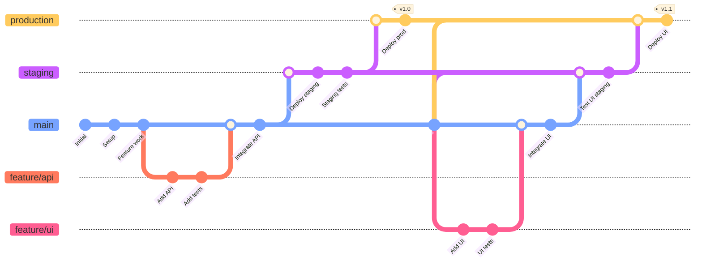

---
# You can also start simply with 'default'
theme: default
# random image from a curated Unsplash collection by Anthony
# like them? see https://unsplash.com/collections/94734566/slidev
background: pexels-spacex-586019.jpg
# some information about your slides (markdown enabled)
title: "Git"
info: "Git best practices"
# apply unocss classes to the current slide
class: text-left
# https://sli.dev/features/drawing
drawings:
  persist: false
# slide transition: https://sli.dev/guide/animations.html#slide-transitions
transition: fade-out
# enable MDC Syntax: https://sli.dev/features/mdc
mdc: true
---

# Git Best Practices
Comprehensive guide to Git best practices for modern development workflows

---
transition: fade-out
---

# What is Git?

<div class="grid grid-cols-2 gap-8">
  <div>
    <h3 class="text-lg font-bold mb-2"><span class="text-highlight">Distributed Version Control</span></h3>
    <div class="text-sm space-y-2">
      <div>📁 <strong>Track changes</strong> in files over time</div>
      <div>🔄 <strong>Collaborate</strong> with multiple developers</div>
      <div>🌍 <strong>Distributed</strong> - every clone is a full backup</div>
      <div>⚡ <strong>Fast</strong> - most operations are local</div>
      <div>🔒 <strong>Integrity</strong> - everything is checksummed</div>
    </div>
    <h3 class="text-lg font-bold mb-2 mt-6"><span class="text-highlight">Key Concepts</span></h3>
    <div class="text-sm space-y-2">
      <div>📦 <strong>Repository:</strong> Project directory with Git tracking</div>
      <div>📸 <strong>commit id:</strong> Snapshot of your code at a point in time</div>
      <div>🌿 <strong>Branch:</strong> Independent line of development</div>
      <div>🔗 <strong>Merge:</strong> Combining changes from different branches</div>
      <div>🏷️ <strong>Tag:</strong> Marking specific commits (releases)</div>
    </div>
  </div>
  
  <div>
    <div class="flex justify-center">
      
    </div>
    <a href=https://nvie.com/posts/a-successful-git-branching-model target=_blank class="text-blue-600 hover:text-blue-800 underline">
    https://nvie.com/posts/a-successful-git-branching-model/
    </a>
  </div>
</div>

<style>
.text-highlight {
  background-color: #2B90B6;
  background-size: 100%;
  font-weight: bold;
  -webkit-background-clip: text;
  -moz-background-clip: text;
  -webkit-text-fill-color: transparent;
  -moz-text-fill-color: transparent;
}
</style>


---
transition: fade-out
---

# Why Git Best Practices Matter

<div class="absolute top-1/2 transform -translate-y-1/2">

- <span class="text-highlight">Maintain clean and readable project history</span> for better collaboration
- <span class="text-highlight">Enable efficient code reviews</span> and faster debugging
- <span class="text-highlight">Reduce merge conflicts</span> and integration issues
- <span class="text-highlight">Facilitate easier rollbacks</span> and hotfix deployments
- <span class="text-highlight">Support automated CI/CD pipelines</span> and deployment strategies
- <span class="text-highlight">Improve team productivity</span> and code quality

</div>

<style>
.text-highlight {
  background-color: #2B90B6;
  background-size: 100%;
  font-weight: bold;
  -webkit-background-clip: text;
  -moz-background-clip: text;
  -webkit-text-fill-color: transparent;
  -moz-text-fill-color: transparent;
}
</style>

---
transition: fade-out
---

# Git Setup & Configuration

<div class="grid grid-cols-2 gap-8">
  <div>
    <h3 class="text-lg font-bold mb-2"><span class="text-highlight">Authentication</span></h3>
    <div class="text-sm space-y-2">
      Choose 1:
      <ul>
        <li>Set up SSH keys for <a href="https://learn.microsoft.com/en-us/azure/devops/repos/git/use-ssh-keys-to-authenticate" target="_blank" class="text-blue-600 hover:text-blue-800 underline">Azure DevOps</a> / <a href="https://docs.github.com/en/authentication/connecting-to-github-with-ssh/adding-a-new-ssh-key-to-your-github-account" target="_blank" class="text-blue-600 hover:text-blue-800 underline">GitHub</a> (use <b>git bash</b> terminal on Windows)</li>
        <li>Use <a href="https://github.com/git-ecosystem/git-credential-manager" target="_blank" class="text-blue-600 hover:text-blue-800 underline">Git Credential Manager</a></li>
      </ul>
    </div>
    <p></p>
    <h3 class="text-lg font-bold mb-2"><span class="text-highlight">Sample Repository Structure</span></h3>
    <div class="text-sm space-y-1">
      <div>📄 <strong>README.md</strong> - Project overview and setup</div>
      <div>📄 <strong>.gitignore</strong> - Files and directories to ignore</div>
      <div>📁 <strong>.github/</strong> - GitHub templates and workflows</div>
      <div>📁 <strong>.git/</strong> - Git configuration and hooks</div>
      <div>📁 <strong>docs/</strong> - Documentation</div>
      <div>📁 <strong>scripts/</strong> - Build and deployment scripts</div>
    </div>
  </div>
  
  <div>
    <h3 class="text-lg font-bold mb-2"><span class="text-highlight">Initial git Setup</span></h3>
    <div class="text-sm space-y-2">
      <div class="bg-gray-100 p-2 rounded font-mono">
        git config user.name "Your Name"<br>
        git config user.email "your@email.com"
      </div>
      <b>
      Check your setup:
      </b>
      <div class="bg-gray-100 p-2 rounded font-mono">
        cat .git/config
      </div>
    </div>
    <p></p>
    <h3 class="text-lg font-bold mb-2"><span class="text-highlight">Essential .gitignore</span></h3>
        <div class="bg-gray-100 p-2 rounded font-mono text-xs">
          # Common files to ignore<br>
          node_modules/<br>
          .env<br>
          dist/<br>
          *.log<br>
          .DS_Store<br>
          .venv/
        </div>
        <b>Useful Resources:</b>
        <ul class="text-xs space-y-1">
          <li><a href="https://github.com/github/gitignore/blob/main/Python.gitignore" target="_blank" class="text-blue-600 hover:text-blue-800 underline">Python .gitignore template</a></li>
          <li><a href="https://www.toptal.com/developers/gitignore" target="_blank" class="text-blue-600 hover:text-blue-800 underline">gitignore.io generator</a></li>
        </ul>
  </div>
</div>

<style>
.text-highlight {
  background-color: #2B90B6;
  background-size: 100%;
  font-weight: bold;
  -webkit-background-clip: text;
  -moz-background-clip: text;
  -webkit-text-fill-color: transparent;
  -moz-text-fill-color: transparent;
}
</style>

---
transition: fade-out
---

# Repository Configuration

<div class="grid grid-cols-2 gap-8">
  <div>
    <h3 class="text-lg font-bold mb-2"><span class="text-highlight">Branch Protection Rules</span></h3>
    <div class="text-sm space-y-2">
      <div>🛡️ <strong>Require pull request reviews</strong></div>
      <div>✅ <strong>Require status checks</strong></div>
      <div>🚫 <strong>Restrict pushes to main</strong> </div>
      <div>🔄 <strong>Require up-to-date branches</strong></div>
      <div>👑 <strong>Include administrators</strong></div>
    </div>
    <h3 class="text-lg font-bold mb-2 mt-4"><span class="text-highlight">CI/CD setup & Contributor Helpers</span></h3>
    <div class="text-sm space-y-2">
        <div>🔗 <strong>Pre-commit hooks:</strong> git hooks, husky</div>
        <div>🚀 <strong>Post-commit workflows:</strong> GitHub Actions, Azure Pipelines, Jenkins, GitKraken</div>
        <div>📊 <strong>Quality gates:</strong> Github actions summary, Azure Devops Test Plan, Sonarqube</div>
        <div>🎯 <strong>Integrations:</strong> Slack integration, LLM integration (review, config), Jira integration</div>
        <div>📄 <strong>Templates:</strong> PR templates, issue templates, commit templates</div>
    </div>
  </div>
  <div>
    <h3 class="text-lg font-bold mb-2"><span class="text-highlight">Secrets Management</span></h3>
    <div class="text-sm space-y-2">
      <div>🔐 <strong>Repository secrets for CI/CD</strong></div>
      <div>🌍 <strong>Environment-specific secrets</strong></div>
      <div>🔄 <strong>Automatic secret rotation</strong></div>
      <div>🎯 <strong>Least privilege access</strong></div>
    </div>
  <!-- <h3 class="text-lg font-bold mb-2"><span class="text-highlight">CI/CD Pipeline Visualization</span></h3> -->
  <div class="flex justify-center mt-8">
    
  </div>
  </div>
</div>

<style>
.text-highlight {
  background-color: #2B90B6;
  background-size: 100%;
  font-weight: bold;
  -webkit-background-clip: text;
  -moz-background-clip: text;
  -webkit-text-fill-color: transparent;
  -moz-text-fill-color: transparent;
}
</style>

---
transition: fade-out
layout: none
---

<!-- # Pre-commit Hooks vs Post-commit Workflows -->

<div class="grid grid-cols-1 gap-8 p-8">
  <div class="overflow-x-auto">
    <table class="w-full text-sm border-collapse border border-gray-300">
      <thead>
        <tr class="bg-gray-100">
          <th class="border border-gray-300 p-3 text-left font-bold">Aspect</th>
          <th class="border border-gray-300 p-3 text-left font-bold text-blue-600">Pre-commit Hooks</th>
          <th class="border border-gray-300 p-3 text-left font-bold text-green-600">Post-commit Workflows</th>
        </tr>
      </thead>
      <tbody>
        <tr>
          <td class="border border-gray-300 p-3 font-semibold">⏱️ Timing</td>
          <td class="border border-gray-300 p-3">Run before commit is created</td>
          <td class="border border-gray-300 p-3">Run after commit/push to remote</td>
        </tr>
        <tr class="bg-gray-50">
          <td class="border border-gray-300 p-3 font-semibold">🚫 Prevention</td>
          <td class="border border-gray-300 p-3">✅ Prevents bad commits entirely</td>
          <td class="border border-gray-300 p-3">❌ Cannot prevent commits, only detect issues</td>
        </tr>
        <tr>
          <td class="border border-gray-300 p-3 font-semibold">⚡ Speed</td>
          <td class="border border-gray-300 p-3">✅ Fast feedback (seconds)</td>
          <td class="border border-gray-300 p-3">❌ Slower feedback (minutes)</td>
        </tr>
        <tr class="bg-gray-50">
          <td class="border border-gray-300 p-3 font-semibold">💻 Environment</td>
          <td class="border border-gray-300 p-3">❌ Limited to developer's machine</td>
          <td class="border border-gray-300 p-3">✅ Consistent CI/CD environment</td>
        </tr>
        <tr>
          <td class="border border-gray-300 p-3 font-semibold">🔧 Setup</td>
          <td class="border border-gray-300 p-3">❌ Must be installed on each dev machine</td>
          <td class="border border-gray-300 p-3">✅ Centrally managed and maintained</td>
        </tr>
        <tr class="bg-gray-50">
          <td class="border border-gray-300 p-3 font-semibold">🛠️ Complexity</td>
          <td class="border border-gray-300 p-3">✅ Simple checks (linting, formatting)</td>
          <td class="border border-gray-300 p-3">✅ Complex workflows (build, test, deploy)</td>
        </tr>
        <tr>
          <td class="border border-gray-300 p-3 font-semibold">👥 Enforcement</td>
          <td class="border border-gray-300 p-3">❌ Can be bypassed with --no-verify</td>
          <td class="border border-gray-300 p-3">✅ Enforced through branch protection</td>
        </tr>
        <tr class="bg-gray-50">
          <td class="border border-gray-300 p-3 font-semibold">📊 Reporting</td>
          <td class="border border-gray-300 p-3">❌ Limited reporting capabilities</td>
          <td class="border border-gray-300 p-3">✅ Rich reporting and notifications</td>
        </tr>
        <tr>
          <td class="border border-gray-300 p-3 font-semibold">🔄 Maintenance</td>
          <td class="border border-gray-300 p-3">❌ Hard to update across team</td>
          <td class="border border-gray-300 p-3">✅ Easy to update centrally</td>
        </tr>
        <tr class="bg-gray-50">
          <td class="border border-gray-300 p-3 font-semibold">💰 Cost</td>
          <td class="border border-gray-300 p-3">✅ No additional infrastructure</td>
          <td class="border border-gray-300 p-3">❌ Requires CI/CD infrastructure</td>
        </tr>
      </tbody>
    </table>
  </div>
</div>

---
transition: fade-out
layout: none
---

<!-- # cont... -->

<div class="grid grid-cols-2 gap-8 p-4">
  <div>
    <h3 class="text-lg font-bold mb-2"><span class="text-highlight">Best Use Cases</span></h3>
    <div class="bg-blue-50 p-4 rounded-lg mb-2">
      <h4 class="font-bold text-blue-600 mb-3">🔧 Pre-commit Hooks</h4>
      <div class="text-sm space-y-2">
        <div>• Code formatting (Prettier, Black)</div>
        <div>• Linting (ESLint, pylint)</div>
        <div>• Simple security checks</div>
        <!-- <div>• Commit message validation</div> -->
        <!-- <div>• File size restrictions</div> -->
        <!-- <div>• Merge conflict detection</div> -->
      </div>
    </div>
    <div class="bg-green-50 p-4 rounded-lg">
      <h4 class="font-bold text-green-600 mb-3">🚀 Post-commit Workflows</h4>
      <div class="text-sm space-y-2">
        <div>• Comprehensive test suites</div>
        <div>• Build and compilation</div>
        <div>• Security scanning</div>
        <div>• Performance testing</div>
        <div>• Automated review</div>
        <div>• Deployment processes</div>
        <div>• Integration testing</div>
      </div>
    </div>
  </div>
  
  <div>
    <h3 class="text-lg font-bold mb-2"><span class="text-highlight">Hybrid Approach</span></h3>
    <div class="bg-yellow-50 p-4 rounded-lg">
      <h4 class="font-bold text-yellow-600 mb-3">🎯 Recommended Strategy</h4>
      <div class="text-sm space-y-3">
        <div>
          <strong>Pre-commit id:</strong> Fast quality checks
          <div class="font-mono text-xs bg-gray-100 p-2 rounded mt-1">
            - Formatting (< 5s)<br>
            - Linting (< 10s)<br>
            - Basic security checks
          </div>
        </div>
        <div>
          <strong>Post-commit id:</strong> Comprehensive validation
          <div class="font-mono text-xs bg-gray-100 p-2 rounded mt-1">
            - Full test suite<br>
            - Build verification<br>
            - Security scanning<br>
            - Automated peer reviews (using bots, LLMs)<br>
            - Deployment pipeline
          </div>
        </div>
      </div>
    </div>
    <div class="bg-purple-50 p-4 rounded-lg mt-4">
      <h4 class="font-bold text-purple-600 mb-3">💡 Implementation Tips</h4>
      <div class="text-sm space-y-2">
        <div>• Make pre-commit hooks fast (< 30 seconds)</div>
        <div>• Provide easy bypass for emergencies</div>
        <div>• Ensure post-commit workflows are reliable</div>
      </div>
    </div>
  </div>
</div>

<style>
.text-highlight {
  background-color: #2B90B6;
  background-size: 100%;
  font-weight: bold;
  -webkit-background-clip: text;
  -moz-background-clip: text;
  -webkit-text-fill-color: transparent;
  -moz-text-fill-color: transparent;
}
</style>


---
transition: fade-out
---

# Git Branching Strategies

<div class="grid grid-cols-3 gap-6">
  <div class="bg-green-50 p-4 rounded-lg">
    <h3 class="font-bold text-green-600 mb-3">🚀 GitHub Flow</h3>
    <div class="text-sm space-y-1">
      <div>• Simple branch-per-feature</div>
      <div>• Continuous deployment</div>
      <div>• Fast iterations</div>
      <div>• Web applications</div>
    </div>
    <div class="mt-3 text-xs">
      <strong>Branches:</strong> main, feature/*
    </div>
  </div>

  <div class="bg-blue-50 p-4 rounded-lg">
    <h3 class="font-bold text-blue-600 mb-3">🌊 Git Flow</h3>
    <div class="text-sm space-y-1">
      <div>• Complex workflow with multiple branch types</div>
      <div>• Scheduled releases</div>
      <div>• Large teams</div>
      <div>• Enterprise projects</div>
    </div>
    <div class="mt-3 text-xs">
      <strong>Branches:</strong> main, develop, feature/*, release/*, hotfix/*
    </div>
  </div>

  <div class="bg-purple-50 p-4 rounded-lg">
    <h3 class="font-bold text-purple-600 mb-3">🔄 GitLab Flow</h3>
    <div class="text-sm space-y-1">
      <div>• Environment-based branches</div>
      <div>• Staged deployments</div>
      <div>• Quality gates</div>
      <div>• Production releases</div>
    </div>
    <div class="mt-3 text-xs">
      <strong>Branches:</strong> main, staging, production, feature/*
    </div>
  </div>
</div>

<div class="mt-8 bg-yellow-50 p-4 rounded-lg">
  <h3 class="font-bold text-yellow-600 mb-2">💡 Branch Naming Conventions</h3>
  <div class="grid grid-cols-2 gap-4 text-sm">
    <div>
      <div class="font-mono bg-gray-100 p-1 rounded">feature/user-authentication</div>
      <div class="font-mono bg-gray-100 p-1 rounded mt-1">bugfix/login-validation-error</div>
      <div class="font-mono bg-gray-100 p-1 rounded mt-1">hotfix/security-patch-2024</div>
    </div>
    <div>
      <div class="font-mono bg-gray-100 p-1 rounded">release/v2.1.0</div>
      <div class="font-mono bg-gray-100 p-1 rounded mt-1">chore/update-dependencies</div>
      <div class="font-mono bg-gray-100 p-1 rounded mt-1">docs/api-documentation</div>
    </div>
  </div>
</div>

<style>
.text-highlight {
  background-color: #2B90B6;
  background-size: 100%;
  font-weight: bold;
  -webkit-background-clip: text;
  -moz-background-clip: text;
  -webkit-text-fill-color: transparent;
  -moz-text-fill-color: transparent;
}
</style>

---
transition: fade-out
---

# GitHub Flow Strategy

<div class="grid grid-cols-2 gap-8">
  <div>
    <h3 class="text-lg font-bold mb-2"><span class="text-highlight">Simple Workflow</span></h3>
    <div class="text-sm space-y-2">
      <div><strong>main:</strong> Always deployable production code</div>
      <div><strong>feature/*:</strong> All development work</div>
    </div>
    <h3 class="text-lg font-bold mb-2 mt-6"><span class="text-highlight">Process Steps</span></h3>
    <div class="text-sm space-y-2">
      <div>1. <strong>Create branch</strong> from main</div>
      <div>2. <strong>Develop</strong> feature with commits</div>
      <div>3. <strong>Open pull request</strong> early</div>
      <div>4. <strong>Discuss & review</strong> code</div>
      <div>5. <strong>Deploy</strong> from branch for testing</div>
      <div>6. <strong>Merge</strong> to main after approval</div>
    </div>
    <!-- <h3 class="text-lg font-bold mb-2 mt-6"><span class="text-highlight">Workflow Commands</span></h3>
    <div class="text-sm space-y-2">
      <div class="bg-gray-100 p-2 rounded font-mono text-xs">
        # Create feature branch<br>
        git checkout main<br>
        git pull origin main<br>
        git checkout -b feature/new-api<br><br>
        # Develop and push<br>
        git add .<br>
        git commit -m "feat: add new API endpoint"<br>
        git push origin feature/new-api<br><br>
        # After PR approval<br>
        git checkout main<br>
        git pull origin main<br>
        git branch -d feature/new-api
      </div>
    </div> -->
  </div>
  
  <div>
    <div class="flex justify-center">
      
    </div>
  </div>
</div>

<style>
.text-highlight {
  background-color: #2B90B6;
  background-size: 100%;
  font-weight: bold;
  -webkit-background-clip: text;
  -moz-background-clip: text;
  -webkit-text-fill-color: transparent;
  -moz-text-fill-color: transparent;
}
</style>

---
transition: fade-out
---

# Git Flow Branching Strategy

<div class="grid grid-cols-2 gap-8">
  <div>
    <h3 class="text-lg font-bold mb-2"><span class="text-highlight">Branch Structure</span></h3>
    <div class="text-sm space-y-2">
      <div><strong>main:</strong> Production-ready releases only</div>
      <div><strong>develop:</strong> Integration branch for features</div>
      <div><strong>feature/*:</strong> Individual feature development</div>
      <div><strong>release/*:</strong> Release preparation and testing</div>
      <div><strong>hotfix/*:</strong> Critical production fixes</div>
    </div>
    <!-- <h3 class="text-lg font-bold mb-2 mt-6"><span class="text-highlight">Workflow Process</span></h3>
    <div class="text-sm space-y-2">
      <div>1. <strong>Create feature branch</strong> from develop</div>
      <div>2. <strong>Develop & commit</strong> changes</div>
      <div>3. <strong>Merge feature</strong> back to develop</div>
      <div>4. <strong>Create release branch</strong> from develop</div>
      <div>5. <strong>Test & fix</strong> in release branch</div>
      <div>6. <strong>Merge to main</strong> and tag release</div>
      <div>7. <strong>Merge back</strong> to develop</div>
    </div> -->
    <h3 class="text-lg font-bold mb-2 mt-6"><span class="text-highlight">Best For</span></h3>
      <div class="text-sm space-y-1">
      <div>✅ Large development teams</div>
      <div>✅ Scheduled releases</div>
      <div>✅ Complex feature development</div>
      <div>✅ Multiple environments</div>
      <div>✅ Enterprise applications</div>
      <div>❌ Continuous deployment</div>
      <div>❌ Simple projects</div>
    </div>
  </div>
  
  <div>
    <div class="flex justify-center mb-2">
      
        </div>
  </div>
</div>

<!-- <div class="mt-8 bg-blue-50 p-4 rounded-lg">
  <h3 class="font-bold text-blue-600 mb-3">🔧 Essential Git Flow Commands</h3>
  <div class="grid grid-cols-2 gap-4 text-sm">
    <div class="bg-gray-100 p-2 rounded font-mono text-xs">
      # Start new feature<br>
      git checkout develop<br>
      git checkout -b feature/user-dashboard<br><br>
      # Finish feature<br>
      git checkout develop<br>
      git merge feature/user-dashboard<br>
      git branch -d feature/user-dashboard
    </div>
    <div class="bg-gray-100 p-2 rounded font-mono text-xs">
      # Create release<br>
      git checkout -b release/v1.2.0 develop<br>
      # After testing & fixes<br>
      git checkout main<br>
      git merge release/v1.2.0<br>
      git tag -a v1.2.0 -m "Release v1.2.0"<br>
      git checkout develop<br>
      git merge release/v1.2.0
    </div>
  </div>
</div> -->

<style>
.text-highlight {
  background-color: #2B90B6;
  background-size: 100%;
  font-weight: bold;
  -webkit-background-clip: text;
  -moz-background-clip: text;
  -webkit-text-fill-color: transparent;
  -moz-text-fill-color: transparent;
}
</style>


---
transition: fade-out
---

# GitLab Flow Strategy

<div class="grid grid-cols-2 gap-8">
  <div>
    <h3 class="text-lg font-bold mb-2"><span class="text-highlight">Environment Branches</span></h3>
    <div class="text-sm space-y-2">
      <div><strong>main:</strong> Development integration</div>
      <div><strong>staging:</strong> Pre-production testing</div>
      <div><strong>production:</strong> Live environment</div>
      <div><strong>feature/*:</strong> Feature development</div>
    </div>
    <h3 class="text-lg font-bold mb-2 mt-6"><span class="text-highlight">Best For</span></h3>
    <div class="text-sm space-y-1">
      <div>✅ Multiple environments</div>
      <div>✅ Staged deployments</div>
      <div>✅ Enterprise applications</div>
      <div>✅ Quality gates</div>
      <div>✅ Compliance requirements</div>
      <div>❌ Simple continuous deployment</div>
      <div>❌ Small teams with single environment</div>
    </div>
    <!-- <h3 class="text-lg font-bold mb-2 mt-6"><span class="text-highlight">Deployment Flow</span></h3>
    <div class="text-sm space-y-2">
      <div>1. <strong>Develop</strong> in feature branches</div>
      <div>2. <strong>Merge</strong> to main after review</div>
      <div>3. <strong>Deploy</strong> main to staging</div>
      <div>4. <strong>Test</strong> in staging environment</div>
      <div>5. <strong>Merge</strong> staging to production</div>
      <div>6. <strong>Deploy</strong> to production</div>
    </div> -->
    <!-- <h3 class="text-lg font-bold mb-2 mt-6"><span class="text-highlight">Workflow Commands</span></h3>
    <div class="text-sm space-y-2">
      <div class="bg-gray-100 p-2 rounded font-mono text-xs">
        # Feature development<br>
        git checkout main<br>
        git checkout -b feature/payment<br>
        # ... develop feature ...<br>
        git push origin feature/payment<br><br>
        # After merge to main<br>
        git checkout staging<br>
        git merge main<br>
        git push origin staging<br><br>
        # After staging tests pass<br>
        git checkout production<br>
        git merge staging<br>
        git push origin production
      </div>
    </div> -->
  </div>
  <div>
    <div class="bg-white p-4 rounded border">

    </div>
    <h3 class="text-lg font-bold mb-2 mt-6"><span class="text-highlight">Release Types</span></h3>
    <div class="text-sm space-y-1">
      <div>🔄 <strong>Environment promotion:</strong> Standard flow</div>
      <div>🚀 <strong>Release branches:</strong> For versioned releases</div>
      <div>🔧 <strong>Upstream first:</strong> For open source</div>
    </div>
  </div>
</div>

<style>
.text-highlight {
  background-color: #2B90B6;
  background-size: 100%;
  font-weight: bold;
  -webkit-background-clip: text;

  -moz-background-clip: text;
  -webkit-text-fill-color: transparent;
  -moz-text-fill-color: transparent;
}
</style>

---
transition: fade-out
---

# Git branching strategies - Further Reading

- https://docs.aws.amazon.com/prescriptive-guidance/latest/choosing-git-branch-approach/visual-overview-of-the-trunk-strategy.html
- https://docs.gitlab.com/user/project/repository/branches/strategies/
- https://www.atlassian.com/git/tutorials/comparing-workflows/gitflow-workflow

---
transition: fade-out
---

# Git Commands - Repository Setup

<div class="grid grid-cols-2 gap-8">
  <div>
    <div class="mb-6">
      <h4 class="font-bold text-blue-600 mb-2">🎯 git init</h4>
      <div class="text-sm mb-2">Initialize a new Git repository</div>
      <div class="bg-gray-100 p-2 rounded font-mono text-xs mb-3">
        mkdir my-project<br>
        cd my-project<br>
        git init<br>
        # Creates .git directory
      </div>
    </div>
    <div class="mb-6">
      <h4 class="font-bold text-blue-600 mb-2">📥 git clone</h4>
      <div class="text-sm mb-2">Copy a repository from remote to local</div>
      <div class="bg-gray-100 p-2 rounded font-mono text-xs mb-3">
        # Clone via HTTPS<br>
        git clone https://github.com/user/repo.git<br>
        # Clone via SSH<br>
        git clone git@github.com:user/repo.git<br>
        # Clone specific branch<br>
        git clone -b develop https://github.com/user/repo.git
      </div>
    </div>
  </div>
  <div>
    <div class="mb-6">
      <h4 class="font-bold text-blue-600 mb-2">⚙️ git config</h4>
      <div class="text-sm mb-2">Configure Git settings</div>
      <div class="bg-gray-100 p-2 rounded font-mono text-xs">
        # Set user information<br>
        git config --global user.name "John Doe"<br>
        git config --global user.email "john@example.com"<br><br>
        # View configuration<br>
        git config --list<br><br>
      </div>
    </div>
    <!-- <div class="bg-green-50 p-4 rounded-lg"> -->
      <!-- <h4 class="font-bold text-green-600 mb-3">💡 Pro Tips</h4>
      <div class="text-sm space-y-2">
        <div>🔧 Use <strong>--global</strong> for user-wide settings</div>
        <div>📁 Use <strong>--local</strong> for project-specific config</div>
        <div>🔍 Check config with <strong>git config --list --show-origin</strong></div>
      </div> -->
    <div class="mb-6">
      <h4 class="font-bold text-green-600 mb-2">🔗 git remote</h4>
      <div class="text-sm mb-2">Manage remote repositories</div>
      <div class="bg-gray-100 p-2 rounded font-mono text-xs">
        # View remotes<br>
        git remote -v<br>
        # Add remote<br>
        git remote add origin https://github.com/user/repo.git<br>
        # Change remote URL<br>
        git remote set-url origin git@github.com:user/repo.git
      </div>
    </div>
  </div>
</div>

<style>
.text-highlight {
  background-color: #2B90B6;
  background-size: 100%;
  font-weight: bold;
  -webkit-background-clip: text;
  -moz-background-clip: text;
  -webkit-text-fill-color: transparent;
  -moz-text-fill-color: transparent;
}
</style>

---
transition: fade-out
---

# Git Commands - The Basics

<div class="grid grid-cols-2 gap-8 h-full">
  <div class="flex justify-center items-center">
    
  </div>
  
  <div class="flex flex-col justify-center">
    <h3 class="text-lg font-bold mb-2"><span class="text-highlight">Essential Git Commands</span></h3>
    <div class="bg-gray-100 p-4 rounded font-mono text-sm">
      <div class="text-green-600"># Basic workflow</div>
      <div>git add &lt;file&gt;</div>
      <div>git commit -m "message"</div>
      <div>git push origin main</div>
      <br>
      <div class="text-green-600"># Synchronization</div>
      <div>git fetch --all</div>
      <div>git merge &lt;branch&gt;</div>
      <div>git pull origin main</div>
    </div>
  </div>
</div>

<style>
.text-highlight {
  background-color: #2B90B6;
  background-size: 100%;
  font-weight: bold;
  -webkit-background-clip: text;
  -moz-background-clip: text;
  -webkit-text-fill-color: transparent;
  -moz-text-fill-color: transparent;
}
</style>

---
transition: fade-out
---

# Git Commands - Push

<div class="grid grid-cols-2 gap-8">
  <div>
    <div class="mb-6">
      <h4 class="font-bold text-green-600 mb-2">➕ git add</h4>
      <div class="text-sm mb-2">Stage changes for commit</div>
      <div class="bg-gray-100 p-2 rounded font-mono text-xs mb-3">
        git add index.html # Add specific file<br>
        git add . # Add all changes<br>
        git add *.js # Add files by pattern<br>
        git add -p # Interactive staging<br>
        git add -p index.html # Interactive staging for specific file
      </div>
    </div>
    <div class="mb-6">
      <h4 class="font-bold text-green-600 mb-2">💾 git commit</h4>
      <div class="text-sm mb-2">Save staged changes to repository</div>
      <div class="bg-gray-100 p-2 rounded font-mono text-xs">
        # Commit with message<br>
        git commit -m "feat: add user authentication"<br>
        # Commit and stage all tracked files<br>
        git commit -am "fix: resolve login bug"<br>
        # Amend last commit message<br>
        git commit --amend -m "Updated message"<br>
        # Amend last commit author<br>
        git commit --amend --reset-author --no-edit 
      </div>
    </div>
  </div>
  <div>
    <div class="mb-6">
      <h4 class="font-bold text-purple-600 mb-2">🚀 git push</h4>
      <div class="text-sm mb-2">Upload local commits to remote repository</div>
      <div class="bg-gray-100 p-2 rounded font-mono text-xs mb-3">
        # Push to default remote/branch<br>
        git push<br>
        # Push and set upstream<br>
        git push -u origin feature/new-login<br>
        # Push all branches<br>
        git push --all<br>
        # Push tags<br>
        git push --tags
      </div>
    </div>
    <div class="bg-blue-50 p-4 rounded-lg">
      <h4 class="font-bold text-blue-600 mb-3">📋 Staging Workflow</h4>
      <div class="text-sm space-y-2">
        <div>1. <strong>Work on files</strong> in working directory</div>
        <div>2. <strong>Stage changes</strong> with git add</div>
        <div>3. <strong>Commit staged changes</strong> with git commit</div>
        <div>4. <strong>Push to remote</strong> when ready</div>
      </div>
    </div>
  </div>
</div>

<style>
.text-highlight {
  background-color: #2B90B6;
  background-size: 100%;
  font-weight: bold;
  -webkit-background-clip: text;
  -moz-background-clip: text;
  -webkit-text-fill-color: transparent;
  -moz-text-fill-color: transparent;
}
</style>

---
transition: fade-out
---

# Git Commands - Syncing Changes

<div class="grid grid-cols-2 gap-8">
  <div>
    <div class="mb-6">
      <h4 class="font-bold text-purple-600 mb-2">📡 git fetch</h4>
      <div class="text-sm mb-2">Download changes without merging</div>
      <div class="bg-gray-100 p-2 rounded font-mono text-xs">
        # Fetch all remotes<br>
        git fetch -a<br>
        # Fetch specific remote<br>
        git fetch origin<br>
        # Fetch and prune deleted branches<br>
        git fetch --prune
      </div>
    </div>
    <div class="mb-6">
      <h4 class="font-bold text-orange-600 mb-2">🔗 git merge</h4>
      <div class="text-sm mb-2">Combine changes from different branches</div>
      <div class="bg-gray-100 p-2 rounded font-mono text-xs mb-3">
        # Merge feature branch into current<br>
        git merge feature/new-api<br>
        # Merge with no fast-forward<br>
        git merge --no-ff feature/payment<br>
        # Merge with squash<br>
        git merge --squash feature/cleanup
      </div>
    </div>
  </div>
  <div>
    <div class="mb-6">
      <h4 class="font-bold text-purple-600 mb-2">⬇️ git pull</h4>
      <div class="text-sm mb-2">Fetch and merge changes from remote</div>
      <div class="bg-gray-100 p-2 rounded font-mono text-xs mb-3">
        # Pull latest changes from remote<br>
        git pull<br>
        # Pull specific branch<br>
        git pull origin main<br>
        # Pull with rebase (cleaner history)<br>
        git pull --rebase<br>
        # Pull without creating merge commit<br>
        git pull --ff-only
      </div>
        </div>
        <div class="bg-yellow-50 p-4 rounded-lg">
      <h4 class="font-bold text-yellow-600 mb-3">⚠️ Synchronization Tips</h4>
      <div class="text-sm space-y-2">
        <div>📡 <strong>Fetch first</strong> to see changes before merging</div>
        <div>🔄 <strong>Pull regularly</strong> to avoid large conflicts</div>
        <div>⚡ <strong>Use rebase</strong> for cleaner commit history</div>
        <div>🎯 <strong>Resolve conflicts</strong> immediately when they occur</div>
      </div>
        </div>
  </div>
</div>

<style>
.text-highlight {
  background-color: #2B90B6;
  background-size: 100%;
  font-weight: bold;
  -webkit-background-clip: text;
  -moz-background-clip: text;
  -webkit-text-fill-color: transparent;
  -moz-text-fill-color: transparent;
}
</style>

---
transition: fade-out
---

# Git Commands - Branch Management

<div class="grid grid-cols-2 gap-8">
  <div>
    <div class="mb-6">
      <h4 class="font-bold text-orange-600 mb-2">🔄 git checkout</h4>
      <div class="text-sm mb-2">Switch branches and restore files (classic approach)</div>
      <div class="bg-gray-100 p-2 rounded font-mono text-xs mb-3">
        # Switch to existing branch<br>
        git checkout main<br>
        # Create and switch to new branch<br>
        git checkout -b feature/new-feature<br>
        # Checkout specific commit<br>
        git checkout abc123<br>
        # Restore file from another branch<br>
        git checkout main -- file.txt
      </div>
    </div>
    <div class="mb-6">
      <h4 class="font-bold text-orange-600 mb-2">🆕 git switch</h4>
      <div class="text-sm mb-2">Switch between branches (modern approach)</div>
      <div class="bg-gray-100 p-2 rounded font-mono text-xs mb-3">
        # Switch to existing branch<br>
        git switch main<br>
        # Create and switch to new branch<br>
        git switch -c feature/user-profile<br>
        # Switch to previous branch<br>
        git switch -<br>
        # Switch to remote branch<br>
        git switch -c local-branch origin/remote-branch
      </div>
    </div>
  </div>
  <div>
    <div class="mb-6">
      <h4 class="font-bold text-purple-600 mb-2">💾 git stash</h4>
      <div class="text-sm mb-2">Temporarily save uncommitted changes</div>
      <div class="bg-gray-100 p-2 rounded font-mono text-xs mb-3">
        # Stash current changes<br>
        git stash<br>
        # Apply latest stash<br>
        git stash apply<br>
      </div>
    </div>
    <div class="mb-6">
      <h4 class="font-bold text-blue-600 mb-2">📦 git submodule</h4>
      <div class="text-sm mb-2">Manage external repositories within your project</div>
      <div class="bg-gray-100 p-2 rounded font-mono text-xs mb-3">
        # Add submodule<br>
        git submodule add https://github.com/user/repo.git libs/repo<br>
        # Initialize submodules<br>
        git submodule init<br>
        # Update submodules<br>
        git submodule update<br>
        # Clone with submodules<br>
        git clone --recursive https://github.com/user/main-repo.git
      </div>
    </div>
  </div>
</div>

<div class="mt-8 grid grid-cols-2 gap-8">
  <div class="bg-green-50 p-4 rounded-lg">
    <h4 class="font-bold text-green-600 mb-3">🌿 Branch Best Practices</h4>
    <div class="text-sm space-y-2">
      <div>📝 Use descriptive branch names</div>
      <div>🔄 Switch often, commit frequently</div>
      <div>🧹 Delete merged branches</div>
      <div>📡 Push feature branches for backup</div>
      <div>⚡ Prefer <strong>git switch</strong> over checkout for branches</div>
    </div>
  </div>
  <!-- <div class="bg-blue-50 p-4 rounded-lg">
    <h4 class="font-bold text-blue-600 mb-3">💡 Pro Tips</h4>
    <div class="text-sm space-y-2">
      <div>💾 Use stash when switching branches with uncommitted work</div>
      <div>📦 Submodules help manage dependencies and shared code</div>
      <div>🔍 Use <strong>git switch</strong> for safer branch operations</div>
      <div>🎯 Checkout is powerful but can be confusing for beginners</div>
    </div>
  </div> -->
</div>

<style>
.text-highlight {
  background-color: #2B90B6;
  background-size: 100%;
  font-weight: bold;
  -webkit-background-clip: text;
  -moz-background-clip: text;
  -webkit-text-fill-color: transparent;
  -moz-text-fill-color: transparent;
}
</style>

---
transition: fade-out
---

# Git Commands - Undoing Changes

<div class="grid grid-cols-2 gap-8">
  <div>
    <div class="mb-6">
      <h4 class="font-bold text-blue-600 mb-2">🔄 git restore</h4>
      <div class="text-sm mb-2">Restore files to previous state (modern, safe approach)</div>
      <div class="bg-gray-100 p-2 rounded font-mono text-xs mb-3">
        # Restore working directory file<br>
        git restore index.html<br>
        # Restore staged file (unstage)<br>
        git restore --staged config.js<br>
        # Restore from specific commit<br>
        git restore --source=HEAD~2 app.js<br>
        # Restore all modified files<br>
        git restore .
      </div>
    </div>
    <div class="mb-6">
      <h4 class="font-bold text-orange-600 mb-2">⚡ git reset</h4>
      <div class="text-sm mb-2">Move branch pointer and reset repository state</div>
      <div class="bg-gray-100 p-2 rounded font-mono text-xs mb-3">
        # Soft reset (keep changes staged)<br>
        git reset --soft HEAD~1<br>
        # Mixed reset (unstage changes)<br>
        git reset HEAD~1<br>
        # Hard reset (⚠️ discard all changes)<br>
        git reset --hard HEAD~1<br>
        # Reset specific file<br>
        git reset HEAD file.txt
      </div>
    </div>
  </div>
  <div>
    <div class="mb-6">
      <h4 class="font-bold text-green-600 mb-2">⏪ git revert</h4>
      <div class="text-sm mb-2">Create new commit that undoes previous changes (safest)</div>
      <div class="bg-gray-100 p-2 rounded font-mono text-xs mb-3">
        # Revert last commit<br>
        git revert HEAD<br>
        # Revert specific commit<br>
        git revert abc123<br>
        # Revert without committing immediately<br>
        git revert --no-commit HEAD<br>
        # Revert merge commit<br>
        git revert -m 1 abc123
      </div>
    </div>
    <div class="bg-blue-50 p-4 rounded-lg mb-2">
      <h4 class="font-bold text-blue-600 mb-3">🎯 When to Use Each</h4>
      <div class="text-sm space-y-2">
        <div><strong>git restore:</strong> Fix working directory mistakes</div>
        <div><strong>git reset:</strong> Undo local commits (use carefully)</div>
        <div><strong>git revert:</strong> Undo public/shared commits (safest)</div>
      </div>
    </div>
  </div>
</div>

<style>
.text-highlight {
  background-color: #2B90B6;
  background-size: 100%;
  font-weight: bold;
  -webkit-background-clip: text;
  -moz-background-clip: text;
  -webkit-text-fill-color: transparent;
  -moz-text-fill-color: transparent;
}
</style>

---
transition: fade-out
---

# Git Commit Messages

<div class="grid grid-cols-2 gap-8">
  <div>
    <h3 class="text-lg font-bold mb-2"><span class="text-highlight">Commit Message Structure</span></h3>
    <div class="text-sm space-y-2">
      <div class="bg-gray-100 p-2 rounded font-mono text-xs">
      git commit -m "&lt;type&gt;(&lt;scope&gt;): &lt;subject&gt;"
      </div>
    </div>
    <h3 class="text-lg font-bold mb-2 mt-6"><span class="text-highlight">Commit Types</span></h3>
    <div class="grid grid-cols-2 gap-4">
      <div class="text-sm space-y-1">
        <div><strong>feat:</strong> New feature</div>
        <div><strong>fix:</strong> Bug fix</div>
        <div><strong>docs:</strong> Documentation</div>
        <div><strong>style:</strong> Formatting</div>
      </div>
      <div class="text-sm space-y-1">
        <div><strong>refactor:</strong> Code restructuring</div>
        <div><strong>test:</strong> Adding tests</div>
        <div><strong>chore:</strong> Maintenance</div>
      </div>
    </div>
    <h3 class="text-lg font-bold mb-2 mt-6"><span class="text-highlight">Quick Tips</span></h3>
    <div class="text-sm space-y-1">
      <div>📝 Use imperative mood: "add" not "added"</div>
      <div>📏 Keep subject under 50 characters</div>
      <div>💡 Explain what and why, not how</div>
    </div>
  </div>
  <div>
    <h3 class="text-lg font-bold mb-2"><span class="text-highlight">Good Examples</span></h3>
    <div class="text-sm space-y-2">
      <div class="bg-green-100 p-2 rounded font-mono text-xs">
      feat(auth): add OAuth integration<br><br>
      fix(api): resolve timeout issue<br><br>
      docs(readme): update setup instructions<br><br>
      refactor(utils): simplify date formatting
      </div>
    </div>
    <h3 class="text-lg font-bold mb-2 mt-6"><span class="text-highlight">Bad Examples</span></h3>
    <div class="text-sm space-y-2">
      <div class="bg-red-100 p-2 rounded font-mono text-xs">
      ❌ update stuff<br>
      ❌ fix bug<br>
      ❌ WIP<br>
      ❌ final version
      </div>
    </div>
  </div>
</div>

<style>
.text-highlight {
  background-color: #2B90B6;
  background-size: 100%;
  font-weight: bold;
  -webkit-background-clip: text;
  -moz-background-clip: text;
  -webkit-text-fill-color: transparent;
  -moz-text-fill-color: transparent;
}
</style>

---
transition: fade-out
---

# Pull Request Best Practices (Creating a PR)

<div class="grid grid-cols-2 gap-8">
  <div>
    <h3 class="text-lg font-bold mb-2"><span class="text-highlight">Creating PRs</span></h3>
    <div class="text-sm space-y-2">
      <div>📝 <strong>Write descriptive titles</strong> that explain the change</div>
      <div>📋 <strong>Use PR templates</strong> for consistent information</div>
      <div>🎯 <strong>Keep PRs small and focused</strong> (< 400 lines)</div>
      <div>🔗 <strong>Link to related issues</strong> or work items</div>
      <div>📸 <strong>Include screenshots</strong> for UI changes</div>
      <div>✅ <strong>Self-review before submitting</strong></div>
    </div>
      <h3 class="text-lg font-bold mb-2 mt-4"><span class="text-highlight">Useful Resources</span></h3>
      <div class="text-sm space-y-2">
        <ul class="space-y-1">
          <li><a href="https://learn.microsoft.com/en-us/azure/devops/repos/git/pull-requests?view=azure-devops&tabs=browser" target="_blank" class="text-blue-600 hover:text-blue-800 underline">Azure DevOps Pull Requests Documentation</a></li>
          <li><a href="https://docs.github.com/en/pull-requests/collaborating-with-pull-requests/proposing-changes-to-your-work-with-pull-requests/creating-a-pull-request" target="_blank" class="text-blue-600 hover:text-blue-800 underline">GitHub Pull Request Creation Guide</a></li>
        </ul>
      </div>
  </div>
  
  <div>
    <h3 class="text-lg font-bold mb-2"><span class="text-highlight">PR Description Template</span></h3>
      <div class="text-sm space-y-2">
        <div class="bg-gray-100 p-2 rounded font-mono text-xs">
        ## What changed?<br>
        Brief summary of the changes<br><br>
        ## Why?<br>
        Explain the motivation and context<br><br>
        ## How to test?<br>
        - Step 1: Do this<br>
        - Step 2: Verify that<br><br>
        ## Checklist<br>
        - [ ] Tests added/updated<br>
        - [ ] Documentation updated<br>
        - [ ] Breaking changes noted
        </div>
      </div>
  </div>
</div>

<style>
.text-highlight {
  background-color: #2B90B6;
  background-size: 100%;
  font-weight: bold;
  -webkit-background-clip: text;
  -moz-background-clip: text;
  -webkit-text-fill-color: transparent;
  -moz-text-fill-color: transparent;
}
</style>

---
transition: fade-out
---

# Pull Request Best Practices (Reviewing a PR)

<div class="grid grid-cols-2 gap-8">
  <div>
    <h3 class="text-lg font-bold mb-2"><span class="text-highlight">Effective PR Reviews</span></h3>
    <div class="text-sm space-y-2">
      <div>⏰ <strong>Review promptly</strong> (within 24 hours)</div>
      <div>🎯 <strong>Focus on logic and architecture</strong> over style</div>
      <div>🔍 <strong>Check for security vulnerabilities</strong></div>
      <div>🧪 <strong>Verify test coverage and quality</strong></div>
      <div>📚 <strong>Ensure documentation is updated</strong></div>
      <div>🏗️ <strong>Validate design patterns</strong></div>
    </div>
    <h3 class="text-lg font-bold mb-2 mt-6"><span class="text-highlight">Review Workflow</span></h3>
    <div class="text-sm space-y-2">
      <div>1. <strong>Understand the context</strong> - read PR description</div>
      <div>2. <strong>Check automated tests</strong> - ensure CI passes</div>
      <div>3. <strong>Review code changes</strong> - line by line</div>
      <div>4. <strong>Test locally</strong> if needed</div>
      <div>5. <strong>Provide constructive feedback</strong></div>
      <div>6. <strong>Approve or request changes</strong></div>
    </div>
  </div>
  
  <div>
    <h3 class="text-lg font-bold mb-2"><span class="text-highlight">Comment Guidelines</span></h3>
    <div class="text-sm space-y-2">
      <div class="bg-green-100 p-2 rounded">
        <div class="font-bold text-green-600">✅ Good Feedback:</div>
        <div class="text-xs">"Consider using Promise.all() here to run API calls in parallel for better performance"</div>
      </div>
      <div class="bg-blue-100 p-2 rounded">
        <div class="font-bold text-blue-600">💡 Suggestions:</div>
        <div class="text-xs">"Nitpick: Could we extract this logic into a utility function for reusability?"</div>
      </div>
      <div class="bg-red-100 p-2 rounded">
        <div class="font-bold text-red-600">❌ Avoid:</div>
        <div class="text-xs">"This is wrong" or "Bad code"</div>
      </div>
    </div>
    <h3 class="text-lg font-bold mb-2 mt-6"><span class="text-highlight">Review Checklist</span></h3>
    <div class="text-sm space-y-1">
      <div>🔒 <strong>Security:</strong> No exposed secrets, proper validation</div>
      <div>🏗️ <strong>Architecture:</strong> Follows team patterns</div>
      <div>📈 <strong>Performance:</strong> No obvious bottlenecks</div>
      <div>🧹 <strong>Code Quality:</strong> Readable and maintainable</div>
      <div>🧪 <strong>Testing:</strong> Adequate coverage</div>
      <div>📖 <strong>Documentation:</strong> Updated as needed</div>
    </div>
  </div>
</div>

<style>
.text-highlight {
  background-color: #2B90B6;
  background-size: 100%;
  font-weight: bold;
  -webkit-background-clip: text;
  -moz-background-clip: text;
  -webkit-text-fill-color: transparent;
  -moz-text-fill-color: transparent;
}
</style>

---
transition: fade-out
---

# Pull Request Best Practices (Merging a PR)

<div class="grid grid-cols-2 gap-8">
  <div>
    <h3 class="text-lg font-bold mb-2"><span class="text-highlight">Before Merging Checklist</span></h3>
    <div class="text-sm space-y-2">
      <div>✅ <strong>All required approvals received</strong></div>
      <div>✅ <strong>All automated checks pass</strong></div>
      <div>✅ <strong>No merge conflicts</strong></div>
      <div>✅ <strong>Branch is up to date</strong></div>
      <div>✅ <strong>Linked work items updated</strong></div>
      <div>✅ <strong>Documentation reviewed</strong></div>
    </div>
    <h3 class="text-lg font-bold mb-2 mt-4"><span class="text-highlight">Post-Merge Actions</span></h3>
    <div class="text-sm space-y-2">
      <div>🗑️ <strong>Delete feature branch</strong> (if no longer needed)</div>
      <div>📊 <strong>Monitor deployment pipeline</strong></div>
      <div>🔍 <strong>Verify changes in staging/production</strong></div>
      <div>📝 <strong>Update project documentation</strong></div>
      <div>🏷️ <strong>Close related issues</strong></div>
      <div>📢 <strong>Notify stakeholders</strong> if needed</div>
    </div>
  </div>
  <div>
    <h3 class="text-lg font-bold mb-2"><span class="text-highlight">Merge Strategy Selection</span></h3>
    <div class="text-sm space-y-2">
      <div class="bg-blue-100 p-2 rounded">
        <div class="font-bold text-blue-600">🔗 Use Merge Commit when:</div>
        <div class="text-xs">• You want to preserve feature branch context</div>
        <div class="text-xs">• Working with long-running feature branches</div>
      </div>
      <div class="bg-green-100 p-2 rounded">
        <div class="font-bold text-green-600">🎯 Use Squash Merge when:</div>
        <div class="text-xs">• You want clean, linear history</div>
        <div class="text-xs">• Feature has many small commits</div>
      </div>
      <div class="bg-purple-100 p-2 rounded">
        <div class="font-bold text-purple-600">⚡ Use Rebase Merge when:</div>
        <div class="text-xs">• Commits are already clean and meaningful</div>
        <div class="text-xs">• You want to maintain commit history</div>
      </div>
    </div>
    
  </div>
</div>

<style>
.text-highlight {
  background-color: #2B90B6;
  background-size: 100%;
  font-weight: bold;
  -webkit-background-clip: text;
  -moz-background-clip: text;
  -webkit-text-fill-color: transparent;
  -moz-text-fill-color: transparent;
}
</style>

---
transition: fade-out
---

# Git Merge Conflict - After Commit

🧪 Example Scenario

Assume:
-	Remote main: A—B—C
-	Local feature/xy: A—B—X—Y

```bash
> git pull origin main
hint: You have divergent branches and need to specify how to reconcile them.
hint: You can do so by running one of the following commands sometime before
hint: your next pull:
hint:
hint:   git config pull.rebase false  # merge (the default strategy)
hint:   git config pull.rebase true   # rebase
hint:   git config pull.ff only       # fast-forward only
hint:
hint: You can replace "git config" with "git config --global" to set a default
hint: preference for all repositories. You can also pass --rebase, --no-rebase,
hint: or --ff-only on the command line to override the configured default per
hint: invocation.
fatal: Need to specify how to reconcile divergent branches.
```

---
transition: fade-out
---

# Git Merge Conflict - After Commit (`--no-rebase`)

🧪 Example Scenario

Assume:
- Remote main: A—B—C
-	Local feature/xy: A—B—X—Y

```sh
git pull origin main --no-rebase
```

⸻

Result:
```
         A---B---C
                \ 
                 M  ← Merge commit
                  \
                   X---Y
```

✔ Preserves local history, adds a merge commit.

---
transition: fade-out
---

# Git Merge Conflict - After Commit (`--rebase`)

🧪 Example Scenario

Assume:
- Remote main: A—B—C
-	Local feature/xy: A—B—X—Y

```sh
git pull origin main --rebase
```
⸻

Result:
```
         A---B---C---X'---Y'
```

✔ Rewrites your local commits to appear after the latest remote commit (cleaner history).

---
transition: fade-out
---

# Git Merge Conflict - After Commit (`--ff-only`)

🧪 Example Scenario

Assume:
- Remote main: A—B—C
-	Local feature/xy: A—B—X—Y

```sh
git pull origin main --ff-only
```

Result:
```
         A---B---C  ← Only fast-forwards allowed
(Local must match remote exactly or be behind)
```

-	Only succeeds if your local has no unique commits.
-	Fails in the scenario above because of X and Y.

---
transition: fade-out
---

# Git Merge Conflict - After Commit (conflict resolution)

<div class="grid gap-8">
  <div>
    <h3 class="text-lg font-bold mb-2"><span class="text-highlight">Resolution Process</span></h3>
    <div class="text-sm space-y-3">
      <div>
        <strong>1. Identify Conflicts:</strong>
        <div class="mt-1">Git marks files with conflicts using special markers:</div>
        <div class="bg-gray-100 p-2 rounded font-mono text-xs mt-1">
          &lt;&lt;&lt;&lt;&lt;&lt;&lt; HEAD<br>
          Your changes<br>
          =======<br>
          Incoming changes<br>
          &gt;&gt;&gt;&gt;&gt;&gt;&gt; branch-name
        </div>
      </div>
      <div>
        <strong>2. Edit Files:</strong>
        <div class="mt-1">Manually edit files to resolve conflicts. Choose which changes to keep or combine both.</div>
      </div>
      <div>
        <strong>3. Mark as Resolved:</strong>
        <div class="bg-gray-100 p-2 rounded font-mono text-xs mt-1">
          git add &lt;file&gt;
        </div>
      </div>
      <div>
        <strong>4. Continue Merge:</strong>
        <div class="bg-gray-100 p-2 rounded font-mono text-xs mt-1">
          git commit
        </div>
      </div>
    </div>
  </div>
  
  <!-- <div>
    <div class="flex justify-center items-start">
      
    </div>
  </div> -->
</div>

<style>
.text-highlight {
  background-color: #2B90B6;
  background-size: 100%;
  font-weight: bold;
  -webkit-background-clip: text;
  -moz-background-clip: text;
  -webkit-text-fill-color: transparent;
  -moz-text-fill-color: transparent;
}
</style>

---
transition: fade-out
---

# Git Merge Conflict - After Commit (summary)

<div class="grid grid-cols-1 gap-8">
  <div class="overflow-x-auto">
    <table class="w-full text-sm border-collapse border border-gray-300">    <thead>
        <tr class="bg-gray-100">
          <th class="border border-gray-300 p-3 text-left font-bold">Aspect</th>
          <th class="border border-gray-300 p-3 text-left font-bold text-blue-600">🎯 --no-rebase</th>
          <th class="border border-gray-300 p-3 text-left font-bold text-green-600">🧹 --rebase</th>
          <th class="border border-gray-300 p-3 text-left font-bold text-purple-600">🛡️ --ff-only</th>
        </tr>
      </thead>
      <tbody>
        <tr>
          <td class="border border-gray-300 p-3 font-semibold">🔀 Strategy</td>
          <td class="border border-gray-300 p-3">Creates merge commit to combine divergent branches</td>
          <td class="border border-gray-300 p-3">Replays local commits on top of remote commits</td>
          <td class="border border-gray-300 p-3">Only fast-forwards, no merge or rebase</td>
        </tr>
        <tr class="bg-gray-50">
          <td class="border border-gray-300 p-3 font-semibold">📈 History</td>
          <td class="border border-gray-300 p-3">Preserves original commit history with merge commit</td>
          <td class="border border-gray-300 p-3">Creates linear history, rewrites local commits</td>
          <td class="border border-gray-300 p-3">Maintains linear history, no additional commits</td>
        </tr>
        <tr>
          <td class="border border-gray-300 p-3 font-semibold">🔄 Conflicts</td>
          <td class="border border-gray-300 p-3">May require conflict resolution during merge</td>
          <td class="border border-gray-300 p-3">May require conflict resolution for each commit</td>
          <td class="border border-gray-300 p-3">Fails if there are any conflicts</td>
        </tr>
        <tr>
          <td class="border border-gray-300 p-3 font-semibold">✅ When to Use</td>
          <td class="border border-gray-300 p-3">Default choice, preserves complete history</td>
          <td class="border border-gray-300 p-3">Want clean linear history, feature branches</td>
          <td class="border border-gray-300 p-3">Ensure no merge commits, strict workflows</td>
        </tr>
        <!-- <tr class="bg-gray-50">
          <td class="border border-gray-300 p-3 font-semibold">⚠️ Risks</td>
          <td class="border border-gray-300 p-3">Can create "merge commit noise" in history</td>
          <td class="border border-gray-300 p-3">Rewrites history, can cause issues if commits are public</td>
          <td class="border border-gray-300 p-3">Will fail if you have any local commits</td>
        </tr> -->
        <!-- <tr>
          <td class="border border-gray-300 p-3 font-semibold">👥 Team Impact</td>
          <td class="border border-gray-300 p-3">Safe for shared repositories</td>
          <td class="border border-gray-300 p-3">Avoid if commits are already pushed/shared</td>
          <td class="border border-gray-300 p-3">Safe, prevents accidental merges</td>
        </tr> -->
        <tr class="bg-yellow-50">
          <td class="border border-gray-300 p-3 font-semibold text-yellow-600 mb-3">💡 Recommendation</td>
          <td class="border border-gray-300 p-3">Safe for most situations, preserves history</td>
          <td class="border border-gray-300 p-3">Use for feature branches to maintain clean history</td>
          <td class="border border-gray-300 p-3">Use in CI/CD or when you want to ensure no merge commits</td>
        </tr>
      </tbody>
    </table>
  </div>
</div>


---
transition: fade-out
---

# Git Merge Conflict - Unstaged Changes

<div class="grid grid-cols-2 gap-8">
  <div>
    <h3 class="text-lg font-bold mb-2"><span class="text-highlight">Common Scenarios</span></h3>
    <div class="text-sm space-y-3">
      <div class="bg-yellow-50 p-3 rounded-lg">
        <div class="font-bold text-yellow-600 mb-2">⚠️ Uncommitted Changes + Merge</div>
        <div>You have uncommitted changes in your working directory and attempt to merge another branch. Git will prevent the merge and prompt you to resolve the conflicts.</div>
      </div>
      <div class="bg-orange-50 p-3 rounded-lg">
        <div class="font-bold text-orange-600 mb-2">🔀 Uncommitted Changes + Branch Switch</div>
        <div>You have uncommitted changes and checkout another branch, which may lead to conflicts if the changes overlap with the target branch.</div>
      </div>
    </div>
  </div>
  
  <div>
    <h3 class="text-lg font-bold mb-2"><span class="text-highlight">Resolution Steps</span></h3>
    <div class="text-sm space-y-3">
      <div>
        <strong class="text-blue-600">1. Stash Changes:</strong>
        <div class="mt-1">Temporarily save your uncommitted changes:</div>
        <div class="bg-gray-100 p-2 rounded font-mono text-xs mt-1">
          git stash
        </div>
      </div>
      <div>
        <strong class="text-green-600">2. Perform Merge:</strong>
        <div class="mt-1">Merge the target branch:</div>
        <div class="bg-gray-100 p-2 rounded font-mono text-xs mt-1">
          git pull &lt;target-branch&gt;
        </div>
      </div>
      <div>
        <strong class="text-purple-600">3. Apply Stashed Changes:</strong>
        <div class="mt-1">Reapply your stashed changes:</div>
        <div class="bg-gray-100 p-2 rounded font-mono text-xs mt-1">
          git stash pop
        </div>
      </div>
      <div>
        <strong class="text-red-600">4. Resolve Conflicts:</strong>
        <div class="mt-1">Follow the usual conflict resolution steps.</div>
      </div>
    </div>
  </div>
</div>
<!-- 
<div class="mt-6 bg-blue-50 p-4 rounded-lg">
  <h4 class="font-bold text-blue-600 mb-3">💡 Pro Tips</h4>
  <div class="text-sm space-y-2">
    <div>• Use <strong>git stash push -m "description"</strong> to add a message to your stash</div>
    <div>• Use <strong>git stash list</strong> to see all your stashes</div>
    <div>• Use <strong>git stash apply</strong> instead of <strong>pop</strong> to keep the stash</div>
    <div>• Consider committing your work instead of stashing for important changes</div>
  </div>
</div> -->

<style>
.text-highlight {
  background-color: #2B90B6;
  background-size: 100%;
  font-weight: bold;
  -webkit-background-clip: text;
  -moz-background-clip: text;
  -webkit-text-fill-color: transparent;
  -moz-text-fill-color: transparent;
}
</style>

---
transition: fade-out
---

# Advanced Technique: Interactive Staging

<div class="grid grid-cols-2 gap-8">
  <div>
    <h3 class="text-lg font-bold mb-2"><span class="text-highlight">Scenario</span></h3>
    <div class="text-sm mb-2">
      You want to commit specific lines of code from a file, not the entire file's changes.
    </div>
    <h3 class="text-lg font-bold mb-2"><span class="text-highlight">Example File Changes</span></h3>
    <div class="text-sm space-y-2">
      <div><strong>Original `math.py`:</strong></div>
      <div class="bg-gray-100 p-2 rounded font-mono text-xs">
        def add(a, b):<br>
        &nbsp;&nbsp;&nbsp;&nbsp;return a + b<br><br>
        def subtract(a, b):<br>
        &nbsp;&nbsp;&nbsp;&nbsp;return a - b
      </div>
      <div class="mt-3"><strong>Your changes:</strong></div>
      <div class="bg-yellow-100 p-2 rounded font-mono text-xs">
        def add(a, b):<br>
        &nbsp;&nbsp;&nbsp;&nbsp;return a - (-1 * b)  <span class="text-red-600"># Modified</span><br><br>
        def subtract(a, b):<br>
        &nbsp;&nbsp;&nbsp;&nbsp;return a + (-1 * b)  <span class="text-green-600"># Want to commit only this</span>
      </div>
    </div>
  </div>
  
  <div>
    <!-- <h3 class="text-lg font-bold mb-2"><span class="text-highlight">Interactive Staging Process</span></h3> -->
    <div class="text-sm space-y-3">
      <div>
        <strong>1. Start Interactive Staging:</strong>
        <div class="bg-gray-100 p-2 rounded font-mono text-xs mt-1">
          git add -p math.py
        </div>
      </div>
      <div>
        <strong>2. Review Each Hunk:</strong>
        <div class="bg-gray-100 p-2 rounded font-mono text-xs mt-1">
          @@ -1,2 +1,2 @@ def add(a, b):<br>
          &nbsp;def add(a, b):<br>
          -&nbsp;&nbsp;&nbsp;&nbsp;return a + b<br>
          +&nbsp;&nbsp;&nbsp;&nbsp;return a - (-1 * b)<br><br>
          (1/2) Stage this hunk [y,n,q,a,d,K,j,J,g,/,e,?]? <span class="text-red-600">n</span>
        </div>
      </div>
      <div>
        <strong>3. Select Desired Changes:</strong>
        <div class="bg-gray-100 p-2 rounded font-mono text-xs mt-1">
          @@ -4,2 +4,2 @@ def subtract(a, b):<br>
          &nbsp;def subtract(a, b):<br>
          -&nbsp;&nbsp;&nbsp;&nbsp;return a - b<br>
          +&nbsp;&nbsp;&nbsp;&nbsp;return a + (-1 * b)<br><br>
          (2/2) Stage this hunk [y,n,q,a,d,K,j,J,g,/,e,?]? <span class="text-green-600">y</span>
        </div>
      </div>
      <div>
        <strong>4. Commit Selected Changes:</strong>
        <div class="bg-gray-100 p-2 rounded font-mono text-xs mt-1">
          git commit -m "refactor: improve subtract function implementation"
        </div>
      </div>
    </div>
  </div>
</div>

<!-- <div class="mt-8 bg-blue-50 p-4 rounded-lg">
  <h4 class="font-bold text-blue-600 mb-3">🎛️ Interactive Staging Options</h4>
  <div class="grid grid-cols-2 gap-4 text-sm">
    <div>
      <div><strong>y</strong> - stage this hunk</div>
      <div><strong>n</strong> - do not stage this hunk</div>
      <div><strong>q</strong> - quit; do not stage this or remaining hunks</div>
      <div><strong>a</strong> - stage this and all remaining hunks</div>
    </div>
    <div>
      <div><strong>d</strong> - do not stage this or remaining hunks</div>
      <div><strong>s</strong> - split the current hunk into smaller hunks</div>
      <div><strong>e</strong> - manually edit the current hunk</div>
      <div><strong>?</strong> - print help</div>
    </div>
  </div>
</div> -->

<style>
.text-highlight {
  background-color: #2B90B6;
  background-size: 100%;
  font-weight: bold;
  -webkit-background-clip: text;
  -moz-background-clip: text;
  -webkit-text-fill-color: transparent;
  -moz-text-fill-color: transparent;
}
</style>

---
transition: fade-out
---

# Advanced Technique: Cherry-Picking Commits

<div class="grid grid-cols-2 gap-8">
  <div>
    <h3 class="text-lg font-bold mb-2"><span class="text-highlight">Scenario</span></h3>
    <div class="text-sm mb-2">
      You want to apply a specific commit from one branch to another without merging the entire branch.
    </div>
    <h3 class="text-lg font-bold mb-2"><span class="text-highlight">When to Use Cherry-Pick</span></h3>
    <div class="text-sm space-y-2">
      <div>🔧 <strong>Hotfixes:</strong> Apply critical fixes to multiple branches</div>
      <div>📦 <strong>Feature extraction:</strong> Move specific commits to different branches</div>
      <div>🔄 <strong>Backporting:</strong> Apply patches to older release branches</div>
      <div>🎯 <strong>Selective merging:</strong> Choose specific changes without full merge</div>
    </div>
    <h3 class="text-lg font-bold mb-2 mt-6"><span class="text-highlight">Example Workflow</span></h3>
    <div class="text-sm space-y-2">
      <div class="bg-gray-100 p-2 rounded font-mono text-xs">
        # Identify commit to cherry-pick<br>
        git log --oneline feature/new-api<br>
        # Switch to target branch<br>
        git checkout main<br>
        # Apply specific commit<br>
        git cherry-pick abc123f
      </div>
    </div>
  </div>
  
  <div>
    <h3 class="text-lg font-bold mb-2"><span class="text-highlight">Cherry-Pick Process</span></h3>
    <div class="text-sm space-y-3">
      <div>
        <strong class="text-blue-600">1. Identify Commit:</strong>
        <div class="mt-1">Find the commit hash you want to cherry-pick:</div>
        <div class="bg-gray-100 p-2 rounded font-mono text-xs mt-1">
          git log --oneline<br>
          git show &lt;commit-hash&gt;  # Preview changes
        </div>
      </div>
      <div>
        <strong class="text-green-600">2. Checkout Target Branch:</strong>
        <div class="mt-1">Switch to the branch where you want to apply the commit:</div>
        <div class="bg-gray-100 p-2 rounded font-mono text-xs mt-1">
          git checkout &lt;target-branch&gt;
        </div>
      </div>
      <div>
        <strong class="text-purple-600">3. Cherry-Pick Commit:</strong>
        <div class="mt-1">Apply the specific commit:</div>
        <div class="bg-gray-100 p-2 rounded font-mono text-xs mt-1">
          git cherry-pick &lt;commit-hash&gt;
        </div>
      </div>
      <div>
        <strong class="text-red-600">4. Resolve Conflicts (if any):</strong>
        <div class="mt-1">If there are conflicts, resolve them and continue:</div>
        <div class="bg-gray-100 p-2 rounded font-mono text-xs mt-1">
          git cherry-pick --continue<br>
          # Or abort if needed<br>
          git cherry-pick --abort
        </div>
      </div>
    </div>
  </div>
</div>

<style>
.text-highlight {
  background-color: #2B90B6;
  background-size: 100%;
  font-weight: bold;
  -webkit-background-clip: text;
  -moz-background-clip: text;
  -webkit-text-fill-color: transparent;
  -moz-text-fill-color: transparent;
}
</style>

<!--# Cherry-Pick: Advanced Options & Best Practices

<div class="grid grid-cols-2 gap-8">
  <div>
    <h3 class="text-lg font-bold mb-2"><span class="text-highlight">Advanced Cherry-Pick Options</span></h3>
    <div class="text-sm space-y-2">
      <div class="bg-gray-100 p-2 rounded font-mono text-xs">
        # Cherry-pick multiple commits<br>
        git cherry-pick abc123f def456g<br><br>
        # Cherry-pick without committing<br>
        git cherry-pick --no-commit abc123f<br><br>
        # Cherry-pick with custom message<br>
        git cherry-pick -e abc123f<br><br>
        # Cherry-pick range of commits<br>
        git cherry-pick abc123f..def456g
      </div>
    </div>
    <h3 class="text-lg font-bold mb-2 mt-6"><span class="text-highlight">Remote Cherry-Pick</span></h3>
    <div class="text-sm space-y-2">
      <div class="bg-gray-100 p-2 rounded font-mono text-xs">
        # Cherry-pick from different remote<br>
        git cherry-pick origin/feature-branch~2<br><br>
        # Cherry-pick and sign off<br>
        git cherry-pick -s abc123f<br><br>
        # Preview changes before applying<br>
        git show abc123f
      </div>
    </div>
  </div>
  
  <div>
    <h3 class="text-lg font-bold mb-2"><span class="text-highlight">Best Practices & Warnings</span></h3>
    <div class="text-sm space-y-2">
      <div class="bg-yellow-50 p-3 rounded-lg">
        <div class="font-bold text-yellow-600 mb-2">⚠️ Use Carefully</div>
        <div>• Cherry-picking creates duplicate commits</div>
        <div>• Can make history confusing if overused</div>
        <div>• May cause conflicts when merging later</div>
      </div>
      <div class="bg-green-50 p-3 rounded-lg">
        <div class="font-bold text-green-600 mb-2">✅ Good Use Cases</div>
        <div>• Emergency hotfixes across branches</div>
        <div>• Backporting specific features</div>
        <div>• Moving commits between branches</div>
      </div>
      <div class="bg-blue-50 p-3 rounded-lg">
        <div class="font-bold text-blue-600 mb-2">💡 Pro Tips</div>
        <div>• Test cherry-picked changes thoroughly</div>
        <div>• Document why you cherry-picked</div>
        <div>• Consider rebase for cleaner history</div>
      </div>
    </div>
  </div>
</div>

<style>
.text-highlight {
  background-color: #2B90B6;
  background-size: 100%;
  font-weight: bold;
  -webkit-background-clip: text;
  -moz-background-clip: text;
  -webkit-text-fill-color: transparent;
  -moz-text-fill-color: transparent;
}
</style> -->

---
transition: fade-out
---

# Git Submodules - Introduction

<div class="grid grid-cols-2 gap-8">
  <div>
    <h3 class="text-lg font-bold mb-2"><span class="text-highlight">What are Submodules?</span></h3>
    <div class="text-sm space-y-2">
      <div>📦 <strong>Include external repositories</strong> as subdirectories</div>
      <div>🔗 <strong>Maintain separate version control</strong> for each repository</div>
      <div>🎯 <strong>Pin to specific commits</strong> for reproducible builds</div>
      <div>🔄 <strong>Share common code</strong> across multiple projects</div>
    </div>
    <h3 class="text-lg font-bold mb-2 mt-6"><span class="text-highlight">Common Use Cases</span></h3>
    <div class="text-sm space-y-2">
      <div>📚 <strong>Shared libraries:</strong> Common utilities across projects</div>
      <div>🎨 <strong>Theme/template systems:</strong> Reusable UI components</div>
      <div>🔧 <strong>Configuration repos:</strong> Shared config files</div>
      <div>📖 <strong>Documentation:</strong> Centralized docs repository</div>
      <div>🧪 <strong>Test frameworks:</strong> Shared testing utilities</div>
    </div>
  </div>
  
  <div>
    <h3 class="text-lg font-bold mb-2"><span class="text-highlight">Basic Commands</span></h3>
    <div class="text-sm space-y-2">
      <div class="bg-gray-100 p-2 rounded font-mono text-xs">
        # Add a submodule<br>
        git submodule add https://github.com/user/shared-lib.git lib/shared<br><br>
        # Clone repo with submodules<br>
        git clone --recursive https://github.com/user/main-repo.git<br><br>
        # Initialize existing submodules<br>
        git submodule init<br>
        git submodule update
      </div>
    </div>
    <h3 class="text-lg font-bold mb-2 mt-6"><span class="text-highlight">Repository Structure</span></h3>
    <div class="text-sm space-y-2">
      <div class="bg-gray-100 p-2 rounded font-mono text-xs">
        my-project/<br>
        ├── .gitmodules       # Submodule configuration<br>
        ├── lib/<br>
        │   └── shared/       # Submodule directory<br>
        ├── src/<br>
        └── README.md
      </div>
    </div>
  </div>
</div>

<style>
.text-highlight {
  background-color: #2B90B6;
  background-size: 100%;
  font-weight: bold;
  -webkit-background-clip: text;
  -moz-background-clip: text;
  -webkit-text-fill-color: transparent;
  -moz-text-fill-color: transparent;
}
</style>

---
transition: fade-out
---

# Git Submodules - Management & Best Practices

<div class="grid grid-cols-2 gap-8">
  <div>
    <h3 class="text-lg font-bold mb-2"><span class="text-highlight">Advanced Submodule Operations</span></h3>
    <div class="text-sm space-y-2">
      <div class="bg-gray-100 p-2 rounded font-mono text-xs">
        # Update all submodules to latest<br>
        git submodule update --remote<br>
        # Update specific submodule<br>
        git submodule update --remote lib/shared<br>
        # Remove a submodule<br>
        git submodule deinit lib/shared<br>
        git rm lib/shared<br>
        # Check submodule status<br>
        git submodule status
      </div>
    </div>
    <h3 class="text-lg font-bold mb-2 mt-4"><span class="text-highlight">Best Practices</span></h3>
    <div class="text-sm space-y-2">
      <div>📌 <strong>Pin to specific commits</strong> for stability</div>
      <div>📝 <strong>Document submodule purpose</strong> in README</div>
      <div>🔄 <strong>Regular updates</strong> with testing</div>
      <div>⚠️ <strong>Be cautious with nested submodules</strong></div>
      <div>🎯 <strong>Consider alternatives</strong> like package managers</div>
    </div>
  </div>
  
  <div>
    <h3 class="text-lg font-bold mb-2"><span class="text-highlight">Challenges & Solutions</span></h3>
    <div class="text-sm space-y-2">
      <div class="bg-red-50 p-3 rounded-lg">
        <div class="font-bold text-red-600 mb-2">⚠️ Common Issues</div>
        <div>• Increased complexity for team members</div>
        <div>• Easy to forget updating submodules</div>
        <div>• Detached HEAD state can be confusing</div>
        <div>• Merge conflicts in .gitmodules file</div>
      </div>
      <div class="bg-green-50 p-3 rounded-lg">
        <div class="font-bold text-green-600 mb-2">✅ Solutions</div>
        <div>• Automate with CI/CD hooks</div>
        <div>• Use git aliases for common operations</div>
        <div>• Clear team documentation</div>
        <div>• Consider Git subtrees or package managers</div>
      </div>
    </div>
    <!-- <h3 class="text-lg font-bold mb-2 mt-4"><span class="text-highlight">Alternatives</span></h3>
    <div class="text-sm space-y-2">
      <div>📦 <strong>Package managers:</strong> npm, pip, Maven</div>
      <div>🌳 <strong>Git subtrees:</strong> Simpler than submodules</div>
      <div>🔗 <strong>Git worktrees:</strong> Multiple working trees</div>
      <div>🐳 <strong>Containerization:</strong> Docker for dependencies</div>
    </div> -->
  </div>
</div>

<style>
.text-highlight {
  background-color: #2B90B6;
  background-size: 100%;
  font-weight: bold;
  -webkit-background-clip: text;
  -moz-background-clip: text;
  -webkit-text-fill-color: transparent;
  -moz-text-fill-color: transparent;
}
</style>

<!-- # Performance & Optimization

<div class="grid grid-cols-2 gap-8">
  <div>
    <h3 class="text-lg font-bold mb-2"><span class="text-highlight">Repository Performance</span></h3>
    <div class="text-sm space-y-2">
      <div>📦 <strong>Keep repository size manageable</strong></div>
      <div>🗂️ <strong>Use Git LFS for large files</strong></div>
      <div>🧹 <strong>Regular garbage collection</strong></div>
      <div>📈 <strong>Monitor repository metrics</strong></div>
      <div>🔍 <strong>Analyze itory with git-sizer</strong></div>
    </div>
    <h3 class="text-lg font-bold mb-2 mt-6"><span class="text-highlight">Git Configuration</span></h3>
    <div class="text-sm space-y-2">
      <div class="bg-gray-100 p-2 rounded font-mono text-xs">
        # Optimize for performance<br>
        git config core.preloadindex true<br>
        git config core.fscache true<br>
        git config gc.auto 256<br><br>
        # Enable parallel processing<br>
        git config pack.threads 0<br><br>
        # Use SSH multiplexing<br>
        git config core.sshCommand "ssh -o ControlMaster=auto -o ControlPersist=600s"
      </div>
    </div>
  </div>
  
  <div>
    <h3 class="text-lg font-bold mb-2"><span class="text-highlight">Workflow Optimization</span></h3>
    <div class="text-sm space-y-2">
      <div>⚡ <strong>Use shallow clones for CI</strong></div>
      <div>🎯 <strong>Optimize pipeline triggers</strong></div>
      <div>📦 <strong>Cache dependencies</strong></div>
      <div>🔄 <strong>Parallel job execution</strong></div>
      <div>📊 <strong>Monitor build performance</strong></div>
    </div>
    <h3 class="text-lg font-bold mb-2 mt-6"><span class="text-highlight">CI/CD Optimization</span></h3>
    <div class="text-sm space-y-2">
      <div class="bg-gray-100 p-2 rounded font-mono text-xs">
        # GiHub Actions optimization<br>
        - uses: actions/checkout@v3<br>
        &nbsp;&nbsp;with:<br>
        &nbsp;&nbsp;&nbsp;&nbsp;fetch-depth: 1  # Shallow clone<br><br>
        # Cache node modules<br>
        - uses: actions/cache@v3<br>
        &nbsp;&nbsp;with:<br>
        &nbsp;&nbsp;&nbsp;&nbsp;path: ~/.npm<br>
        &nbsp;&nbsp;&nbsp;&nbsp;key: ${{ runner.os }}-node-${{ hashFiles('**/package-lock.json') }}
      </div>
    </div>
    <h3 class="text-lg font-bold mb-2 mt-6"><span class="text-highlight">Monitoring</span></h3>
    <div class="text-sm space-y-2">
      <div>📈 <strong>Track repository size growth</strong></div>
      <div>⏱️ <strong>Monitor clone/fetch times</strong></div>
      <div>🔍 <strong>Analyze commit patterns</strong></div>
    </div>
  </div>
</div>

<style>
.text-highlight {
  background-color: #2B90B6;
  background-size: 100%;
  font-weight: bold;
  -webkit-background-clip: text;
  -moz-background-clip: text;
  -webkit-text-fill-color: transparent;
  -moz-text-fill-color: transparent;
}
</style> -->

---
transition: fade-out
---

# Software Versioning

<div class="grid grid-cols-2 gap-8">
  <div>
    <h3 class="text-lg font-bold mb-2"><span class="text-highlight">Semantic Versioning (SemVer)</span></h3>
    <div class="text-sm space-y-2">
      <div class="bg-gray-100 p-2 rounded font-mono text-xs">
        MAJOR.MINOR.PATCH<br>
        Example: 2.4.1
      </div>
      <div><strong>MAJOR:</strong> Breaking changes</div>
      <div><strong>MINOR:</strong> New features (backward compatible)</div>
      <div><strong>PATCH:</strong> Bug fixes (backward compatible)</div>
    </div>
    <h3 class="text-lg font-bold mb-2 mt-6"><span class="text-highlight">Git Tags</span></h3>
    <div class="text-sm space-y-2">
      <div class="bg-gray-100 p-2 rounded font-mono text-xs">
        # Create annotated tag<br>
        git tag -a v1.2.0 -m "Release version 1.2.0"<br>
        # Push tags to remote<br>
        git push --tags<br>
        # List all tags<br>
        git tag -l<br>
        # Checkout specific version<br>
        git checkout v1.2.0
      </div>
    </div>
  </div>
  
  <div>
    <h3 class="text-lg font-bold mb-2"><span class="text-highlight">Version Strategies</span></h3>
    <div class="text-sm space-y-2">
      <div class="bg-blue-100 p-2 rounded">
        <div class="font-bold text-blue-600">📅 Calendar Versioning:</div>
        <div class="text-xs">Example: 2024.03.15 (Ubuntu style)</div>
      </div>
      <div class="bg-green-100 p-2 rounded">
        <div class="font-bold text-green-600">🔢 Sequential Versioning:</div>
        <div class="text-xs">Example: 1.0, 2.0, 3.0 (simple increments)</div>
      </div>
      <div class="bg-purple-100 p-2 rounded">
        <div class="font-bold text-purple-600">🏷️ Named Releases:</div>
        <div class="text-xs">Example: Codenames + version (Android)</div>
      </div>
    </div>
    <h3 class="text-lg font-bold mb-2 mt-6"><span class="text-highlight">SemVer Examples</span></h3>
    <div class="text-sm space-y-2">
      <div class="bg-gray-100 p-2 rounded font-mono text-xs">
        1.0.0 → 1.0.1 (Bug fix)<br>
        1.0.1 → 1.1.0 (New feature)<br>
        1.1.0 → 2.0.0 (Breaking change)<br><br>
        Pre-release: 2.0.0-alpha.1<br>
        Build metadata: 1.0.0+20130313144700
      </div>
    </div>
  </div>
</div>

<style>
.text-highlight {
  background-color: #2B90B6;
  background-size: 100%;
  font-weight: bold;
  -webkit-background-clip: text;
  -moz-background-clip: text;
  -webkit-text-fill-color: transparent;
  -moz-text-fill-color: transparent;
}
</style>

---
transition: fade-out
---

# Release Management & Best Practices

<div class="grid grid-cols-2 gap-8">
  <div>
    <h3 class="text-lg font-bold mb-2"><span class="text-highlight">Release Management</span></h3>
    <div class="text-sm space-y-2">
      <div>🏷️ <strong>Tag every release</strong> with descriptive messages</div>
      <div>📝 <strong>Maintain changelog</strong> for each version</div>
      <div>🔄 <strong>Automate versioning</strong> with CI/CD pipelines</div>
      <div>📦 <strong>Create release notes</strong> for stakeholders</div>
    </div>
    <!-- <h3 class="text-lg font-bold mb-2 mt-6"><span class="text-highlight">Automated Versioning</span></h3>
    <div class="text-sm space-y-2">
      <div class="bg-gray-100 p-2 rounded font-mono text-xs">
        # Using conventional commits<br>
        feat: new feature → MINOR bump<br>
        fix: bug fix → PATCH bump<br>
        BREAKING CHANGE: → MAJOR bump<br><br>
        # Tools: semantic-release, standard-version<br>
        npm install --save-dev semantic-release
      </div>
    </div> -->
  </div>
  
  <div>
    <!-- <h3 class="text-lg font-bold mb-2"><span class="text-highlight">Changelog Format</span></h3>
    <div class="text-sm space-y-2">
      <div class="bg-gray-100 p-2 rounded font-mono text-xs">
        ## [2.1.0] - 2024-01-15<br>
        ### Added<br>
        - New user authentication system<br>
        - API rate limiting<br><br>
        ### Changed<br>
        - Improved error handling<br><br>
        ### Fixed<br>
        - Memory leak in cache system<br><br>
        ### Deprecated<br>
        - Old authentication method
      </div>
    </div> -->
    <h3 class="text-lg font-bold mb-2"><span class="text-highlight">Release Workflow</span></h3>
    <div class="text-sm space-y-2">
      <div>1. <strong>Code freeze</strong> on release branch</div>
      <div>2. <strong>Final testing</strong> and bug fixes</div>
      <div>3. <strong>Update version</strong> and changelog</div>
      <div>4. <strong>Create release tag</strong></div>
      <div>5. <strong>Deploy to production</strong></div>
      <div>6. <strong>Publish release notes</strong></div>
    </div>
  </div>
</div>

<div class="mt-8 bg-yellow-50 p-4 rounded-lg">
  <h4 class="font-bold text-yellow-600 mb-3">💡 Best Practices</h4>
  <div class="grid grid-cols-2 gap-4 text-sm">
    <div>
      <div>🎯 <strong>Be consistent</strong> with versioning scheme</div>
      <div>📋 <strong>Document breaking changes</strong> clearly</div>
      <div>🔒 <strong>Never modify released tags</strong></div>
    </div>
    <div>
      <div>🚀 <strong>Automate version bumping</strong> where possible</div>
      <div>📊 <strong>Include metadata</strong> in release artifacts</div>
      <div>🏆 <strong>Celebrate major milestones</strong> with team</div>
    </div>
  </div>
</div>

<style>
.text-highlight {
  background-color: #2B90B6;
  background-size: 100%;
  font-weight: bold;
  -webkit-background-clip: text;
  -moz-background-clip: text;
  -webkit-text-fill-color: transparent;
  -moz-text-fill-color: transparent;
}
</style>

---
transition: fade-out
---

# Team Collaboration Best Practices

<div class="grid grid-cols-2 gap-8">
  <div>
    <h3 class="text-lg font-bold mb-2"><span class="text-highlight">Establish Clear Workflows</span></h3>
    <div class="text-sm space-y-2">
      <div>📋 <strong>Document branching strategy</strong> and share with team</div>
      <div>👥 <strong>Define code review process</strong> with clear criteria</div>
      <div>🎯 <strong>Set merge requirements</strong> (approvals, tests, etc.)</div>
      <div>📊 <strong>Regular team retrospectives</strong> to improve processes</div>
    </div>
    <h3 class="text-lg font-bold mb-2 mt-6"><span class="text-highlight">Effective Communication</span></h3>
    <div class="text-sm space-y-2">
      <div>💬 <strong>Write descriptive PR titles</strong> and descriptions</div>
      <div>🏷️ <strong>Use conventional commit messages</strong></div>
      <div>🔗 <strong>Link PRs to issues/tickets</strong></div>
      <div>⏰ <strong>Review PRs promptly</strong> (within 24 hours)</div>
      <div>❓ <strong>Ask clarifying questions</strong> when needed</div>
    </div>
  </div>
  
  <div>
    <h3 class="text-lg font-bold mb-2"><span class="text-highlight">Quality Gates</span></h3>
    <div class="text-sm space-y-2">
      <div class="bg-blue-50 p-3 rounded-lg">
        <div class="font-bold text-blue-600 mb-2">Required Before Merge:</div>
        <div class="space-y-1">
          <div>✅ All automated tests pass</div>
          <div>✅ Code review approval</div>
          <div>✅ Security scans clear</div>
          <div>✅ Documentation updated</div>
        </div>
      </div>
    </div>
    <h3 class="text-lg font-bold mb-2 mt-6"><span class="text-highlight">Knowledge Sharing</span></h3>
    <div class="text-sm space-y-2">
      <div>📚 <strong>Maintain team documentation</strong></div>
      <div>🎤 <strong>Share Git tips in team meetings</strong></div>
      <div>👨‍🏫 <strong>Pair programming for complex changes</strong></div>
      <div>🏆 <strong>Recognize good Git practices</strong></div>
    </div>
  </div>
</div>

<style>
.text-highlight {
  background-color: #2B90B6;
  background-size: 100%;
  font-weight: bold;
  -webkit-background-clip: text;
  -moz-background-clip: text;
  -webkit-text-fill-color: transparent;
  -moz-text-fill-color: transparent;
}
</style>

---
transition: fade-out
---

# Onboarding New Developers

<div class="grid grid-cols-2 gap-8">
  <div>
    <h3 class="text-lg font-bold mb-2"><span class="text-highlight">Setup & Documentation</span></h3>
    <div class="text-sm space-y-2">
      <div>📖 <strong>Git workflow guide</strong> with team-specific practices</div>
      <div>🛠️ <strong>Automated setup scripts</strong> for development environment</div>
      <div>📋 <strong>Checklist for new developers</strong></div>
      <div>🎯 <strong>Practice repository</strong> for learning Git workflows</div>
    </div>
    <h3 class="text-lg font-bold mb-2 mt-6"><span class="text-highlight">Training Approach</span></h3>
    <div class="text-sm space-y-2">
      <div>👨‍🏫 <strong>Pair programming sessions</strong> for first few PRs</div>
      <div>📝 <strong>Code review training</strong> - both giving and receiving</div>
      <div>🎪 <strong>Demo Git commands</strong> and team workflows</div>
      <div>💡 <strong>Share common Git scenarios</strong> and solutions</div>
    </div>
  </div>
  
  <div>
    <h3 class="text-lg font-bold mb-2"><span class="text-highlight">Onboarding Checklist</span></h3>
    <div class="text-sm space-y-2">
      <div class="bg-green-50 p-3 rounded-lg">
        <div class="font-bold text-green-600 mb-2">Week 1 Goals:</div>
        <div class="space-y-1">
          <div>□ Git and development tools installed</div>
          <div>□ Repository access configured</div>
          <div>□ First practice PR submitted</div>
          <div>□ Team workflow documentation read</div>
        </div>
      </div>
      <div class="bg-blue-50 p-3 rounded-lg">
        <div class="font-bold text-blue-600 mb-2">Week 2-3 Goals:</div>
        <div class="space-y-1">
          <div>□ Participated in code reviews</div>
          <div>□ Resolved first merge conflict</div>
          <div>□ Completed first real feature</div>
          <div>□ Comfortable with branch management</div>
        </div>
      </div>
    </div>
  </div>
</div>

<style>
.text-highlight {
  background-color: #2B90B6;
  background-size: 100%;
  font-weight: bold;
  -webkit-background-clip: text;
  -moz-background-clip: text;
  -webkit-text-fill-color: transparent;
  -moz-text-fill-color: transparent;
}
</style>

---
transition: fade-out
layout: center
class: text-center
---

# Thank You!

## Questions & Discussion

<div class="mt-8">
<h3 class="text-lg font-bold"><span class="text-highlight">Key Takeaways</span></h3>
<ul class="mt-4 text-sm list-none">
  <li>🌊 Choose the right branching strategy for your team and project</li>
  <li>📝 Write clear, conventional commit messages for better history</li>
  <li>🔍 Implement thorough code review processes</li>
  <li>🛡️ Prioritize security and compliance in your Git workflows</li>
  <li>⚡ Optimize performance for large repositories and teams</li>
  <li>👥 Foster collaboration through clear documentation and communication</li>
</ul>
</div>

<div class="mt-8 text-sm">
<div class="font-bold">📚 Additional Resources:</div>
<div>• Pro Git Book (git-scm.com/book)</div>
<div>• Conventional Commits (conventionalcommits.org)</div>
</div>

<style>
.text-highlight {
  background-color: #2B90B6;
  background-size: 100%;
  font-weight: bold;
  -webkit-background-clip: text;
  -moz-background-clip: text;
  -webkit-text-fill-color: transparent;
  -moz-text-fill-color: transparent;
}
</style>

