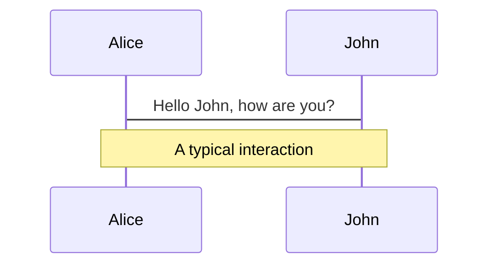

---
# You can also start simply with 'default'
theme: default
# random image from a curated Unsplash collection by Anthony
# like them? see https://unsplash.com/collections/94734566/slidev
background: pexels-spacex-586019.jpg
# some information about your slides (markdown enabled)
title: "Git Best Practices"
info: "Git best practices for GitHub and Azure DevOps"
# apply unocss classes to the current slide
class: text-left
# https://sli.dev/features/drawing
drawings:
  persist: false
# slide transition: https://sli.dev/guide/animations.html#slide-transitions
transition: fade-out
# enable MDC Syntax: https://sli.dev/features/mdc
mdc: true
---

# Git Best Practices
## For GitHub and Azure DevOps

<!--
Comprehensive guide to Git best practices for modern development workflows
-->

---
transition: fade-out
---

# Why Git Best Practices Matter

- Maintain clean and readable project history for better collaboration
- Enable efficient code reviews and faster debugging
- Reduce merge conflicts and integration issues
- Facilitate easier rollbacks and hotfix deployments
- Support automated CI/CD pipelines and deployment strategies
- Improve team productivity and code quality

---
transition: fade-out
---

# Repository Setup & Configuration

  

    <h3 class="text-lg font-bold mb-4">Initial Setup</h3>
    

      

        git config user.name "Your Name" 
        git config user.email "your@email.com"
      

    

    <h3 class="text-lg font-bold mb-4 mt-6">Essential .gitignore</h3>
    

        

          # Common files to ignore 
          node_modules/ 
          .env 
          dist/ 
          *.log 
          .DS_Store 
          .venv/
        

        <h4 class="text-sm font-bold mt-3 mb-2">Useful Resources:</h4>
        <ul class="text-xs space-y-1">
          <li><a href="https://github.com/github/gitignore/blob/main/Python.gitignore" target="_blank" class="text-blue-600 hover:text-blue-800 underline">Python .gitignore template</a></li>
          <li><a href="https://www.toptal.com/developers/gitignore" target="_blank" class="text-blue-600 hover:text-blue-800 underline">gitignore.io generator</a></li>
        </ul>
    

  

  
  

    <h3 class="text-lg font-bold mb-4">Sample Repository Structure</h3>
    

      
📄 <strong>README.md</strong> - Project overview and setup

      
📄 <strong>CONTRIBUTING.md</strong> - Contribution guidelines

      
📁 <strong>.github/</strong> - GitHub templates and workflows

      
📁 <strong>.git/</strong> - Git configuration and hooks

      
📁 <strong>docs/</strong> - Documentation

      
📁 <strong>scripts/</strong> - Build and deployment scripts

    

    <h3 class="text-lg font-bold mb-4 mt-6">Branch Protection</h3>
    

      
✅ Require pull request reviews

      
✅ Require status checks to pass

      
✅ Restrict pushes to main branch

      
✅ Include administrators in restrictions

    

  

---
transition: fade-out
---

# Branching Strategies

  

    <h3 class="font-bold text-blue-600 mb-3">🌊 Git Flow</h3>
    

      
<strong>main:</strong> Production releases

      
<strong>develop:</strong> Integration branch

      
<strong>feature/*:</strong> New features

      
<strong>release/*:</strong> Release preparation

      
<strong>hotfix/*:</strong> Critical fixes

    

    

      <strong>Best for:</strong> Complex projects with scheduled releases
    

  

  

    <h3 class="font-bold text-green-600 mb-3">🚀 GitHub Flow</h3>
    

      
<strong>main:</strong> Always deployable

      
<strong>feature/*:</strong> All development

      
<strong>Process:</strong>

      
1. Create branch from main

      
2. Develop & commit

      
3. Open pull request

      
4. Review & merge

    

    

      <strong>Best for:</strong> Continuous deployment, web apps
    

  

  

    <h3 class="font-bold text-purple-600 mb-3">🔄 GitLab Flow</h3>
    

      
<strong>main:</strong> Development

      
<strong>production:</strong> Live environment

      
<strong>staging:</strong> Testing environment

      
<strong>feature/*:</strong> Feature development

    

    

      <strong>Best for:</strong> Multiple environments, staged deployments
    

  

  <h3 class="font-bold text-yellow-600 mb-2">💡 Branch Naming Conventions</h3>
  

    

      
feature/user-authentication

      
bugfix/login-validation-error

      
hotfix/security-patch-2024

    

    

      
release/v2.1.0

      
chore/update-dependencies

      
docs/api-documentation

    

  

---
transition: fade-out
---

# Commit Message Best Practices

  

    <h3 class="text-lg font-bold mb-4">Conventional Commits</h3>
    

      

        &lt;type&gt;[optional scope]: &lt;description&gt;  
        [optional body]  
        [optional footer(s)]
      

    

    <h3 class="text-lg font-bold mb-4 mt-6">Commit Types</h3>
    

      
<strong>feat:</strong> New feature

      
<strong>fix:</strong> Bug fix

      
<strong>docs:</strong> Documentation changes

      
<strong>style:</strong> Code formatting

      
<strong>refactor:</strong> Code restructuring

      
<strong>test:</strong> Adding tests

      
<strong>chore:</strong> Maintenance tasks

    

  

  
  

    <h3 class="text-lg font-bold mb-4">Good Examples</h3>
    

      

        feat(auth): add OAuth 2.0 integration  
        - Implement Google OAuth provider 
        - Add user session management 
        - Update login UI components  
        Closes #123
      

      

        fix(api): resolve timeout in user endpoint  
        Increase timeout from 5s to 30s for large datasets
      

    

    <h3 class="text-lg font-bold mb-4 mt-6">Bad Examples</h3>
    

      

        ❌ update stuff 
        ❌ fix bug 
        ❌ WIP 
        ❌ final version
      

    

  

---
transition: fade-out
---

# GitHub Best Practices

  

    <h3 class="text-lg font-bold mb-4">Pull Request Workflow</h3>
    

      

        # Create feature branch 
        git checkout -b feature/new-dashboard  
        # Make changes and commit 
        git add . 
        git commit -m "feat: add user dashboard"  
        # Push and create PR 
        git push origin feature/new-dashboard
      

    

    <h3 class="text-lg font-bold mb-4 mt-6">PR Templates</h3>
    

      

        ## Description 
        Brief description of changes  
        ## Type of Change 
        - [ ] Bug fix 
        - [ ] New feature 
        - [ ] Breaking change  
        ## Testing 
        - [ ] Unit tests pass 
        - [ ] Integration tests pass
      

    

  

  
  

    <h3 class="text-lg font-bold mb-4">GitHub Actions Example</h3>
    

      

        name: CI/CD Pipeline  
        on: 
        &nbsp;&nbsp;pull_request: 
        &nbsp;&nbsp;&nbsp;&nbsp;branches: [ main ] 
        &nbsp;&nbsp;push: 
        &nbsp;&nbsp;&nbsp;&nbsp;branches: [ main ]  
        jobs: 
        &nbsp;&nbsp;test: 
        &nbsp;&nbsp;&nbsp;&nbsp;runs-on: ubuntu-latest 
        &nbsp;&nbsp;&nbsp;&nbsp;steps: 
        &nbsp;&nbsp;&nbsp;&nbsp;- uses: actions/checkout@v3 
        &nbsp;&nbsp;&nbsp;&nbsp;- name: Run tests 
        &nbsp;&nbsp;&nbsp;&nbsp;&nbsp;&nbsp;run: npm test
      

    

    <h3 class="text-lg font-bold mb-4 mt-6">Issue Templates</h3>
    

      
🐛 <strong>Bug Report Template</strong>

      
✨ <strong>Feature Request Template</strong>

      
❓ <strong>Question Template</strong>

      
🔧 <strong>Task Template</strong>

    

  

---
transition: fade-out
---

# Azure DevOps Best Practices

  

    <h3 class="text-lg font-bold mb-4">Azure Repos Setup</h3>
    

      

        # Clone Azure DevOps repo 
        git clone https://dev.azure.com/org/project/_git/repo  
        # Set up remote tracking 
        git remote add origin https://dev.azure.com/org/project/_git/repo  
        # Configure for Azure DevOps 
        git config credential.helper manager-core
      

    

    

    <h3 class="text-lg font-bold mb-4 mt-6">Branch Policies</h3>
      
✅ Require minimum 2 reviewers

      
✅ Check for linked work items

      
✅ Require build validation

      
✅ Auto-complete after requirements met

      
✅ Squash merge for clean history

    

  

  
  

    <h3 class="text-lg font-bold mb-4">Azure Pipelines YAML</h3>
    

      

        trigger: 
        - main 
        - develop  
        pr: 
        - main  
        pool: 
        &nbsp;&nbsp;vmImage: 'ubuntu-latest'  
        steps: 
        - task: NodeTool@0 
        &nbsp;&nbsp;inputs: 
        &nbsp;&nbsp;&nbsp;&nbsp;versionSpec: '18.x'  
        - script: npm ci 
        &nbsp;&nbsp;displayName: 'Install dependencies'  
        - script: npm test 
        &nbsp;&nbsp;displayName: 'Run tests'
      

    

    <h3 class="text-lg font-bold mb-4 mt-6">Work Item Integration</h3>
    

      
🔗 Link commits to work items

      
📋 Reference work items in PR descriptions

      
🎯 Use AB# prefix for automatic linking

      
✅ Close work items via commits

    

  

---
transition: fade-out
---

# Code Review Best Practices

  

    <h3 class="text-lg font-bold mb-4">Before Submitting PR</h3>
    

      
✅ <strong>Self-review your code</strong>

      
✅ <strong>Run tests locally</strong>

      
✅ <strong>Update documentation</strong>

      
✅ <strong>Add meaningful commit messages</strong>

      
✅ <strong>Keep PRs small and focused</strong>

      
✅ <strong>Include screenshots for UI changes</strong>

    

    <h3 class="text-lg font-bold mb-4 mt-6">PR Description Template</h3>
    

      

        ## What changed? 
        Brief summary of the changes  
        ## Why? 
        Explain the motivation  
        ## How to test? 
        Step-by-step testing instructions  
        ## Screenshots 
        Before/after images if applicable
      

    

  

  
  

    <h3 class="text-lg font-bold mb-4">During Code Review</h3>
    

      
👀 <strong>Review logic and architecture</strong>

      
🔍 <strong>Check for security vulnerabilities</strong>

      
📝 <strong>Verify code readability</strong>

      
⚡ <strong>Assess performance impact</strong>

      
🧪 <strong>Ensure adequate test coverage</strong>

      
📚 <strong>Validate documentation updates</strong>

    

    <h3 class="text-lg font-bold mb-4 mt-6">Review Comments</h3>
    

      

        
✅ Good:

        
"Consider using a Map here for O(1) lookup instead of Array.find() for better performance"

      

      

        
❌ Bad:

        
"This is wrong"

      

    

  

---
transition: fade-out
---

# Advanced Git Techniques

  

    <h3 class="text-lg font-bold mb-4">Interactive Rebase</h3>
    

      

        # Clean up commit history 
        git rebase -i HEAD~3  
        # Options: 
        # pick - keep commit 
        # squash - combine with previous 
        # edit - modify commit 
        # drop - remove commit
      

    

    <h3 class="text-lg font-bold mb-4 mt-6">Git Hooks</h3>
    

      

        # .git/hooks/pre-commit 
        #!/bin/sh 
        npm run lint 
        npm run test  
        # .git/hooks/commit-msg 
        #!/bin/sh 
        # Validate commit message format 
        npx commitlint --edit $1
      

    

  

  
  

    <h3 class="text-lg font-bold mb-4">Cherry-picking</h3>
    

      

        # Apply specific commit to current branch 
        git cherry-pick &lt;commit-hash&gt;  
        # Apply multiple commits 
        git cherry-pick A..B  
        # Cherry-pick without committing 
        git cherry-pick --no-commit &lt;hash&gt;
      

    

    <h3 class="text-lg font-bold mb-4 mt-6">Bisect for Debugging</h3>
    

      

        # Start bisect session 
        git bisect start 
        git bisect bad HEAD 
        git bisect good &lt;known-good-commit&gt;  
        # Git will checkout middle commit 
        # Test and mark as good/bad 
        git bisect good  # or git bisect bad  
        # Finish when bug is found 
        git bisect reset
      

    

  

---
transition: fade-out
---

# Security & Compliance

  

    <h3 class="text-lg font-bold mb-4">Secure Practices</h3>
    

      
🔐 <strong>Never commit secrets</strong>

      
🎯 <strong>Use .gitignore for sensitive files</strong>

      
🔑 <strong>Use SSH keys or Personal Access Tokens</strong>

      
🛡️ <strong>Enable 2FA on all accounts</strong>

      
🔍 <strong>Scan for secrets in commits</strong>

      
📝 <strong>Sign commits with GPG</strong>

    

    <h3 class="text-lg font-bold mb-4 mt-6">Secret Scanning</h3>
    

      

        # Install git-secrets 
        brew install git-secrets  
        # Set up for repository 
        git secrets --install 
        git secrets --register-aws  
        # Scan commits 
        git secrets --scan
      

    

  

  
  

    <h3 class="text-lg font-bold mb-4">Compliance & Audit</h3>
    

      
📊 <strong>Enable audit logging</strong>

      
👥 <strong>Track contributor activity</strong>

      
🔒 <strong>Enforce branch protection rules</strong>

      
📋 <strong>Maintain compliance documentation</strong>

      
🔄 <strong>Regular access reviews</strong>

      
📈 <strong>Monitor repository metrics</strong>

    

    <h3 class="text-lg font-bold mb-4 mt-6">GitHub Security Features</h3>
    

      
🔍 <strong>Dependabot alerts</strong>

      
🛡️ <strong>Security advisories</strong>

      
🔐 <strong>Secret scanning</strong>

      
📝 <strong>Code scanning with CodeQL</strong>

      
🎯 <strong>Dependency review</strong>

    

    <h3 class="text-lg font-bold mb-4 mt-6">Azure DevOps Security</h3>
    

      
🔑 <strong>Azure AD integration</strong>

      
🛡️ <strong>Conditional access policies</strong>

      
📊 <strong>Audit trail and reporting</strong>

    

  

---
transition: fade-out
---

# Release Management

  

    <h3 class="text-lg font-bold mb-4">Semantic Versioning</h3>
    

      

        
MAJOR.MINOR.PATCH

        
2.1.3

      

      
🔴 <strong>MAJOR:</strong> Breaking changes

      
🟡 <strong>MINOR:</strong> New features (backward compatible)

      
🟢 <strong>PATCH:</strong> Bug fixes

    

    <h3 class="text-lg font-bold mb-4 mt-6">Git Tags</h3>
    

      

        # Create annotated tag 
        git tag -a v2.1.0 -m "Release version 2.1.0"  
        # Push tags to remote 
        git push origin --tags  
        # List tags 
        git tag -l
      

    

  

  
  

    <h3 class="text-lg font-bold mb-4">GitHub Releases</h3>
    

      

        # Using GitHub CLI 
        gh release create v2.1.0 \ 
        &nbsp;&nbsp;--title "Version 2.1.0" \ 
        &nbsp;&nbsp;--notes "## What's New 
        &nbsp;&nbsp;- Feature A 
        &nbsp;&nbsp;- Bug fix B" \ 
        &nbsp;&nbsp;dist/*
      

    

    <h3 class="text-lg font-bold mb-4 mt-6">Azure DevOps Releases</h3>
    

      
🚀 <strong>Release pipelines</strong>

      
🎯 <strong>Multi-stage deployments</strong>

      
✅ <strong>Approval gates</strong>

      
📋 <strong>Release notes automation</strong>

      
🔄 <strong>Rollback strategies</strong>

    

    <h3 class="text-lg font-bold mb-4 mt-6">Changelog Automation</h3>
    

      

        # Generate changelog 
        npx conventional-changelog-cli -p angular -i CHANGELOG.md -s  
        # With release automation 
        npx semantic-release
      

    

  

---
transition: fade-out
---

# Common Git Problems & Solutions

  

    <h3 class="text-lg font-bold mb-4">Merge Conflicts</h3>
    

      

        # When merge conflict occurs 
        git status  # See conflicted files  
        # Edit files to resolve conflicts 
        # Look for &lt;&lt;&lt;&lt;&lt;&lt;&lt; markers  
        # After resolving 
        git add . 
        git commit -m "resolve merge conflicts"
      

    

    <h3 class="text-lg font-bold mb-4 mt-6">Undo Changes</h3>
    

      

        # Undo last commit (keep changes) 
        git reset --soft HEAD~1  
        # Undo last commit (discard changes) 
        git reset --hard HEAD~1  
        # Undo specific file 
        git checkout -- filename.js
      

    

  

  
  

    <h3 class="text-lg font-bold mb-4">Large File Issues</h3>
    

      

        # Install Git LFS 
        git lfs install  
        # Track large files 
        git lfs track "*.psd" 
        git lfs track "*.zip"  
        # Commit .gitattributes 
        git add .gitattributes 
        git commit -m "track large files with LFS"
      

    

    <h3 class="text-lg font-bold mb-4 mt-6">Repository Cleanup</h3>
    

      

        # Remove file from history 
        git filter-branch --force --index-filter \ 
        'git rm --cached --ignore-unmatch secrets.env' \ 
        --prune-empty --tag-name-filter cat -- --all  
        # Alternative with BFG 
        java -jar bfg.jar --delete-files secrets.env 
        git reflog expire --expire=now --all 
        git gc --prune=now --aggressive
      

    

  

---
transition: fade-out
---

# Performance & Optimization

  

    <h3 class="text-lg font-bold mb-4">Repository Performance</h3>
    

      
📦 <strong>Keep repository size manageable</strong>

      
🗂️ <strong>Use Git LFS for large files</strong>

      
🧹 <strong>Regular garbage collection</strong>

      
📈 <strong>Monitor repository metrics</strong>

      
🔍 <strong>Analyze repository with git-sizer</strong>

    

    <h3 class="text-lg font-bold mb-4 mt-6">Git Configuration</h3>
    

      

        # Optimize for performance 
        git config core.preloadindex true 
        git config core.fscache true 
        git config gc.auto 256  
        # Enable parallel processing 
        git config pack.threads 0  
        # Use SSH multiplexing 
        git config core.sshCommand "ssh -o ControlMaster=auto -o ControlPersist=600s"
      

    

  

  
  

    <h3 class="text-lg font-bold mb-4">Workflow Optimization</h3>
    

      
⚡ <strong>Use shallow clones for CI</strong>

      
🎯 <strong>Optimize pipeline triggers</strong>

      
📦 <strong>Cache dependencies</strong>

      
🔄 <strong>Parallel job execution</strong>

      
📊 <strong>Monitor build performance</strong>

    

    <h3 class="text-lg font-bold mb-4 mt-6">CI/CD Optimization</h3>
    

      

        # GitHub Actions optimization 
        - uses: actions/checkout@v3 
        &nbsp;&nbsp;with: 
        &nbsp;&nbsp;&nbsp;&nbsp;fetch-depth: 1  # Shallow clone  
        # Cache node modules 
        - uses: actions/cache@v3 
        &nbsp;&nbsp;with: 
        &nbsp;&nbsp;&nbsp;&nbsp;path: ~/.npm 
        &nbsp;&nbsp;&nbsp;&nbsp;key: ${{ runner.os }}-node-${{ hashFiles('**/package-lock.json') }}
      

    

    <h3 class="text-lg font-bold mb-4 mt-6">Monitoring</h3>
    

      
📈 <strong>Track repository size growth</strong>

      
⏱️ <strong>Monitor clone/fetch times</strong>

      
🔍 <strong>Analyze commit patterns</strong>

    

  

---
transition: fade-out
---

# Team Collaboration Best Practices

  

    <h3 class="text-lg font-bold mb-4">Team Workflows</h3>
    

      
📋 <strong>Establish clear Git workflows</strong>

      
📝 <strong>Document branching strategy</strong>

      
👥 <strong>Define code review process</strong>

      
🎯 <strong>Set merge/PR requirements</strong>

      
📊 <strong>Regular retrospectives</strong>

      
🔄 <strong>Continuous improvement</strong>

    

    <h3 class="text-lg font-bold mb-4 mt-6">Communication</h3>
    

      
💬 <strong>Clear PR descriptions</strong>

      
🏷️ <strong>Meaningful commit messages</strong>

      
📋 <strong>Link to issue tracking</strong>

      
📚 <strong>Update documentation</strong>

      
🔔 <strong>Timely PR reviews</strong>

      
❓ <strong>Ask questions when unclear</strong>

    

  

  
  

    <h3 class="text-lg font-bold mb-4">Onboarding New Developers</h3>
    

      
📖 <strong>Git workflow documentation</strong>

      
🛠️ <strong>Setup scripts and guides</strong>

      
👨‍🏫 <strong>Pair programming sessions</strong>

      
📝 <strong>Code review training</strong>

      
🎯 <strong>Practice repositories</strong>

    

    <h3 class="text-lg font-bold mb-4 mt-6">Knowledge Sharing</h3>
    

      
📚 <strong>Maintain team wiki</strong>

      
🎤 <strong>Regular tech talks</strong>

      
💡 <strong>Share Git tips & tricks</strong>

      
🏆 <strong>Celebrate good practices</strong>

      
🔍 <strong>Code review feedback</strong>

    

    <h3 class="text-lg font-bold mb-4 mt-6">Quality Gates</h3>
    

      

        
✅ All tests pass

        
✅ Code coverage threshold met

        
✅ Security scans pass

        
✅ Performance benchmarks

        
✅ Documentation updated

      

    

  

---
transition: fade-out
layout: center
class: text-center
---

# Thank You!

## Questions & Discussion

<h3 class="text-lg font-bold">Key Takeaways</h3>
<ul class="mt-4 text-sm list-none">
  <li>🌊 Choose the right branching strategy for your team and project</li>
  <li>📝 Write clear, conventional commit messages for better history</li>
  <li>🔍 Implement thorough code review processes</li>
  <li>🛡️ Prioritize security and compliance in your Git workflows</li>
  <li>⚡ Optimize performance for large repositories and teams</li>
  <li>👥 Foster collaboration through clear documentation and communication</li>
</ul>

📚 Additional Resources:

• Pro Git Book (git-scm.com/book)

• GitHub Docs & Azure DevOps Documentation

• Conventional Commits (conventionalcommits.org)

