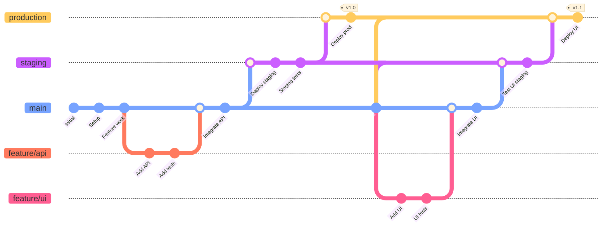
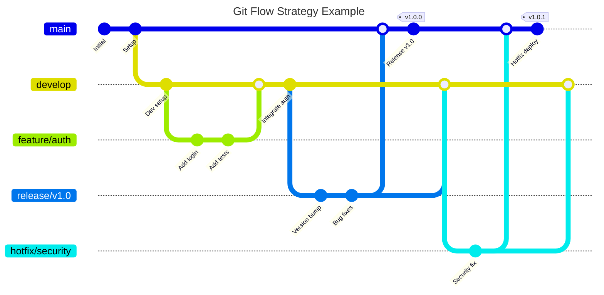

---
# You can also start simply with 'default'
theme: default
# random image from a curated Unsplash collection by Anthony
# like them? see https://unsplash.com/collections/94734566/slidev
background: pexels-spacex-586019.jpg
# some information about your slides (markdown enabled)
title: "Git Best Practices"
info: "Git best practices for GitHub and Azure DevOps"
# apply unocss classes to the current slide
class: text-left
# https://sli.dev/features/drawing
drawings:
  persist: false
# slide transition: https://sli.dev/guide/animations.html#slide-transitions
transition: fade-out
# enable MDC Syntax: https://sli.dev/features/mdc
mdc: true
---

# Git Best Practices
## For GitHub and Azure DevOps

<!--
Comprehensive guide to Git best practices for modern development workflows
-->

---
transition: fade-out
---

# What is Git?

<div class="grid grid-cols-2 gap-8">
  <div>
    <h3 class="text-lg font-bold mb-4"><span class="text-highlight">Distributed Version Control</span></h3>
    <div class="text-sm space-y-2">
      <div>📁 <strong>Track changes</strong> in files over time</div>
      <div>🔄 <strong>Collaborate</strong> with multiple developers</div>
      <div>🌍 <strong>Distributed</strong> - every clone is a full backup</div>
      <div>⚡ <strong>Fast</strong> - most operations are local</div>
      <div>🔒 <strong>Integrity</strong> - everything is checksummed</div>
    </div>
    <h3 class="text-lg font-bold mb-4 mt-6"><span class="text-highlight">Key Concepts</span></h3>
    <div class="text-sm space-y-2">
      <div>📦 <strong>Repository:</strong> Project directory with Git tracking</div>
      <div>📸 <strong>commit id:</strong> Snapshot of your code at a point in time</div>
      <div>🌿 <strong>Branch:</strong> Independent line of development</div>
      <div>🔗 <strong>Merge:</strong> Combining changes from different branches</div>
      <div>🏷️ <strong>Tag:</strong> Marking specific commits (releases)</div>
    </div>
  </div>
  
  <div>
    <div class="flex justify-center">
      
    </div>
    <a href=https://nvie.com/posts/a-successful-git-branching-model target=_blank class="text-blue-600 hover:text-blue-800 underline">
    https://nvie.com/posts/a-successful-git-branching-model/
    </a>
  </div>
</div>

<style>
.text-highlight {
  background-color: #2B90B6;
  background-size: 100%;
  font-weight: bold;
  -webkit-background-clip: text;
  -moz-background-clip: text;
  -webkit-text-fill-color: transparent;
  -moz-text-fill-color: transparent;
}
</style>


---
transition: fade-out
---

# Why Git Best Practices Matter

<div class="absolute top-1/2 transform -translate-y-1/2">

- <span class="text-highlight">Maintain clean and readable project history</span> for better collaboration
- <span class="text-highlight">Enable efficient code reviews</span> and faster debugging
- <span class="text-highlight">Reduce merge conflicts</span> and integration issues
- <span class="text-highlight">Facilitate easier rollbacks</span> and hotfix deployments
- <span class="text-highlight">Support automated CI/CD pipelines</span> and deployment strategies
- <span class="text-highlight">Improve team productivity</span> and code quality

</div>

<style>
.text-highlight {
  background-color: #2B90B6;
  background-size: 100%;
  font-weight: bold;
  -webkit-background-clip: text;
  -moz-background-clip: text;
  -webkit-text-fill-color: transparent;
  -moz-text-fill-color: transparent;
}
</style>

---
transition: fade-out
---

# Git Setup & Configuration

<div class="grid grid-cols-2 gap-8">
  <div>
    <h3 class="text-lg font-bold mb-4"><span class="text-highlight">Authentication</span></h3>
    <div class="text-sm space-y-2">
      Choose 1:
      <ul>
        <li>Set up SSH keys for <a href="https://learn.microsoft.com/en-us/azure/devops/repos/git/use-ssh-keys-to-authenticate" target="_blank" class="text-blue-600 hover:text-blue-800 underline">Azure DevOps</a> / <a href="https://docs.github.com/en/authentication/connecting-to-github-with-ssh/adding-a-new-ssh-key-to-your-github-account" target="_blank" class="text-blue-600 hover:text-blue-800 underline">GitHub</a> (use <b>git bash</b> terminal on Windows)</li>
        <li>Use <a href="https://github.com/git-ecosystem/git-credential-manager" target="_blank" class="text-blue-600 hover:text-blue-800 underline">Git Credential Manager</a></li>
      </ul>
    </div>
    <p></p>
    <h3 class="text-lg font-bold mb-4"><span class="text-highlight">Sample Repository Structure</span></h3>
    <div class="text-sm space-y-1">
      <div>📄 <strong>README.md</strong> - Project overview and setup</div>
      <div>📄 <strong>.gitignore</strong> - Files and directories to ignore</div>
      <div>📁 <strong>.github/</strong> - GitHub templates and workflows</div>
      <div>📁 <strong>.git/</strong> - Git configuration and hooks</div>
      <div>📁 <strong>docs/</strong> - Documentation</div>
      <div>📁 <strong>scripts/</strong> - Build and deployment scripts</div>
    </div>
  </div>
  
  <div>
    <h3 class="text-lg font-bold mb-4"><span class="text-highlight">Initial git Setup</span></h3>
    <div class="text-sm space-y-2">
      <div class="bg-gray-100 p-2 rounded font-mono">
        git config user.name "Your Name"<br>
        git config user.email "your@email.com"
      </div>
      <b>
      Check your setup:
      </b>
      <div class="bg-gray-100 p-2 rounded font-mono">
        cat .git/config
      </div>
    </div>
    <p></p>
    <h3 class="text-lg font-bold mb-4"><span class="text-highlight">Essential .gitignore</span></h3>
        <div class="bg-gray-100 p-2 rounded font-mono text-xs">
          # Common files to ignore<br>
          node_modules/<br>
          .env<br>
          dist/<br>
          *.log<br>
          .DS_Store<br>
          .venv/
        </div>
        <b>Useful Resources:</b>
        <ul class="text-xs space-y-1">
          <li><a href="https://github.com/github/gitignore/blob/main/Python.gitignore" target="_blank" class="text-blue-600 hover:text-blue-800 underline">Python .gitignore template</a></li>
          <li><a href="https://www.toptal.com/developers/gitignore" target="_blank" class="text-blue-600 hover:text-blue-800 underline">gitignore.io generator</a></li>
        </ul>
  </div>
</div>

<style>
.text-highlight {
  background-color: #2B90B6;
  background-size: 100%;
  font-weight: bold;
  -webkit-background-clip: text;
  -moz-background-clip: text;
  -webkit-text-fill-color: transparent;
  -moz-text-fill-color: transparent;
}
</style>

---
transition: fade-out
---

# Repository Configuration

<div class="grid grid-cols-2 gap-8">
  <div>
    <h3 class="text-lg font-bold mb-4"><span class="text-highlight">Branch Protection Rules</span></h3>
    <div class="text-sm space-y-2">
      <div>🛡️ <strong>Require pull request reviews</strong></div>
      <div>✅ <strong>Require status checks</strong></div>
      <div>🚫 <strong>Restrict pushes to main</strong> </div>
      <div>🔄 <strong>Require up-to-date branches</strong></div>
      <div>👑 <strong>Include administrators</strong></div>
    </div>
    <h3 class="text-lg font-bold mb-4 mt-4"><span class="text-highlight">CI/CD setup & Contributor Helpers</span></h3>
    <div class="text-sm space-y-2">
        <div>🔗 <strong>Pre-commit hooks:</strong> git hooks, husky</div>
        <div>🚀 <strong>Post-commit workflows:</strong> GitHub Actions, Azure Pipelines, Jenkins, GitKraken</div>
        <div>📊 <strong>Quality gates:</strong> Github actions summary, Azure Devops Test Plan, Sonarqube</div>
        <div>🎯 <strong>Integrations:</strong> Slack integration, LLM integration (review, config), Jira integration</div>
        <div>📄 <strong>Templates:</strong> PR templates, issue templates, commit templates</div>
    </div>
  </div>
  <div>
    <h3 class="text-lg font-bold mb-4"><span class="text-highlight">Secrets Management</span></h3>
    <div class="text-sm space-y-2">
      <div>🔐 <strong>Repository secrets for CI/CD</strong></div>
      <div>🌍 <strong>Environment-specific secrets</strong></div>
      <div>🔄 <strong>Automatic secret rotation</strong></div>
      <div>🎯 <strong>Least privilege access</strong></div>
    </div>
  <!-- <h3 class="text-lg font-bold mb-4"><span class="text-highlight">CI/CD Pipeline Visualization</span></h3> -->
  <div class="flex justify-center mt-8">
    
  </div>
  </div>
</div>

<style>
.text-highlight {
  background-color: #2B90B6;
  background-size: 100%;
  font-weight: bold;
  -webkit-background-clip: text;
  -moz-background-clip: text;
  -webkit-text-fill-color: transparent;
  -moz-text-fill-color: transparent;
}
</style>

---
transition: fade-out
layout: none
---

<!-- # Pre-commit Hooks vs Post-commit Workflows -->

<div class="grid grid-cols-1 gap-8 p-8">
  <div class="overflow-x-auto">
    <table class="w-full text-sm border-collapse border border-gray-300">
      <thead>
        <tr class="bg-gray-100">
          <th class="border border-gray-300 p-3 text-left font-bold">Aspect</th>
          <th class="border border-gray-300 p-3 text-left font-bold text-blue-600">Pre-commit Hooks</th>
          <th class="border border-gray-300 p-3 text-left font-bold text-green-600">Post-commit Workflows</th>
        </tr>
      </thead>
      <tbody>
        <tr>
          <td class="border border-gray-300 p-3 font-semibold">⏱️ Timing</td>
          <td class="border border-gray-300 p-3">Run before commit is created</td>
          <td class="border border-gray-300 p-3">Run after commit/push to remote</td>
        </tr>
        <tr class="bg-gray-50">
          <td class="border border-gray-300 p-3 font-semibold">🚫 Prevention</td>
          <td class="border border-gray-300 p-3">✅ Prevents bad commits entirely</td>
          <td class="border border-gray-300 p-3">❌ Cannot prevent commits, only detect issues</td>
        </tr>
        <tr>
          <td class="border border-gray-300 p-3 font-semibold">⚡ Speed</td>
          <td class="border border-gray-300 p-3">✅ Fast feedback (seconds)</td>
          <td class="border border-gray-300 p-3">❌ Slower feedback (minutes)</td>
        </tr>
        <tr class="bg-gray-50">
          <td class="border border-gray-300 p-3 font-semibold">💻 Environment</td>
          <td class="border border-gray-300 p-3">❌ Limited to developer's machine</td>
          <td class="border border-gray-300 p-3">✅ Consistent CI/CD environment</td>
        </tr>
        <tr>
          <td class="border border-gray-300 p-3 font-semibold">🔧 Setup</td>
          <td class="border border-gray-300 p-3">❌ Must be installed on each dev machine</td>
          <td class="border border-gray-300 p-3">✅ Centrally managed and maintained</td>
        </tr>
        <tr class="bg-gray-50">
          <td class="border border-gray-300 p-3 font-semibold">🛠️ Complexity</td>
          <td class="border border-gray-300 p-3">✅ Simple checks (linting, formatting)</td>
          <td class="border border-gray-300 p-3">✅ Complex workflows (build, test, deploy)</td>
        </tr>
        <tr>
          <td class="border border-gray-300 p-3 font-semibold">👥 Enforcement</td>
          <td class="border border-gray-300 p-3">❌ Can be bypassed with --no-verify</td>
          <td class="border border-gray-300 p-3">✅ Enforced through branch protection</td>
        </tr>
        <tr class="bg-gray-50">
          <td class="border border-gray-300 p-3 font-semibold">📊 Reporting</td>
          <td class="border border-gray-300 p-3">❌ Limited reporting capabilities</td>
          <td class="border border-gray-300 p-3">✅ Rich reporting and notifications</td>
        </tr>
        <tr>
          <td class="border border-gray-300 p-3 font-semibold">🔄 Maintenance</td>
          <td class="border border-gray-300 p-3">❌ Hard to update across team</td>
          <td class="border border-gray-300 p-3">✅ Easy to update centrally</td>
        </tr>
        <tr class="bg-gray-50">
          <td class="border border-gray-300 p-3 font-semibold">💰 Cost</td>
          <td class="border border-gray-300 p-3">✅ No additional infrastructure</td>
          <td class="border border-gray-300 p-3">❌ Requires CI/CD infrastructure</td>
        </tr>
      </tbody>
    </table>
  </div>
</div>

---
transition: fade-out
layout: none
---

<!-- # cont... -->

<div class="grid grid-cols-2 gap-8 p-4">
  <div>
    <h3 class="text-lg font-bold mb-4"><span class="text-highlight">Best Use Cases</span></h3>
    <div class="bg-blue-50 p-4 rounded-lg mb-4">
      <h4 class="font-bold text-blue-600 mb-3">🔧 Pre-commit Hooks</h4>
      <div class="text-sm space-y-2">
        <div>• Code formatting (Prettier, Black)</div>
        <div>• Linting (ESLint, pylint)</div>
        <div>• Simple security checks</div>
        <!-- <div>• Commit message validation</div> -->
        <!-- <div>• File size restrictions</div> -->
        <!-- <div>• Merge conflict detection</div> -->
      </div>
    </div>
    <div class="bg-green-50 p-4 rounded-lg">
      <h4 class="font-bold text-green-600 mb-3">🚀 Post-commit Workflows</h4>
      <div class="text-sm space-y-2">
        <div>• Comprehensive test suites</div>
        <div>• Build and compilation</div>
        <div>• Security scanning</div>
        <div>• Performance testing</div>
        <div>• Automated review</div>
        <div>• Deployment processes</div>
        <div>• Integration testing</div>
      </div>
    </div>
  </div>
  
  <div>
    <h3 class="text-lg font-bold mb-4"><span class="text-highlight">Hybrid Approach</span></h3>
    <div class="bg-yellow-50 p-4 rounded-lg">
      <h4 class="font-bold text-yellow-600 mb-3">🎯 Recommended Strategy</h4>
      <div class="text-sm space-y-3">
        <div>
          <strong>Pre-commit id:</strong> Fast quality checks
          <div class="font-mono text-xs bg-gray-100 p-2 rounded mt-1">
            - Formatting (< 5s)<br>
            - Linting (< 10s)<br>
            - Basic security checks
          </div>
        </div>
        <div>
          <strong>Post-commit id:</strong> Comprehensive validation
          <div class="font-mono text-xs bg-gray-100 p-2 rounded mt-1">
            - Full test suite<br>
            - Build verification<br>
            - Security scanning<br>
            - Automated peer reviews (using bots, LLMs)<br>
            - Deployment pipeline
          </div>
        </div>
      </div>
    </div>
    <div class="bg-purple-50 p-4 rounded-lg mt-4">
      <h4 class="font-bold text-purple-600 mb-3">💡 Implementation Tips</h4>
      <div class="text-sm space-y-2">
        <div>• Make pre-commit hooks fast (< 30 seconds)</div>
        <div>• Provide easy bypass for emergencies</div>
        <div>• Ensure post-commit workflows are reliable</div>
      </div>
    </div>
  </div>
</div>

<style>
.text-highlight {
  background-color: #2B90B6;
  background-size: 100%;
  font-weight: bold;
  -webkit-background-clip: text;
  -moz-background-clip: text;
  -webkit-text-fill-color: transparent;
  -moz-text-fill-color: transparent;
}
</style>


---
transition: fade-out
---

# Git Branching Strategies

<div class="grid grid-cols-3 gap-6">
  <div class="bg-green-50 p-4 rounded-lg">
    <h3 class="font-bold text-green-600 mb-3">🚀 GitHub Flow</h3>
    <div class="text-sm space-y-1">
      <div>• Simple branch-per-feature</div>
      <div>• Continuous deployment</div>
      <div>• Fast iterations</div>
      <div>• Web applications</div>
    </div>
    <div class="mt-3 text-xs">
      <strong>Branches:</strong> main, feature/*
    </div>
  </div>

  <div class="bg-blue-50 p-4 rounded-lg">
    <h3 class="font-bold text-blue-600 mb-3">🌊 Git Flow</h3>
    <div class="text-sm space-y-1">
      <div>• Complex workflow with multiple branch types</div>
      <div>• Scheduled releases</div>
      <div>• Large teams</div>
      <div>• Enterprise projects</div>
    </div>
    <div class="mt-3 text-xs">
      <strong>Branches:</strong> main, develop, feature/*, release/*, hotfix/*
    </div>
  </div>

  <div class="bg-purple-50 p-4 rounded-lg">
    <h3 class="font-bold text-purple-600 mb-3">🔄 GitLab Flow</h3>
    <div class="text-sm space-y-1">
      <div>• Environment-based branches</div>
      <div>• Staged deployments</div>
      <div>• Quality gates</div>
      <div>• Production releases</div>
    </div>
    <div class="mt-3 text-xs">
      <strong>Branches:</strong> main, staging, production, feature/*
    </div>
  </div>
</div>

<div class="mt-8 bg-yellow-50 p-4 rounded-lg">
  <h3 class="font-bold text-yellow-600 mb-2">💡 Branch Naming Conventions</h3>
  <div class="grid grid-cols-2 gap-4 text-sm">
    <div>
      <div class="font-mono bg-gray-100 p-1 rounded">feature/user-authentication</div>
      <div class="font-mono bg-gray-100 p-1 rounded mt-1">bugfix/login-validation-error</div>
      <div class="font-mono bg-gray-100 p-1 rounded mt-1">hotfix/security-patch-2024</div>
    </div>
    <div>
      <div class="font-mono bg-gray-100 p-1 rounded">release/v2.1.0</div>
      <div class="font-mono bg-gray-100 p-1 rounded mt-1">chore/update-dependencies</div>
      <div class="font-mono bg-gray-100 p-1 rounded mt-1">docs/api-documentation</div>
    </div>
  </div>
</div>

<style>
.text-highlight {
  background-color: #2B90B6;
  background-size: 100%;
  font-weight: bold;
  -webkit-background-clip: text;
  -moz-background-clip: text;
  -webkit-text-fill-color: transparent;
  -moz-text-fill-color: transparent;
}
</style>

---
transition: fade-out
---

# GitHub Flow Strategy

<div class="grid grid-cols-2 gap-8">
  <div>
    <h3 class="text-lg font-bold mb-4"><span class="text-highlight">Simple Workflow</span></h3>
    <div class="text-sm space-y-2">
      <div><strong>main:</strong> Always deployable production code</div>
      <div><strong>feature/*:</strong> All development work</div>
    </div>
    <h3 class="text-lg font-bold mb-4 mt-6"><span class="text-highlight">Process Steps</span></h3>
    <div class="text-sm space-y-2">
      <div>1. <strong>Create branch</strong> from main</div>
      <div>2. <strong>Develop</strong> feature with commits</div>
      <div>3. <strong>Open pull request</strong> early</div>
      <div>4. <strong>Discuss & review</strong> code</div>
      <div>5. <strong>Deploy</strong> from branch for testing</div>
      <div>6. <strong>Merge</strong> to main after approval</div>
    </div>
    <!-- <h3 class="text-lg font-bold mb-4 mt-6"><span class="text-highlight">Workflow Commands</span></h3>
    <div class="text-sm space-y-2">
      <div class="bg-gray-100 p-2 rounded font-mono text-xs">
        # Create feature branch<br>
        git checkout main<br>
        git pull origin main<br>
        git checkout -b feature/new-api<br><br>
        # Develop and push<br>
        git add .<br>
        git commit -m "feat: add new API endpoint"<br>
        git push origin feature/new-api<br><br>
        # After PR approval<br>
        git checkout main<br>
        git pull origin main<br>
        git branch -d feature/new-api
      </div>
    </div> -->
  </div>
  
  <div>
    <div class="flex justify-center">
      
    </div>
  </div>
</div>

<style>
.text-highlight {
  background-color: #2B90B6;
  background-size: 100%;
  font-weight: bold;
  -webkit-background-clip: text;
  -moz-background-clip: text;
  -webkit-text-fill-color: transparent;
  -moz-text-fill-color: transparent;
}
</style>

---
transition: fade-out
---

# Git Flow Branching Strategy

<div class="grid grid-cols-2 gap-8">
  <div>
    <h3 class="text-lg font-bold mb-4"><span class="text-highlight">Branch Structure</span></h3>
    <div class="text-sm space-y-2">
      <div><strong>main:</strong> Production-ready releases only</div>
      <div><strong>develop:</strong> Integration branch for features</div>
      <div><strong>feature/*:</strong> Individual feature development</div>
      <div><strong>release/*:</strong> Release preparation and testing</div>
      <div><strong>hotfix/*:</strong> Critical production fixes</div>
    </div>
    <!-- <h3 class="text-lg font-bold mb-4 mt-6"><span class="text-highlight">Workflow Process</span></h3>
    <div class="text-sm space-y-2">
      <div>1. <strong>Create feature branch</strong> from develop</div>
      <div>2. <strong>Develop & commit</strong> changes</div>
      <div>3. <strong>Merge feature</strong> back to develop</div>
      <div>4. <strong>Create release branch</strong> from develop</div>
      <div>5. <strong>Test & fix</strong> in release branch</div>
      <div>6. <strong>Merge to main</strong> and tag release</div>
      <div>7. <strong>Merge back</strong> to develop</div>
    </div> -->
    <h3 class="text-lg font-bold mb-4 mt-6"><span class="text-highlight">Best For</span></h3>
      <div class="text-sm space-y-1">
      <div>✅ Large development teams</div>
      <div>✅ Scheduled releases</div>
      <div>✅ Complex feature development</div>
      <div>✅ Multiple environments</div>
      <div>✅ Enterprise applications</div>
      <div>❌ Continuous deployment</div>
      <div>❌ Simple projects</div>
    </div>
  </div>
  
  <div>
    <div class="flex justify-center mb-4">
      
        </div>
  </div>
</div>

<!-- <div class="mt-8 bg-blue-50 p-4 rounded-lg">
  <h3 class="font-bold text-blue-600 mb-3">🔧 Essential Git Flow Commands</h3>
  <div class="grid grid-cols-2 gap-4 text-sm">
    <div class="bg-gray-100 p-2 rounded font-mono text-xs">
      # Start new feature<br>
      git checkout develop<br>
      git checkout -b feature/user-dashboard<br><br>
      # Finish feature<br>
      git checkout develop<br>
      git merge feature/user-dashboard<br>
      git branch -d feature/user-dashboard
    </div>
    <div class="bg-gray-100 p-2 rounded font-mono text-xs">
      # Create release<br>
      git checkout -b release/v1.2.0 develop<br>
      # After testing & fixes<br>
      git checkout main<br>
      git merge release/v1.2.0<br>
      git tag -a v1.2.0 -m "Release v1.2.0"<br>
      git checkout develop<br>
      git merge release/v1.2.0
    </div>
  </div>
</div> -->

<style>
.text-highlight {
  background-color: #2B90B6;
  background-size: 100%;
  font-weight: bold;
  -webkit-background-clip: text;
  -moz-background-clip: text;
  -webkit-text-fill-color: transparent;
  -moz-text-fill-color: transparent;
}
</style>


---
transition: fade-out
---

# GitLab Flow Strategy

<div class="grid grid-cols-2 gap-8">
  <div>
    <h3 class="text-lg font-bold mb-4"><span class="text-highlight">Environment Branches</span></h3>
    <div class="text-sm space-y-2">
      <div><strong>main:</strong> Development integration</div>
      <div><strong>staging:</strong> Pre-production testing</div>
      <div><strong>production:</strong> Live environment</div>
      <div><strong>feature/*:</strong> Feature development</div>
    </div>
    <h3 class="text-lg font-bold mb-4 mt-6"><span class="text-highlight">Best For</span></h3>
    <div class="text-sm space-y-1">
      <div>✅ Multiple environments</div>
      <div>✅ Staged deployments</div>
      <div>✅ Enterprise applications</div>
      <div>✅ Quality gates</div>
      <div>✅ Compliance requirements</div>
      <div>❌ Simple continuous deployment</div>
      <div>❌ Small teams with single environment</div>
    </div>
    <!-- <h3 class="text-lg font-bold mb-4 mt-6"><span class="text-highlight">Deployment Flow</span></h3>
    <div class="text-sm space-y-2">
      <div>1. <strong>Develop</strong> in feature branches</div>
      <div>2. <strong>Merge</strong> to main after review</div>
      <div>3. <strong>Deploy</strong> main to staging</div>
      <div>4. <strong>Test</strong> in staging environment</div>
      <div>5. <strong>Merge</strong> staging to production</div>
      <div>6. <strong>Deploy</strong> to production</div>
    </div> -->
    <!-- <h3 class="text-lg font-bold mb-4 mt-6"><span class="text-highlight">Workflow Commands</span></h3>
    <div class="text-sm space-y-2">
      <div class="bg-gray-100 p-2 rounded font-mono text-xs">
        # Feature development<br>
        git checkout main<br>
        git checkout -b feature/payment<br>
        # ... develop feature ...<br>
        git push origin feature/payment<br><br>
        # After merge to main<br>
        git checkout staging<br>
        git merge main<br>
        git push origin staging<br><br>
        # After staging tests pass<br>
        git checkout production<br>
        git merge staging<br>
        git push origin production
      </div>
    </div> -->
  </div>
  <div>
    <div class="bg-white p-4 rounded border">

    </div>
    <h3 class="text-lg font-bold mb-4 mt-6"><span class="text-highlight">Release Types</span></h3>
    <div class="text-sm space-y-1">
      <div>🔄 <strong>Environment promotion:</strong> Standard flow</div>
      <div>🚀 <strong>Release branches:</strong> For versioned releases</div>
      <div>🔧 <strong>Upstream first:</strong> For open source</div>
    </div>
  </div>
</div>

<style>
.text-highlight {
  background-color: #2B90B6;
  background-size: 100%;
  font-weight: bold;
  -webkit-background-clip: text;

  -moz-background-clip: text;
  -webkit-text-fill-color: transparent;
  -moz-text-fill-color: transparent;
}
</style>

---
transition: fade-out
---

# Git branching strategies - Further Reading

- https://docs.aws.amazon.com/prescriptive-guidance/latest/choosing-git-branch-approach/visual-overview-of-the-trunk-strategy.html
- https://docs.gitlab.com/user/project/repository/branches/strategies/
- https://www.atlassian.com/git/tutorials/comparing-workflows/gitflow-workflow

---
transition: fade-out
---

# Git Commands - Repository Setup

<div class="grid grid-cols-2 gap-8">
  <div>
    <div class="mb-6">
      <h4 class="font-bold text-blue-600 mb-2">🎯 git init</h4>
      <div class="text-sm mb-2">Initialize a new Git repository</div>
      <div class="bg-gray-100 p-2 rounded font-mono text-xs mb-3">
        mkdir my-project<br>
        cd my-project<br>
        git init<br>
        # Creates .git directory
      </div>
    </div>
    <div class="mb-6">
      <h4 class="font-bold text-blue-600 mb-2">📥 git clone</h4>
      <div class="text-sm mb-2">Copy a repository from remote to local</div>
      <div class="bg-gray-100 p-2 rounded font-mono text-xs mb-3">
        # Clone via HTTPS<br>
        git clone https://github.com/user/repo.git<br>
        # Clone via SSH<br>
        git clone git@github.com:user/repo.git<br>
        # Clone specific branch<br>
        git clone -b develop https://github.com/user/repo.git
      </div>
    </div>
  </div>
  <div>
    <div class="mb-6">
      <h4 class="font-bold text-blue-600 mb-2">⚙️ git config</h4>
      <div class="text-sm mb-2">Configure Git settings</div>
      <div class="bg-gray-100 p-2 rounded font-mono text-xs">
        # Set user information<br>
        git config --global user.name "John Doe"<br>
        git config --global user.email "john@example.com"<br><br>
        # View configuration<br>
        git config --list<br><br>
      </div>
    </div>
    <!-- <div class="bg-green-50 p-4 rounded-lg"> -->
      <!-- <h4 class="font-bold text-green-600 mb-3">💡 Pro Tips</h4>
      <div class="text-sm space-y-2">
        <div>🔧 Use <strong>--global</strong> for user-wide settings</div>
        <div>📁 Use <strong>--local</strong> for project-specific config</div>
        <div>🔍 Check config with <strong>git config --list --show-origin</strong></div>
      </div> -->
    <div class="mb-6">
      <h4 class="font-bold text-green-600 mb-2">🔗 git remote</h4>
      <div class="text-sm mb-2">Manage remote repositories</div>
      <div class="bg-gray-100 p-2 rounded font-mono text-xs">
        # View remotes<br>
        git remote -v<br>
        # Add remote<br>
        git remote add origin https://github.com/user/repo.git<br>
        # Change remote URL<br>
        git remote set-url origin git@github.com:user/repo.git
      </div>
    </div>
  </div>
</div>

<style>
.text-highlight {
  background-color: #2B90B6;
  background-size: 100%;
  font-weight: bold;
  -webkit-background-clip: text;
  -moz-background-clip: text;
  -webkit-text-fill-color: transparent;
  -moz-text-fill-color: transparent;
}
</style>

---
transition: fade-out
---

# Git Commands - The Basics

<div class="grid grid-cols-2 gap-8 h-full">
  <div class="flex justify-center items-center">
    
  </div>
  
  <div class="flex flex-col justify-center">
    <h3 class="text-lg font-bold mb-4"><span class="text-highlight">Essential Git Commands</span></h3>
    <div class="bg-gray-100 p-4 rounded font-mono text-sm">
      <div class="text-green-600"># Basic workflow</div>
      <div>git add &lt;file&gt;</div>
      <div>git commit -m "message"</div>
      <div>git push origin main</div>
      <br>
      <div class="text-green-600"># Synchronization</div>
      <div>git fetch --all</div>
      <div>git merge &lt;branch&gt;</div>
      <div>git pull origin main</div>
    </div>
  </div>
</div>

<style>
.text-highlight {
  background-color: #2B90B6;
  background-size: 100%;
  font-weight: bold;
  -webkit-background-clip: text;
  -moz-background-clip: text;
  -webkit-text-fill-color: transparent;
  -moz-text-fill-color: transparent;
}
</style>

---
transition: fade-out
---

# Git Commands - Push

<div class="grid grid-cols-2 gap-8">
  <div>
    <div class="mb-6">
      <h4 class="font-bold text-green-600 mb-2">➕ git add</h4>
      <div class="text-sm mb-2">Stage changes for commit</div>
      <div class="bg-gray-100 p-2 rounded font-mono text-xs mb-3">
        git add index.html # Add specific file<br>
        git add . # Add all changes<br>
        git add *.js # Add files by pattern<br>
        git add -p # Interactive staging<br>
        git add -p index.html # Interactive staging for specific file
      </div>
    </div>
    <div class="mb-6">
      <h4 class="font-bold text-green-600 mb-2">💾 git commit</h4>
      <div class="text-sm mb-2">Save staged changes to repository</div>
      <div class="bg-gray-100 p-2 rounded font-mono text-xs">
        # Commit with message<br>
        git commit -m "feat: add user authentication"<br>
        # Commit and stage all tracked files<br>
        git commit -am "fix: resolve login bug"<br>
        # Amend last commit message<br>
        git commit --amend -m "Updated message"<br>
        # Amend last commit author<br>
        git commit --amend --reset-author --no-edit 
      </div>
    </div>
  </div>
  <div>
    <div class="mb-6">
      <h4 class="font-bold text-purple-600 mb-2">🚀 git push</h4>
      <div class="text-sm mb-2">Upload local commits to remote repository</div>
      <div class="bg-gray-100 p-2 rounded font-mono text-xs mb-3">
        # Push to default remote/branch<br>
        git push<br>
        # Push and set upstream<br>
        git push -u origin feature/new-login<br>
        # Push all branches<br>
        git push --all<br>
        # Push tags<br>
        git push --tags
      </div>
    </div>
    <div class="bg-blue-50 p-4 rounded-lg">
      <h4 class="font-bold text-blue-600 mb-3">📋 Staging Workflow</h4>
      <div class="text-sm space-y-2">
        <div>1. <strong>Work on files</strong> in working directory</div>
        <div>2. <strong>Stage changes</strong> with git add</div>
        <div>3. <strong>Commit staged changes</strong> with git commit</div>
        <div>4. <strong>Push to remote</strong> when ready</div>
      </div>
    </div>
  </div>
</div>

<style>
.text-highlight {
  background-color: #2B90B6;
  background-size: 100%;
  font-weight: bold;
  -webkit-background-clip: text;
  -moz-background-clip: text;
  -webkit-text-fill-color: transparent;
  -moz-text-fill-color: transparent;
}
</style>

---
transition: fade-out
---

# Git Commands - Syncing Changes

<div class="grid grid-cols-2 gap-8">
  <div>
    <div class="mb-6">
      <h4 class="font-bold text-purple-600 mb-2">📡 git fetch</h4>
      <div class="text-sm mb-2">Download changes without merging</div>
      <div class="bg-gray-100 p-2 rounded font-mono text-xs">
        # Fetch all remotes<br>
        git fetch -a<br>
        # Fetch specific remote<br>
        git fetch origin<br>
        # Fetch and prune deleted branches<br>
        git fetch --prune
      </div>
    </div>
    <div class="mb-6">
      <h4 class="font-bold text-orange-600 mb-2">🔗 git merge</h4>
      <div class="text-sm mb-2">Combine changes from different branches</div>
      <div class="bg-gray-100 p-2 rounded font-mono text-xs mb-3">
        # Merge feature branch into current<br>
        git merge feature/new-api<br>
        # Merge with no fast-forward<br>
        git merge --no-ff feature/payment<br>
        # Merge with squash<br>
        git merge --squash feature/cleanup
      </div>
    </div>
  </div>
  <div>
    <div class="mb-6">
      <h4 class="font-bold text-purple-600 mb-2">⬇️ git pull</h4>
      <div class="text-sm mb-2">Fetch and merge changes from remote</div>
      <div class="bg-gray-100 p-2 rounded font-mono text-xs mb-3">
        # Pull latest changes from remote<br>
        git pull<br>
        # Pull specific branch<br>
        git pull origin main<br>
        # Pull with rebase (cleaner history)<br>
        git pull --rebase<br>
        # Pull without creating merge commit<br>
        git pull --ff-only
      </div>
        </div>
        <div class="bg-yellow-50 p-4 rounded-lg">
      <h4 class="font-bold text-yellow-600 mb-3">⚠️ Synchronization Tips</h4>
      <div class="text-sm space-y-2">
        <div>📡 <strong>Fetch first</strong> to see changes before merging</div>
        <div>🔄 <strong>Pull regularly</strong> to avoid large conflicts</div>
        <div>⚡ <strong>Use rebase</strong> for cleaner commit history</div>
        <div>🎯 <strong>Resolve conflicts</strong> immediately when they occur</div>
      </div>
        </div>
  </div>
</div>

<style>
.text-highlight {
  background-color: #2B90B6;
  background-size: 100%;
  font-weight: bold;
  -webkit-background-clip: text;
  -moz-background-clip: text;
  -webkit-text-fill-color: transparent;
  -moz-text-fill-color: transparent;
}
</style>

---
transition: fade-out
---

# Git Commands - Branch Management

<div class="grid grid-cols-2 gap-8">
  <div>
    <div class="mb-6">
      <h4 class="font-bold text-orange-600 mb-2">🔄 git checkout</h4>
      <div class="text-sm mb-2">Switch branches and restore files (classic approach)</div>
      <div class="bg-gray-100 p-2 rounded font-mono text-xs mb-3">
        # Switch to existing branch<br>
        git checkout main<br>
        # Create and switch to new branch<br>
        git checkout -b feature/new-feature<br>
        # Checkout specific commit<br>
        git checkout abc123<br>
        # Restore file from another branch<br>
        git checkout main -- file.txt
      </div>
    </div>
    <div class="mb-6">
      <h4 class="font-bold text-orange-600 mb-2">🆕 git switch</h4>
      <div class="text-sm mb-2">Switch between branches (modern approach)</div>
      <div class="bg-gray-100 p-2 rounded font-mono text-xs mb-3">
        # Switch to existing branch<br>
        git switch main<br>
        # Create and switch to new branch<br>
        git switch -c feature/user-profile<br>
        # Switch to previous branch<br>
        git switch -<br>
        # Switch to remote branch<br>
        git switch -c local-branch origin/remote-branch
      </div>
    </div>
  </div>
  <div>
    <div class="mb-6">
      <h4 class="font-bold text-purple-600 mb-2">💾 git stash</h4>
      <div class="text-sm mb-2">Temporarily save uncommitted changes</div>
      <div class="bg-gray-100 p-2 rounded font-mono text-xs mb-3">
        # Stash current changes<br>
        git stash<br>
        # Apply latest stash<br>
        git stash apply<br>
      </div>
    </div>
    <div class="mb-6">
      <h4 class="font-bold text-blue-600 mb-2">📦 git submodule</h4>
      <div class="text-sm mb-2">Manage external repositories within your project</div>
      <div class="bg-gray-100 p-2 rounded font-mono text-xs mb-3">
        # Add submodule<br>
        git submodule add https://github.com/user/repo.git libs/repo<br>
        # Initialize submodules<br>
        git submodule init<br>
        # Update submodules<br>
        git submodule update<br>
        # Clone with submodules<br>
        git clone --recursive https://github.com/user/main-repo.git
      </div>
    </div>
  </div>
</div>

<div class="mt-8 grid grid-cols-2 gap-8">
  <div class="bg-green-50 p-4 rounded-lg">
    <h4 class="font-bold text-green-600 mb-3">🌿 Branch Best Practices</h4>
    <div class="text-sm space-y-2">
      <div>📝 Use descriptive branch names</div>
      <div>🔄 Switch often, commit frequently</div>
      <div>🧹 Delete merged branches</div>
      <div>📡 Push feature branches for backup</div>
      <div>⚡ Prefer <strong>git switch</strong> over checkout for branches</div>
    </div>
  </div>
  <!-- <div class="bg-blue-50 p-4 rounded-lg">
    <h4 class="font-bold text-blue-600 mb-3">💡 Pro Tips</h4>
    <div class="text-sm space-y-2">
      <div>💾 Use stash when switching branches with uncommitted work</div>
      <div>📦 Submodules help manage dependencies and shared code</div>
      <div>🔍 Use <strong>git switch</strong> for safer branch operations</div>
      <div>🎯 Checkout is powerful but can be confusing for beginners</div>
    </div>
  </div> -->
</div>

<style>
.text-highlight {
  background-color: #2B90B6;
  background-size: 100%;
  font-weight: bold;
  -webkit-background-clip: text;
  -moz-background-clip: text;
  -webkit-text-fill-color: transparent;
  -moz-text-fill-color: transparent;
}
</style>

---
transition: fade-out
---

# Git Commands - Undoing Changes

<div class="grid grid-cols-2 gap-8">
  <div>
    <div class="mb-6">
      <h4 class="font-bold text-blue-600 mb-2">🔄 git restore</h4>
      <div class="text-sm mb-2">Restore files to previous state (modern, safe approach)</div>
      <div class="bg-gray-100 p-2 rounded font-mono text-xs mb-3">
        # Restore working directory file<br>
        git restore index.html<br>
        # Restore staged file (unstage)<br>
        git restore --staged config.js<br>
        # Restore from specific commit<br>
        git restore --source=HEAD~2 app.js<br>
        # Restore all modified files<br>
        git restore .
      </div>
    </div>
    <div class="mb-6">
      <h4 class="font-bold text-orange-600 mb-2">⚡ git reset</h4>
      <div class="text-sm mb-2">Move branch pointer and reset repository state</div>
      <div class="bg-gray-100 p-2 rounded font-mono text-xs mb-3">
        # Soft reset (keep changes staged)<br>
        git reset --soft HEAD~1<br>
        # Mixed reset (unstage changes)<br>
        git reset HEAD~1<br>
        # Hard reset (⚠️ discard all changes)<br>
        git reset --hard HEAD~1<br>
        # Reset specific file<br>
        git reset HEAD file.txt
      </div>
    </div>
  </div>
  <div>
    <div class="mb-6">
      <h4 class="font-bold text-green-600 mb-2">⏪ git revert</h4>
      <div class="text-sm mb-2">Create new commit that undoes previous changes (safest)</div>
      <div class="bg-gray-100 p-2 rounded font-mono text-xs mb-3">
        # Revert last commit<br>
        git revert HEAD<br>
        # Revert specific commit<br>
        git revert abc123<br>
        # Revert without committing immediately<br>
        git revert --no-commit HEAD<br>
        # Revert merge commit<br>
        git revert -m 1 abc123
      </div>
    </div>
    <div class="bg-blue-50 p-4 rounded-lg mb-4">
      <h4 class="font-bold text-blue-600 mb-3">🎯 When to Use Each</h4>
      <div class="text-sm space-y-2">
        <div><strong>git restore:</strong> Fix working directory mistakes</div>
        <div><strong>git reset:</strong> Undo local commits (use carefully)</div>
        <div><strong>git revert:</strong> Undo public/shared commits (safest)</div>
      </div>
    </div>
  </div>
</div>

<style>
.text-highlight {
  background-color: #2B90B6;
  background-size: 100%;
  font-weight: bold;
  -webkit-background-clip: text;
  -moz-background-clip: text;
  -webkit-text-fill-color: transparent;
  -moz-text-fill-color: transparent;
}
</style>

---
transition: fade-out
---

# Git Commit Messages

<div class="grid grid-cols-2 gap-8">
  <div>
    <h3 class="text-lg font-bold mb-4"><span class="text-highlight">Commit Message Structure</span></h3>
    <div class="text-sm space-y-2">
      <div class="bg-gray-100 p-2 rounded font-mono text-xs">
      git commit -m "&lt;type&gt;(&lt;scope&gt;): &lt;subject&gt;"
      </div>
    </div>
    <h3 class="text-lg font-bold mb-4 mt-6"><span class="text-highlight">Commit Types</span></h3>
    <div class="grid grid-cols-2 gap-4">
      <div class="text-sm space-y-1">
        <div><strong>feat:</strong> New feature</div>
        <div><strong>fix:</strong> Bug fix</div>
        <div><strong>docs:</strong> Documentation</div>
        <div><strong>style:</strong> Formatting</div>
      </div>
      <div class="text-sm space-y-1">
        <div><strong>refactor:</strong> Code restructuring</div>
        <div><strong>test:</strong> Adding tests</div>
        <div><strong>chore:</strong> Maintenance</div>
      </div>
    </div>
    <h3 class="text-lg font-bold mb-4 mt-6"><span class="text-highlight">Quick Tips</span></h3>
    <div class="text-sm space-y-1">
      <div>📝 Use imperative mood: "add" not "added"</div>
      <div>📏 Keep subject under 50 characters</div>
      <div>💡 Explain what and why, not how</div>
    </div>
  </div>
  <div>
    <h3 class="text-lg font-bold mb-4"><span class="text-highlight">Good Examples</span></h3>
    <div class="text-sm space-y-2">
      <div class="bg-green-100 p-2 rounded font-mono text-xs">
      feat(auth): add OAuth integration<br><br>
      fix(api): resolve timeout issue<br><br>
      docs(readme): update setup instructions<br><br>
      refactor(utils): simplify date formatting
      </div>
    </div>
    <h3 class="text-lg font-bold mb-4 mt-6"><span class="text-highlight">Bad Examples</span></h3>
    <div class="text-sm space-y-2">
      <div class="bg-red-100 p-2 rounded font-mono text-xs">
      ❌ update stuff<br>
      ❌ fix bug<br>
      ❌ WIP<br>
      ❌ final version
      </div>
    </div>
  </div>
</div>

---
transition: fade-out
---

# Pull Request Best Practices

<div class="grid grid-cols-2 gap-8">
  <div>
    <h3 class="text-lg font-bold mb-4"><span class="text-highlight">Creating PRs</span></h3>
    <div class="text-sm space-y-2">
      <div>📝 <strong>Write descriptive titles</strong> that explain the change</div>
      <div>📋 <strong>Use PR templates</strong> for consistent information</div>
      <div>🎯 <strong>Keep PRs small and focused</strong> (< 400 lines)</div>
      <div>🔗 <strong>Link to related issues</strong> or work items</div>
      <div>📸 <strong>Include screenshots</strong> for UI changes</div>
      <div>✅ <strong>Self-review before submitting</strong></div>
    </div>
    <h3 class="text-lg font-bold mb-4 mt-6"><span class="text-highlight">Review Process</span></h3>
    <div class="text-sm space-y-2">
      <div>👀 <strong>Review promptly</strong> (within 24 hours)</div>
      <div>🎯 <strong>Focus on logic, not style</strong> (use automated tools)</div>
      <div>💬 <strong>Provide constructive feedback</strong></div>
      <div>🔒 <strong>Check for security issues</strong></div>
      <div>📚 <strong>Verify documentation updates</strong></div>
      <div>🧪 <strong>Ensure adequate test coverage</strong></div>
    </div>
  </div>
  
  <div>
    <h3 class="text-lg font-bold mb-4"><span class="text-highlight">PR Description Template</span></h3>
      <div class="text-sm space-y-2">
        <div class="bg-gray-100 p-2 rounded font-mono text-xs">
        ## What changed?<br>
        Brief summary of the changes<br><br>
        ## Why?<br>
        Explain the motivation and context<br><br>
        ## How to test?<br>
        - Step 1: Do this<br>
        - Step 2: Verify that<br><br>
        ## Checklist<br>
        - [ ] Tests added/updated<br>
        - [ ] Documentation updated<br>
        - [ ] Breaking changes noted
        </div>
      </div>
      <h3 class="text-lg font-bold mb-4 mt-6"><span class="text-highlight">Additional Resources</span></h3>
      <div class="text-sm space-y-2">
        <ul class="space-y-1">
        <li><a href="https://learn.microsoft.com/en-us/azure/devops/repos/git/pull-requests?view=azure-devops&tabs=browser" target="_blank" class="text-blue-600 hover:text-blue-800 underline">Azure DevOps Pull Requests Documentation</a></li>
        <li><a href="https://docs.github.com/en/pull-requests/collaborating-with-pull-requests/proposing-changes-to-your-work-with-pull-requests/creating-a-pull-request" target="_blank" class="text-blue-600 hover:text-blue-800 underline">GitHub Pull Request Creation Guide</a></li>
        </ul>
      </div>

  </div>
</div>


<style>
.text-highlight {
  background-color: #2B90B6;
  background-size: 100%;
  font-weight: bold;
  -webkit-background-clip: text;
  -moz-background-clip: text;
  -webkit-text-fill-color: transparent;
  -moz-text-fill-color: transparent;
}
</style>

---
transition: fade-out
---

# Git Conflict (scenario)

🧪 Example Scenario

Assume:
-	Remote main: A—B—C
-	Local feature/xy: A—B—X—Y

```bash
> git pull origin main
hint: You have divergent branches and need to specify how to reconcile them.
hint: You can do so by running one of the following commands sometime before
hint: your next pull:
hint:
hint:   git config pull.rebase false  # merge (the default strategy)
hint:   git config pull.rebase true   # rebase
hint:   git config pull.ff only       # fast-forward only
hint:
hint: You can replace "git config" with "git config --global" to set a default
hint: preference for all repositories. You can also pass --rebase, --no-rebase,
hint: or --ff-only on the command line to override the configured default per
hint: invocation.
fatal: Need to specify how to reconcile divergent branches.
```

---
transition: fade-out
---

# Git Conflict (`--no-rebase`)

🧪 Example Scenario

Assume:
- Remote main: A—B—C
-	Local feature/xy: A—B—X—Y

```sh
git pull origin main --no-rebase
```

⸻

Result:
```
         A---B---C
                \ 
                 M  ← Merge commit
                  \
                   X---Y
```

✔ Preserves local history, adds a merge commit.

---
transition: fade-out
---

# Git Conflict (`--rebase`)

🧪 Example Scenario

Assume:
- Remote main: A—B—C
-	Local feature/xy: A—B—X—Y

```sh
git pull origin main --rebase
```
⸻

Result:
```
         A---B---C---X'---Y'
```

✔ Rewrites your local commits to appear after the latest remote commit (cleaner history).

---
transition: fade-out
---

# Git Conflict (`--ff-only`)

🧪 Example Scenario

Assume:
- Remote main: A—B—C
-	Local feature/xy: A—B—X—Y

```sh
git pull origin main --ff-only
```

Result:
```
         A---B---C  ← Only fast-forwards allowed
(Local must match remote exactly or be behind)
```

-	Only succeeds if your local has no unique commits.
-	Fails in the scenario above because of X and Y.

---
transition: fade-out
---

# Git Conflict (summary)


<div class="grid grid-cols-1 gap-8 p-8">
  <div class="overflow-x-auto">
    <table class="w-full text-sm border-collapse border border-gray-300">
      <thead>
        <tr class="bg-gray-100">
          <th class="border border-gray-300 p-3 text-left font-bold">Aspect</th>
          <th class="border border-gray-300 p-3 text-left font-bold text-blue-600">--no-rebase</th>
          <th class="border border-gray-300 p-3 text-left font-bold text-green-600">--rebase</th>
          <th class="border border-gray-300 p-3 text-left font-bold text-purple-600">--ff-only</th>
        </tr>
      </thead>
      <tbody>
        <tr>
          <td class="border border-gray-300 p-3 font-semibold">🔀 Strategy</td>
          <td class="border border-gray-300 p-3">Creates merge commit to combine divergent branches</td>
          <td class="border border-gray-300 p-3">Replays local commits on top of remote commits</td>
          <td class="border border-gray-300 p-3">Only fast-forwards, no merge or rebase</td>
        </tr>
        <tr class="bg-gray-50">
          <td class="border border-gray-300 p-3 font-semibold">📈 History</td>
          <td class="border border-gray-300 p-3">Preserves original commit history with merge commit</td>
          <td class="border border-gray-300 p-3">Creates linear history, rewrites local commits</td>
          <td class="border border-gray-300 p-3">Maintains linear history, no additional commits</td>
        </tr>
        <tr>
          <td class="border border-gray-300 p-3 font-semibold">🔄 Conflicts</td>
          <td class="border border-gray-300 p-3">May require conflict resolution during merge</td>
          <td class="border border-gray-300 p-3">May require conflict resolution for each commit</td>
          <td class="border border-gray-300 p-3">Fails if there are any conflicts</td>
        </tr>
        <tr>
          <td class="border border-gray-300 p-3 font-semibold">✅ When to Use</td>
          <td class="border border-gray-300 p-3">Default choice, preserves complete history</td>
          <td class="border border-gray-300 p-3">Want clean linear history, feature branches</td>
          <td class="border border-gray-300 p-3">Ensure no merge commits, strict workflows</td>
        </tr>
        <!-- <tr class="bg-gray-50">
          <td class="border border-gray-300 p-3 font-semibold">⚠️ Risks</td>
          <td class="border border-gray-300 p-3">Can create "merge commit noise" in history</td>
          <td class="border border-gray-300 p-3">Rewrites history, can cause issues if commits are public</td>
          <td class="border border-gray-300 p-3">Will fail if you have any local commits</td>
        </tr> -->
        <tr>
          <td class="border border-gray-300 p-3 font-semibold">👥 Team Impact</td>
          <td class="border border-gray-300 p-3">Safe for shared repositories</td>
          <td class="border border-gray-300 p-3">Avoid if commits are already pushed/shared</td>
          <td class="border border-gray-300 p-3">Safe, prevents accidental merges</td>
        </tr>
      </tbody>
    </table>
  </div>
</div>

<div class="mt-6 bg-yellow-50 p-4 rounded-lg">
  <h4 class="font-bold text-yellow-600 mb-3">💡 Recommendation</h4>
  <div class="text-sm space-y-2">
    <div>🎯 <strong>Default (--no-rebase):</strong> Safe for most situations, preserves history</div>
    <div>🧹 <strong>--rebase:</strong> Use for feature branches to maintain clean history</div>
    <div>🛡️ <strong>--ff-only:</strong> Use in CI/CD or when you want to ensure no merge commits</div>
  </div>
</div>


---
transition: fade-out
---

# Common Scenario 1: Merge Conflict Resolution

<div class="grid grid-cols-2 gap-8">
  <div>
    <h3 class="text-lg font-bold mb-4"><span class="text-highlight">When Conflicts Occur</span></h3>
    <div class="text-sm space-y-2">
      <div>🔀 <strong>During merge:</strong> git merge feature-branch</div>
      <div>⬇️ <strong>During pull:</strong> git pull origin main</div>
      <div>🔄 <strong>During rebase:</strong> git rebase main</div>
      <div>🍒 <strong>During cherry-pick:</strong> git cherry-pick abc123</div>
    </div>
    <h3 class="text-lg font-bold mb-4 mt-6"><span class="text-highlight">Step-by-Step Resolution</span></h3>
    <div class="text-sm space-y-2">
      <div class="bg-gray-100 p-2 rounded font-mono text-xs">
        # 1. Check status<br>
        git status<br><br>
        # 2. Open conflicted files<br>
        # Look for conflict markers:<br>
        # &lt;&lt;&lt;&lt;&lt;&lt;&lt; HEAD<br>
        # Your changes<br>
        # =======<br>
        # Their changes<br>
        # &gt;&gt;&gt;&gt;&gt;&gt;&gt; branch-name<br><br>
        # 3. Edit and resolve<br>
        # 4. Stage resolved files<br>
        git add .<br><br>
        # 5. Complete the merge<br>
        git commit -m "resolve merge conflicts"
      </div>
    </div>
  </div>
  
  <div>
    <h3 class="text-lg font-bold mb-4"><span class="text-highlight">Conflict Example</span></h3>
    <div class="text-sm space-y-2">
      <div class="bg-red-100 p-2 rounded font-mono text-xs">
        <strong>Before resolution (app.js):</strong><br>
        function calculateTotal(items) {<br>
        &lt;&lt;&lt;&lt;&lt;&lt;&lt; HEAD<br>
        &nbsp;&nbsp;return items.reduce((sum, item) => sum + item.price, 0);<br>
        =======<br>
        &nbsp;&nbsp;let total = 0;<br>
        &nbsp;&nbsp;for(let item of items) {<br>
        &nbsp;&nbsp;&nbsp;&nbsp;total += item.price * item.quantity;<br>
        &nbsp;&nbsp;}<br>
        &nbsp;&nbsp;return total;<br>
        &gt;&gt;&gt;&gt;&gt;&gt;&gt; feature/quantity-calculation<br>
        }
      </div>
      <div class="bg-green-100 p-2 rounded font-mono text-xs">
        <strong>After resolution:</strong><br>
        function calculateTotal(items) {<br>
        &nbsp;&nbsp;return items.reduce((sum, item) => {<br>
        &nbsp;&nbsp;&nbsp;&nbsp;return sum + (item.price * (item.quantity || 1));<br>
        &nbsp;&nbsp;}, 0);<br>
        }
      </div>
    </div>
    <h3 class="text-lg font-bold mb-4 mt-6"><span class="text-highlight">Prevention Tips</span></h3>
    <div class="text-sm space-y-2">
      <div>📡 <strong>Pull frequently</strong> to stay updated</div>
      <div>🔄 <strong>Rebase feature branches</strong> regularly</div>
      <div>📦 <strong>Keep commits small</strong> and focused</div>
      <div>🤝 <strong>Communicate</strong> about overlapping work</div>
      <div>🧪 <strong>Use merge tools</strong> for complex conflicts</div>
    </div>
  </div>
</div>

<div class="mt-8 bg-blue-50 p-4 rounded-lg">
  <h4 class="font-bold text-blue-600 mb-3">🛠️ Useful Merge Tools</h4>
  <div class="grid grid-cols-3 gap-4 text-sm">
    <div>
      <div class="font-bold">VS Code</div>
      <div class="text-xs">Built-in 3-way merge</div>
    </div>
    <div>
      <div class="font-bold">GitKraken</div>
      <div class="text-xs">Visual merge editor</div>
    </div>
    <div>
      <div class="font-bold">Meld</div>
      <div class="text-xs">Cross-platform tool</div>
    </div>
  </div>
</div>

<style>
.text-highlight {
  background-color: #2B90B6;
  background-size: 100%;
  font-weight: bold;
  -webkit-background-clip: text;
  -moz-background-clip: text;
  -webkit-text-fill-color: transparent;
  -moz-text-fill-color: transparent;
}
</style>

---
transition: fade-out
---

# Common Scenario 2: Conflict before checkout

Happens when you try to switch branches while having uncommitted changes that conflict with the target branch.


<!-- # Branching Strategies Overview

<div class="grid grid-cols-3 gap-6">
  <div class="bg-blue-50 p-4 rounded-lg">
    <h3 class="font-bold text-blue-600 mb-3">🌊 Git Flow</h3>
    <div class="text-sm space-y-1">
      <div>Complex workflow with mutiple branch types📦</div>
      <div>Sch</div>
    </div>
  </div>

  <div class="bg-green-50 p-4 rounded-lg">
    <h3 class="font-bold text-g🌿reen-600 mb-3">🚀 GitHub Flow</h3>
    
ntinuous deployment</div>
      <div>Fast iterations</div>
     📝 <div>Web appl
ss="bg-purple-50 p-4 rounded-lg">
    <h3 class="font-bold text-purple-600
        echo "💾 Committing changes..."<br>ext-sm space-y-1">
      <div>Environment-based branches</div>
      <div>Staged deployments</div>
      <div
        echo "⬇️ Pulling latest changes..."<br>
</div>

<div class="mt-8 bg-yellow-50 p-4 rounded-lg">
  <h3 class="font-bold text-yellow-600 mb-2">💡 Branch Naming Conventions</h3>
  <div class="grid grid-cols-2 gap-4 text-sm">
    <div>
      <div class="font-mono bg-gray-100 p-1 rounded">feature/user-authentication</div>
      <div class="font-mono bg-gray-100 p-1 rounded mt-1">bugfix/login-validation-error</div>
      <div class="font-mono bg-gray-100 p-1 rounded mt-1">hotfix/security-patch-2024</div>
    </div>
    <div>
      <div class="font-mono bg-gray-100 p-1 rounded">release/v2.1.0</div>
      <div class="font-mono bg-gray-100 p-1 rounded mt-1">chore/update-dependencies</div>
      <div class="font-mono bg-gray-100 p-1 rounded mt-1">docs/api-documentation</div>
    </div>
  </div>
</div>

# Git Flow Strategy

<div class="grid grid-cols-2 gap-8">
  <div>
    <h3 class="text-lg font-bold mb-4"><span class="text-highlight">Branch Structure</span></h3>
    <div class="text-sm space-y-2">
      <div><strong>main:</strong> Production-ready releases only</div>
      <div><strong>develop:</strong> Integration branch for features</div>
      <div><strong>feature/*:</strong> Individual feature development</div>
      <div><strong>release/*:</strong> Release preparation and testing</div>
      <div><strong>hotfix/*:</strong> Critical production fixes</div>
    </div>
    <h3 class="text-lg font-bold mb-4 mt-6"><span class="text-highlight">Workflow Commands</span></h3>
    <div class="text-sm space-y-2">
      <div class="bg-gray-100 p-2 rounded font-mono text-xs">
        # Start new feature<br>
        git checkout develop<br>
        git checkout -b feature/user-dashboard<br><br>
        # Finish feature<br>
        git checkout develop<br>
        git merge feature/user-dashboard<br>
        git branch -d feature/user-dashboard<br><br>
        # Create release<br>
        git checkout -b release/v1.2.0 develop<br>
        # After testing, merge to main and develop
      </div>
    </div>
  </div>
  
  <div>
    <h3 class="text-lg font-bold mb-4"><span class="text-highlight">Git Flow Diagram</span></h3>
    <div class="bg-white p-4 rounded border">

    </div>
    <h3 class="text-lg font-bold mb-4 mt-6"><span class="text-highlight">Best For</span></h3>
    <div class="text-sm space-y-1">
      <div>✅ Large development teams</div>
      <div>✅ Scheduled releases</div>
      <div>✅ Complex feature development</div>
      <div>✅ Multiple environments</div>
      <div>❌ Continuous deployment</div>
      <div>❌ Simple projects</div>
    </div>
  </div>
</div>

<style>
.text-highlight {
  background-color: #2B90B6;
  background-size: 100%;
  font-weight: bold;
  -webkit-background-clip: text;
  -moz-background-clip: text;
  -webkit-text-fill-color: transparent;
  -moz-text-fill-color: transparent;
}
</style> -->

---
transition: fade-out
---

# GitHub Flow Strategy

<!-- <div class="grid grid-cols-2 gap-8">
  <div>
    <h3 class="text-lg font-bold mb-4"><span class="text-highlight">Simple Workflow</span></h3>
    <div class="text-sm space-y-2">
      <div><strong>main:</strong> Always deployable production code</div>
      <div><strong>feature/*:</strong> All development work</div>
    </div>
    
    <h3 class="text-lg font-bold mb-4 mt-6"><span class="text-highlight">Process Steps</span></h3>
    <div class="text-sm space-y-2">
      <div>1. <strong>Create branch</strong> from main</div>
      <div>2. <strong>Develop</strong> feature with commits</div>
      <div>3. <strong>Open pull request</strong> early</div>
      <div>4. <strong>Discuss & review</strong> code</div>
      <div>5. <strong>Deploy</strong> from branch for testing</div>
      <div>6. <strong>Merge</strong> to main after approval</div>
    </div>
    
    <h3 class="text-lg font-bold mb-4 mt-6"><span class="text-highlight">Workflow Commands</span></h3>
    <div class="text-sm space-y-2">
      <div class="bg-gray-100 p-2 rounded font-mono text-xs">
        # Create feature branch<br>
        git checkout main<br>
        git pull origin main<br>
        git checkout -b feature/new-api<br><br>
        # Develop and push<br>
        git add .<br>
        git commit -m "feat: add new API endpoint"<br>
        git push origin feature/new-api<br><br>
        # After PR approval<br>
        git checkout main<br>
        git pull origin main<br>
        git branch -d feature/new-api
      </div>
    </div>
  </div>
  
  <div>
    <h3 class="text-lg font-bold mb-4"><span class="text-highlight">GitHub Flow Diagram</span></h3>
    <div class="bg-white p-4 rounded border">
      
```mermaid
gitgraph:
    options:
        mainBranchName: main
    commit id: "Initial"
    commit id: "Setup"
    branch feature/auth
    checkout feature/auth
    commit id: "Add auth"
    commit id: "Add tests"
    commit id: "Fix review"
    checkout main
    merge feature/auth
    commit id: "Deploy" tag: "v1.1"
    branch feature/dashboard
    checkout feature/dashboard
    commit id: "Add dashboard"
    commit id: "Add styling"
    checkout main
    merge feature/dashboard
    commit id: "Deploy" tag: "v1.2"
    branch hotfix/bug
    checkout hotfix/bug
    commit id: "Fix critical bug"
    checkout main
    merge hotfix/bug
    commit id: "Deploy" tag: "v1.2.1"
```

    </div>
    
    <h3 class="text-lg font-bold mb-4 mt-6"><span class="text-highlight">Advantages</span></h3>
    <div class="text-sm space-y-1">
      <div>✅ Simple and straightforward</div>
      <div>✅ Continuous deployment friendly</div>
      <div>✅ Fast feature delivery</div>
      <div>✅ Easy to understand</div>
      <div>✅ Great for web applications</div>
    </div>
    
    <h3 class="text-lg font-bold mb-4 mt-6"><span class="text-highlight">Best For</span></h3>
    <div class="text-sm space-y-1">
      <div>🎯 Continuous deployment</div>
      <div>🎯 Small to medium teams</div>
      <div>🎯 Web applications</div>
      <div>🎯 SaaS products</div>
    </div>
  </div>
</div>

<style>
.text-highlight {
  background-color: #2B90B6;
  background-size: 100%;
  font-weight: bold;
  -webkit-background-clip: text;
  -moz-background-clip: text;
  -webkit-text-fill-color: transparent;
  -moz-text-fill-color: transparent;
}
</style> -->

---
transition: fade-out
---

# GitLab Flow Strategy

<!-- <div class="grid grid-cols-2 gap-8">
  <div>
    <h3 class="text-lg font-bold mb-4"><span class="text-highlight">Environment Branches</span></h3>
    <div class="text-sm space-y-2">
      <div><strong>main:</strong> Development integration</div>
      <div><strong>staging:</strong> Pre-production testing</div>
      <div><strong>production:</strong> Live environment</div>
      <div><strong>feature/*:</strong> Feature development</div>
    </div>
    
    <h3 class="text-lg font-bold mb-4 mt-6"><span class="text-highlight">Deployment Flow</span></h3>
    <div class="text-sm space-y-2">
      <div>1. <strong>Develop</strong> in feature branches</div>
      <div>2. <strong>Merge</strong> to main after review</div>
      <div>3. <strong>Deploy</strong> main to staging</div>
      <div>4. <strong>Test</strong> in staging environment</div>
      <div>5. <strong>Merge</strong> staging to production</div>
      <div>6. <strong>Deploy</strong> to production</div>
    </div>
    
    <h3 class="text-lg font-bold mb-4 mt-6"><span class="text-highlight">Workflow Commands</span></h3>
    <div class="text-sm space-y-2">
      <div class="bg-gray-100 p-2 rounded font-mono text-xs">
        # Feature development<br>
        git checkout main<br>
        git checkout -b feature/payment<br>
        # ... develop feature ...<br>
        git push origin feature/payment<br><br>
        # After merge to main<br>
        git checkout staging<br>
        git merge main<br>
        git push origin staging<br><br>
        # After staging tests pass<br>
        git checkout production<br>
        git merge staging<br>
        git push origin production
      </div>
    </div>
  </div>
  
  <div>
    <h3 class="text-lg font-bold mb-4"><span class="text-highlight">GitLab Flow Diagram</span></h3>
    <div class="bg-white p-4 rounded border">
      
```mermaid
gitgraph:
    options:
        mainBranchName: main
    commit id: "Initial"
    branch staging
    branch production
    checkout main
    commit id: "Setup"
    branch feature/api
    checkout feature/api
    commit id: "Add API"
    commit id: "Add tests"
    checkout main
    merge feature/api
    commit id: "Integrate"
    checkout staging
    merge main
    commit id: "Deploy staging"
    checkout production
    merge staging
    commit id: "Deploy prod" tag: "v1.0"
    checkout main
    branch feature/ui
    checkout feature/ui
    commit id: "Add UI"
    checkout main
    merge feature/ui
    checkout staging
    merge main
    commit id: "Test UI"
    checkout production
    merge staging
    commit id: "Deploy UI" tag: "v1.1"
```

    </div>
    
    <h3 class="text-lg font-bold mb-4 mt-6"><span class="text-highlight">Release Types</span></h3>
    <div class="text-sm space-y-1">
      <div>🔄 <strong>Environment promotion:</strong> Standard flow</div>
      <div>🚀 <strong>Release branches:</strong> For versioned releases</div>
      <div>🔧 <strong>Upstream first:</strong> For open source</div>
    </div>
    
    <h3 class="text-lg font-bold mb-4 mt-6"><span class="text-highlight">Best For</span></h3>
    <div class="text-sm space-y-1">
      <div>✅ Multiple environments</div>
      <div>✅ Staged deployments</div>
      <div>✅ Enterprise applications</div>
      <div>✅ Quality gates</div>
      <div>✅ Compliance requirements</div>
    </div>
  </div>
</div>

<style>
.text-highlight {
  background-color: #2B90B6;
  background-size: 100%;
  font-weight: bold;
  -webkit-background-clip: text;
  -moz-background-clip: text;
  -webkit-text-fill-color: transparent;
  -moz-text-fill-color: transparent;
}
</style> -->

---
transition: fade-out
---

# Commit Message Best Practices

<div class="grid grid-cols-2 gap-8">
  <div>
    <h3 class="text-lg font-bold mb-4"><span class="text-highlight">Conventional Commits</span></h3>
    <div class="text-sm space-y-2">
      <div class="bg-gray-100 p-2 rounded font-mono text-xs">
        &lt;type&gt;[optional scope]: &lt;description&gt;<br><br>
        [optional body]<br><br>
        [optional footer(s)]
      </div>
    </div>
    <h3 class="text-lg font-bold mb-4 mt-6"><span class="text-highlight">Commit Types</span></h3>
    <div class="text-sm space-y-1">
      <div><strong>feat:</strong> New feature</div>
      <div><strong>fix:</strong> Bug fix</div>
      <div><strong>docs:</strong> Documentation changes</div>
      <div><strong>style:</strong> Code formatting</div>
      <div><strong>refactor:</strong> Code restructuring</div>
      <div><strong>test:</strong> Adding tests</div>
      <div><strong>chore:</strong> Maintenance tasks</div>
    </div>
  </div>
  
  <div>
    <h3 class="text-lg font-bold mb-4"><span class="text-highlight">Good Examples</span></h3>
    <div class="text-sm space-y-2">
      <div class="bg-green-100 p-2 rounded font-mono text-xs">
        feat(auth): add OAuth 2.0 integration<br><br>
        - Implement Google OAuth provider<br>
        - Add user session management<br>
        - Update login UI components<br><br>
        Closes #123
      </div>
      <div class="bg-green-100 p-2 rounded font-mono text-xs">
        fix(api): resolve timeout in user endpoint<br><br>
        Increase timeout from 5s to 30s for large datasets
      </div>
    </div>
    <h3 class="text-lg font-bold mb-4 mt-6"><span class="text-highlight">Bad Examples</span></h3>
    <div class="text-sm space-y-2">
      <div class="bg-red-100 p-2 rounded font-mono text-xs">
        ❌ update stuff<br>
        ❌ fix bug<br>
        ❌ WIP<br>
        ❌ final version
      </div>
    </div>
  </div>
</div>

<style>
.text-highlight {
  background-color: #2B90B6;
  background-size: 100%;
  font-weight: bold;
  -webkit-background-clip: text;
  -moz-background-clip: text;
  -webkit-text-fill-color: transparent;
  -moz-text-fill-color: transparent;
}
</style>

---
transition: fade-out
---

# GitHub Best Practices

<div class="grid grid-cols-2 gap-8">
  <div>
    <h3 class="text-lg font-bold mb-4"><span class="text-highlight">Pull Request Workflow</span></h3>
    <div class="text-sm space-y-2">
      <div class="bg-gray-100 p-2 rounded font-mono text-xs">
        # Create feature branch<br>
        git checkout -b feature/new-dashboard<br><br>
        # Make changes and commit<br>
        git add .<br>
        git commit -m "feat: add user dashboard"<br><br>
        # Push and create PR<br>
        git push origin feature/new-dashboard
      </div>
    </div>
    <h3 class="text-lg font-bold mb-4 mt-6"><span class="text-highlight">PR Templates</span></h3>
    <div class="text-sm space-y-2">
      <div class="bg-gray-100 p-2 rounded font-mono text-xs">
        ## Description<br>
        Brief description of changes<br><br>
        ## Type of Change<br>
        - [ ] Bug fix<br>
        - [ ] New feature<br>
        - [ ] Breaking change<br><br>
        ## Testing<br>
        - [ ] Unit tests pass<br>
        - [ ] Integration tests pass
      </div>
    </div>
  </div>
  
  <div>
    <h3 class="text-lg font-bold mb-4"><span class="text-highlight">GitHub Actions Example</span></h3>
    <div class="text-sm space-y-2">
      <div class="bg-gray-100 p-2 rounded font-mono text-xs">
        name: CI/CD Pipeline<br><br>
        on:<br>
        &nbsp;&nbsp;pull_request:<br>
        &nbsp;&nbsp;&nbsp;&nbsp;branches: [ main ]<br>
        &nbsp;&nbsp;push:<br>
        &nbsp;&nbsp;&nbsp;&nbsp;branches: [ main ]<br><br>
        jobs:<br>
        &nbsp;&nbsp;test:<br>
        &nbsp;&nbsp;&nbsp;&nbsp;runs-on: ubuntu-latest<br>
        &nbsp;&nbsp;&nbsp;&nbsp;steps:<br>
        &nbsp;&nbsp;&nbsp;&nbsp;- uses: actions/checkout@v3<br>
        &nbsp;&nbsp;&nbsp;&nbsp;- name: Run tests<br>
        &nbsp;&nbsp;&nbsp;&nbsp;&nbsp;&nbsp;run: npm test
      </div>
    </div>
    <h3 class="text-lg font-bold mb-4 mt-6"><span class="text-highlight">Issue Templates</span></h3>
    <div class="text-sm space-y-1">
      <div>🐛 <strong>Bug Report Template</strong></div>
      <div>✨ <strong>Feature Request Template</strong></div>
      <div>❓ <strong>Question Template</strong></div>
      <div>🔧 <strong>Task Template</strong></div>
    </div>
  </div>
</div>

<style>
.text-highlight {
  background-color: #2B90B6;
  background-size: 100%;
  font-weight: bold;
  -webkit-background-clip: text;
  -moz-background-clip: text;
  -webkit-text-fill-color: transparent;
  -moz-text-fill-color: transparent;
}
</style>

---
transition: fade-out
---

# Azure DevOps Best Practices

<div class="grid grid-cols-2 grid-rows-2 gap-8">
  <div>
    <h3 class="text-lg font-bold mb-4"><span class="text-highlight">Azure Repos Setup</span></h3>
    <div class="text-sm space-y-2">
      <div class="bg-gray-100 p-2 rounded font-mono text-xs">
        # Clone Azure DevOps repo<br>
        git clone https://dev.azure.com/org/project/_git/repo<br><br>
        # Set up remote tracking<br>
        git remote add origin https://dev.azure.com/org/project/_git/repo<br><br>
        # Configure for Azure DevOps<br>
        git config credential.helper manager-core
      </div>
    </div>
    <div class="text-sm space-y-1">
    <h3 class="text-lg font-bold mb-4 mt-6"><span class="text-highlight">Branch Policies</span></h3>
      <div>✅ Require minimum 2 reviewers</div>
      <div>✅ Check for linked work items</div>
      <div>✅ Require build validation</div>
      <div>✅ Auto-complete after requirements met</div>
      <div>✅ Squash merge for clean history</div>
    </div>
  </div>
  
  <div>
    <h3 class="text-lg font-bold mb-4"><span class="text-highlight">Azure Pipelines YAML</span></h3>
    <div class="text-sm space-y-2">
      <div class="bg-gray-100 p-2 rounded font-mono text-xs">
        trigger:<br>
        - main<br>
        - develop<br><br>
        pr:<br>
        - main<br><br>
        pool:<br>
        &nbsp;&nbsp;vmImage: 'ubuntu-latest'<br><br>
        steps:<br>
        - task: NodeTool@0<br>
        &nbsp;&nbsp;inputs:<br>
        &nbsp;&nbsp;&nbsp;&nbsp;versionSpec: '18.x'<br><br>
        - script: npm ci<br>
        &nbsp;&nbsp;displayName: 'Install dependencies'<br><br>
        - script: npm test<br>
        &nbsp;&nbsp;displayName: 'Run tests'
      </div>
    </div>
    <h3 class="text-lg font-bold mb-4 mt-6"><span class="text-highlight">Work Item Integration</span></h3>
    <div class="text-sm space-y-1">
      <div>🔗 Link commits to work items</div>
      <div>📋 Reference work items in PR descriptions</div>
      <div>🎯 Use AB# prefix for automatic linking</div>
      <div>✅ Close work items via commits</div>
    </div>
  </div>
</div>

<style>
.text-highlight {
  background-color: #2B90B6;
  background-size: 100%;
  font-weight: bold;
  -webkit-background-clip: text;
  -moz-background-clip: text;
  -webkit-text-fill-color: transparent;
  -moz-text-fill-color: transparent;
}
</style>

---
transition: fade-out
---

# Code Review Best Practices - Part 1

<div class="grid grid-cols-2 gap-8">
  <div>
    <h3 class="text-lg font-bold mb-4"><span class="text-highlight">Before Submitting PR</span></h3>
    <div class="text-sm space-y-2">
      <div>✅ <strong>Self-review your code</strong></div>
      <div>✅ <strong>Run tests locally</strong></div>
      <div>✅ <strong>Update documentation</strong></div>
      <div>✅ <strong>Add meaningful commit messages</strong></div>
      <div>✅ <strong>Keep PRs small and focused</strong></div>
      <div>✅ <strong>Include screenshots for UI changes</strong></div>
    </div>
    <h3 class="text-lg font-bold mb-4 mt-6"><span class="text-highlight">PR Size Guidelines</span></h3>
    <div class="text-sm space-y-2">
      <div>🟢 <strong>Small (< 200 lines):</strong> Easy to review thoroughly</div>
      <div>🟡 <strong>Medium (200-400 lines):</strong> Acceptable with good structure</div>
      <div>🔴 <strong>Large (> 400 lines):</strong> Consider breaking down</div>
    </div>
  </div>

  <div>
    <h3 class="text-lg font-bold mb-4"><span class="text-highlight">PR Description Template</span></h3>
    <div class="text-sm space-y-2">
      <div class="bg-gray-100 p-2 rounded font-mono text-xs">
        ## What changed?<br>
        Brief summary of the changes<br><br>
        ## Why?<br>
        Explain the motivation and context<br><br>
        ## How to test?<br>
        Step-by-step testing instructions<br><br>
        ## Screenshots<br>
        Before/after images if applicable<br><br>
        ## Checklist<br>
        - [ ] Tests added/updated<br>
        - [ ] Documentation updated<br>
        - [ ] Breaking changes noted
      </div>
    </div>
  </div>
</div>

<style>
.text-highlight {
  background-color: #2B90B6;
  background-size: 100%;
  font-weight: bold;
  -webkit-background-clip: text;
  -moz-background-clip: text;
  -webkit-text-fill-color: transparent;
  -moz-text-fill-color: transparent;
}
</style>

---
transition: fade-out
---

# Code Review Best Practices - Part 2

<div class="grid grid-cols-2 gap-8">
  <div>
    <h3 class="text-lg font-bold mb-4"><span class="text-highlight">During Code Review</span></h3>
    <div class="text-sm space-y-2">
      <div>👀 <strong>Review logic and architecture</strong></div>
      <div>🔍 <strong>Check for security vulnerabilities</strong></div>
      <div>📝 <strong>Verify code readability</strong></div>
      <div>⚡ <strong>Assess performance impact</strong></div>
      <div>🧪 <strong>Ensure adequate test coverage</strong></div>
      <div>📚 <strong>Validate documentation updates</strong></div>
    </div>
    <h3 class="text-lg font-bold mb-4 mt-6"><span class="text-highlight">Review Checklist</span></h3>
    <div class="text-sm space-y-1">
      <div>🔒 Security: No secrets, proper validation</div>
      <div>🏗️ Architecture: Follows patterns, proper separation</div>
      <div>🧹 Clean Code: Readable, maintainable, documented</div>
      <div>🎯 Functionality: Meets requirements, edge cases</div>
      <div>📈 Performance: No obvious bottlenecks</div>
    </div>
  </div>

  <div>
    <h3 class="text-lg font-bold mb-4"><span class="text-highlight">Review Comments</span></h3>
    <div class="text-sm space-y-2">
      <div class="bg-green-100 p-2 rounded">
        <div class="font-bold text-green-600">✅ Good:</div>
        <div>"Consider using a Map here for O(1) lookup instead of Array.find() for better performance with large datasets"</div>
      </div>
      <div class="bg-red-100 p-2 rounded">
        <div class="font-bold text-red-600">❌ Bad:</div>
        <div>"This is wrong"</div>
      </div>
    </div>
    <h3 class="text-lg font-bold mb-4 mt-6"><span class="text-highlight">Comment Types</span></h3>
    <div class="text-sm space-y-1">
      <div>🔴 <strong>Must Fix:</strong> Blocking issues</div>
      <div>🟡 <strong>Should Fix:</strong> Important improvements</div>
      <div>🟢 <strong>Consider:</strong> Suggestions</div>
      <div>💡 <strong>Nitpick:</strong> Style preferences</div>
      <div>👍 <strong>Praise:</strong> Acknowledge good work</div>
    </div>
  </div>
</div>

<style>
.text-highlight {
  background-color: #2B90B6;
  background-size: 100%;
  font-weight: bold;
  -webkit-background-clip: text;
  -moz-background-clip: text;
  -webkit-text-fill-color: transparent;
  -moz-text-fill-color: transparent;
}
</style>

---
transition: fade-out
---

# Code Review Best Practices - Part 3

<div class="grid grid-cols-2 gap-8">
  <div>
    <h3 class="text-lg font-bold mb-4"><span class="text-highlight">Review Process Flow</span></h3>
    <div class="text-sm space-y-2">
      <div class="bg-gray-100 p-2 rounded">
        <div class="font-mono text-xs">
          1. Developer creates PR<br>
          2. Automated checks run<br>
          3. Reviewers assigned<br>
          4. Review & feedback<br>
          5. Address comments<br>
          6. Re-review if needed<br>
          7. Approve & merge
        </div>
      </div>
    </div>
    <h3 class="text-lg font-bold mb-4 mt-6"><span class="text-highlight">Time Management</span></h3>
    <div class="text-sm space-y-2">
      <div>⏱️ <strong>Review within 24 hours</strong></div>
      <div>🎯 <strong>Focus on high-impact changes first</strong></div>
      <div>📅 <strong>Schedule dedicated review time</strong></div>
      <div>🔄 <strong>Batch similar reviews together</strong></div>
    </div>
  </div>

  <div>
    <h3 class="text-lg font-bold mb-4"><span class="text-highlight">Tools & Automation</span></h3>
    <div class="text-sm space-y-2">
      <div>🤖 <strong>Automated linting and formatting</strong></div>
      <div>🧪 <strong>Continuous integration tests</strong></div>
      <div>🔍 <strong>Static analysis tools</strong></div>
      <div>📊 <strong>Code coverage reports</strong></div>
      <div>🛡️ <strong>Security scanning</strong></div>
    </div>
    <h3 class="text-lg font-bold mb-4 mt-6"><span class="text-highlight">Team Culture</span></h3>
    <div class="text-sm space-y-2">
      <div>🤝 <strong>Foster learning environment</strong></div>
      <div>💬 <strong>Encourage questions</strong></div>
      <div>🎓 <strong>Share knowledge actively</strong></div>
      <div>🏆 <strong>Celebrate good practices</strong></div>
      <div>🔄 <strong>Continuous improvement mindset</strong></div>
    </div>
  </div>
</div>

<style>
.text-highlight {
  background-color: #2B90B6;
  background-size: 100%;
  font-weight: bold;
  -webkit-background-clip: text;
  -moz-background-clip: text;
  -webkit-text-fill-color: transparent;
  -moz-text-fill-color: transparent;
}
</style>

---
transition: fade-out
---

# Advanced Git Techniques

<div class="grid grid-cols-2 gap-8">
  <div>
    <h3 class="text-lg font-bold mb-4"><span class="text-highlight">Interactive Rebase</span></h3>
    <div class="text-sm space-y-2">
      <div class="bg-gray-100 p-2 rounded font-mono text-xs">
        # Clean up commit history<br>
        git rebase -i HEAD~3<br><br>
        # Options:<br>
        # pick - keep commit<br>
        # squash - combine with previous<br>
        # edit - modify commit<br>
        # drop - remove commit
      </div>
    </div>
    <h3 class="text-lg font-bold mb-4 mt-6"><span class="text-highlight">Git Hooks</span></h3>
    <div class="text-sm space-y-2">
      <div class="bg-gray-100 p-2 rounded font-mono text-xs">
        # .git/hooks/pre-commit<br>
        #!/bin/sh<br>
        npm run lint<br>
        npm run test<br><br>
        # .git/hooks/commit-msg<br>
        #!/bin/sh<br>
        # Validate commit message format<br>
        npx commitlint --edit $1
      </div>
    </div>
  </div>
  
  <div>
    <h3 class="text-lg font-bold mb-4"><span class="text-highlight">Cherry-picking</span></h3>
    <div class="text-sm space-y-2">
      <div class="bg-gray-100 p-2 rounded font-mono text-xs">
        # Apply specific commit to current branch<br>
        git cherry-pick &lt;commit-hash&gt;<br><br>
        # Apply multiple commits<br>
        git cherry-pick A..B<br><br>
        # Cherry-pick without committing<br>
        git cherry-pick --no-commit &lt;hash&gt;
      </div>
    </div>
    <h3 class="text-lg font-bold mb-4 mt-6"><span class="text-highlight">Bisect for Debugging</span></h3>
    <div class="text-sm space-y-2">
      <div class="bg-gray-100 p-2 rounded font-mono text-xs">
        # Start bisect session<br>
        git bisect start<br>
        git bisect bad HEAD<br>
        git bisect good &lt;known-good-commit&gt;<br><br>
        # Git will checkout middle commit<br>
        # Test and mark as good/bad<br>
        git bisect good  # or git bisect bad<br><br>
        # Finish when bug is found<br>
        git bisect reset
      </div>
    </div>
  </div>
</div>

<style>
.text-highlight {
  background-color: #2B90B6;
  background-size: 100%;
  font-weight: bold;
  -webkit-background-clip: text;
  -moz-background-clip: text;
  -webkit-text-fill-color: transparent;
  -moz-text-fill-color: transparent;
}
</style>

---
transition: fade-out
---

# Security & Compliance

<div class="grid grid-cols-2 gap-8">
  <div>
    <h3 class="text-lg font-bold mb-4"><span class="text-highlight">Secure Practices</span></h3>
    <div class="text-sm space-y-2">
      <div>🔐 <strong>Never commit secrets</strong></div>
      <div>🎯 <strong>Use .gitignore for sensitive files</strong></div>
      <div>🔑 <strong>Use SSH keys or Personal Access Tokens</strong></div>
      <div>🛡️ <strong>Enable 2FA on all accounts</strong></div>
      <div>🔍 <strong>Scan for secrets in commits</strong></div>
      <div>📝 <strong>Sign commits with GPG</strong></div>
    </div>
    <h3 class="text-lg font-bold mb-4 mt-6"><span class="text-highlight">Secret Scanning</span></h3>
    <div class="text-sm space-y-2">
      <div class="bg-gray-100 p-2 rounded font-mono text-xs">
        # Install git-secrets<br>
        brew install git-secrets<br><br>
        # Set up for repository<br>
        git secrets --install<br>
        git secrets --register-aws<br><br>
        # Scan commits<br>
        git secrets --scan
      </div>
    </div>
  </div>
  
  <div>
    <h3 class="text-lg font-bold mb-4"><span class="text-highlight">Compliance & Audit</span></h3>
    <div class="text-sm space-y-2">
      <div>📊 <strong>Enable audit logging</strong></div>
      <div>👥 <strong>Track contributor activity</strong></div>
      <div>🔒 <strong>Enforce branch protection rules</strong></div>
      <div>📋 <strong>Maintain compliance documentation</strong></div>
      <div>🔄 <strong>Regular access reviews</strong></div>
      <div>📈 <strong>Monitor repository metrics</strong></div>
    </div>
    <h3 class="text-lg font-bold mb-4 mt-6"><span class="text-highlight">GitHub Security Features</span></h3>
    <div class="text-sm space-y-2">
      <div>🔍 <strong>Dependabot alerts</strong></div>
      <div>🛡️ <strong>Security advisories</strong></div>
      <div>🔐 <strong>Secret scanning</strong></div>
      <div>📝 <strong>Code scanning with CodeQL</strong></div>
      <div>🎯 <strong>Dependency review</strong></div>
    </div>
    <h3 class="text-lg font-bold mb-4 mt-6"><span class="text-highlight">Azure DevOps Security</span></h3>
    <div class="text-sm space-y-2">
      <div>🔑 <strong>Azure AD integration</strong></div>
      <div>🛡️ <strong>Conditional access policies</strong></div>
      <div>📊 <strong>Audit trail and reporting</strong></div>
    </div>
  </div>
</div>

<style>
.text-highlight {
  background-color: #2B90B6;
  background-size: 100%;
  font-weight: bold;
  -webkit-background-clip: text;
  -moz-background-clip: text;
  -webkit-text-fill-color: transparent;
  -moz-text-fill-color: transparent;
}
</style>

---
transition: fade-out
---

# Release Management

<div class="grid grid-cols-2 gap-8">
  <div>
    <h3 class="text-lg font-bold mb-4"><span class="text-highlight">Semantic Versioning</span></h3>
    <div class="text-sm space-y-2">
      <div class="bg-gray-100 p-2 rounded font-mono">
        <div class="text-center text-lg">MAJOR.MINOR.PATCH</div>
        <div class="text-center text-lg">2.1.3</div>
      </div>
      <div>🔴 <strong>MAJOR:</strong> Breaking changes</div>
      <div>🟡 <strong>MINOR:</strong> New features (backward compatible)</div>
      <div>🟢 <strong>PATCH:</strong> Bug fixes</div>
    </div>
    <h3 class="text-lg font-bold mb-4 mt-6"><span class="text-highlight">Git Tags</span></h3>
    <div class="text-sm space-y-2">
      <div class="bg-gray-100 p-2 rounded font-mono text-xs">
        # Create annotated tag<br>
        git tag -a v2.1.0 -m "Release version 2.1.0"<br><br>
        # Push tags to remote<br>
        git push origin --tags<br><br>
        # List tags<br>
        git tag -l
      </div>
    </div>
  </div>
  
  <div>
    <h3 class="text-lg font-bold mb-4"><span class="text-highlight">GitHub Releases</span></h3>
    <div class="text-sm space-y-2">
      <div class="bg-gray-100 p-2 rounded font-mono text-xs">
        # Using GitHub CLI<br>
        gh release create v2.1.0 \<br>
        &nbsp;&nbsp;--title "Version 2.1.0" \<br>
        &nbsp;&nbsp;--notes "## What's New<br>
        &nbsp;&nbsp;- Feature A<br>
        &nbsp;&nbsp;- Bug fix B" \<br>
        &nbsp;&nbsp;dist/*
      </div>
    </div>
    <h3 class="text-lg font-bold mb-4 mt-6"><span class="text-highlight">Azure DevOps Releases</span></h3>
    <div class="text-sm space-y-2">
      <div>🚀 <strong>Release pipelines</strong></div>
      <div>🎯 <strong>Multi-stage deployments</strong></div>
      <div>✅ <strong>Approval gates</strong></div>
      <div>📋 <strong>Release notes automation</strong></div>
      <div>🔄 <strong>Rollback strategies</strong></div>
    </div>
    <h3 class="text-lg font-bold mb-4 mt-6"><span class="text-highlight">Changelog Automation</span></h3>
    <div class="text-sm space-y-2">
      <div class="bg-gray-100 p-2 rounded font-mono text-xs">
        # Generate changelog<br>
        npx conventional-changelog-cli -p angular -i CHANGELOG.md -s<br><br>
        # With release automation<br>
        npx semantic-release
      </div>
    </div>
  </div>
</div>

<style>
.text-highlight {
  background-color: #2B90B6;
  background-size: 100%;
  font-weight: bold;
  -webkit-background-clip: text;
  -moz-background-clip: text;
  -webkit-text-fill-color: transparent;
  -moz-text-fill-color: transparent;
}
</style>

---
transition: fade-out
---

# Common Git Problems & Solutions

<div class="grid grid-cols-2 gap-8">
  <div>
    <h3 class="text-lg font-bold mb-4"><span class="text-highlight">Merge Conflicts</span></h3>
    <div class="text-sm space-y-2">
      <div class="bg-gray-100 p-2 rounded font-mono text-xs">
        # When merge conflict occurs<br>
        git status  # See conflicted files<br><br>
        # Edit files to resolve conflicts<br>
        # Look for &lt;&lt;&lt;&lt;&lt;&lt;&lt; markers<br><br>
        # After resolving<br>
        git add .<br>
        git commit -m "resolve merge conflicts"
      </div>
    </div>
    <h3 class="text-lg font-bold mb-4 mt-6"><span class="text-highlight">Undo Changes</span></h3>
    <div class="text-sm space-y-2">
      <div class="bg-gray-100 p-2 rounded font-mono text-xs">
        # Undo last commit (keep changes)<br>
        git reset --soft HEAD~1<br><br>
        # Undo last commit (discard changes)<br>
        git reset --hard HEAD~1<br><br>
        # Undo specific file<br>
        git checkout -- filename.js
      </div>
    </div>
  </div>
  
  <div>
    <h3 class="text-lg font-bold mb-4"><span class="text-highlight">Large File Issues</span></h3>
    <div class="text-sm space-y-2">
      <div class="bg-gray-100 p-2 rounded font-mono text-xs">
        # Install Git LFS<br>
        git lfs install<br><br>
        # Track large files<br>
        git lfs track "*.psd"<br>
        git lfs track "*.zip"<br><br>
        # Commit .gitattributes<br>
        git add .gitattributes<br>
        git commit -m "track large files with LFS"
      </div>
    </div>
    <h3 class="text-lg font-bold mb-4 mt-6"><span class="text-highlight">Repository Cleanup</span></h3>
    <div class="text-sm space-y-2">
      <div class="bg-gray-100 p-2 rounded font-mono text-xs">
        # Remove file from history<br>
        git filter-branch --force --index-filter \<br>
        'git rm --cached --ignore-unmatch secrets.env' \<br>
        --prune-empty --tag-name-filter cat -- --all<br><br>
        # Alternative with BFG<br>
        java -jar bfg.jar --delete-files secrets.env<br>
        git reflog expire --expire=now --all<br>
        git gc --prune=now --aggressive
      </div>
    </div>
  </div>
</div>

<style>
.text-highlight {
  background-color: #2B90B6;
  background-size: 100%;
  font-weight: bold;
  -webkit-background-clip: text;
  -moz-background-clip: text;
  -webkit-text-fill-color: transparent;
  -moz-text-fill-color: transparent;
}
</style>

---
transition: fade-out
---

# Performance & Optimization

<div class="grid grid-cols-2 gap-8">
  <div>
    <h3 class="text-lg font-bold mb-4"><span class="text-highlight">Repository Performance</span></h3>
    <div class="text-sm space-y-2">
      <div>📦 <strong>Keep repository size manageable</strong></div>
      <div>🗂️ <strong>Use Git LFS for large files</strong></div>
      <div>🧹 <strong>Regular garbage collection</strong></div>
      <div>📈 <strong>Monitor repository metrics</strong></div>
      <div>🔍 <strong>Analyze repository with git-sizer</strong></div>
    </div>
    <h3 class="text-lg font-bold mb-4 mt-6"><span class="text-highlight">Git Configuration</span></h3>
    <div class="text-sm space-y-2">
      <div class="bg-gray-100 p-2 rounded font-mono text-xs">
        # Optimize for performance<br>
        git config core.preloadindex true<br>
        git config core.fscache true<br>
        git config gc.auto 256<br><br>
        # Enable parallel processing<br>
        git config pack.threads 0<br><br>
        # Use SSH multiplexing<br>
        git config core.sshCommand "ssh -o ControlMaster=auto -o ControlPersist=600s"
      </div>
    </div>
  </div>
  
  <div>
    <h3 class="text-lg font-bold mb-4"><span class="text-highlight">Workflow Optimization</span></h3>
    <div class="text-sm space-y-2">
      <div>⚡ <strong>Use shallow clones for CI</strong></div>
      <div>🎯 <strong>Optimize pipeline triggers</strong></div>
      <div>📦 <strong>Cache dependencies</strong></div>
      <div>🔄 <strong>Parallel job execution</strong></div>
      <div>📊 <strong>Monitor build performance</strong></div>
    </div>
    <h3 class="text-lg font-bold mb-4 mt-6"><span class="text-highlight">CI/CD Optimization</span></h3>
    <div class="text-sm space-y-2">
      <div class="bg-gray-100 p-2 rounded font-mono text-xs">
        # GitHub Actions optimization<br>
        - uses: actions/checkout@v3<br>
        &nbsp;&nbsp;with:<br>
        &nbsp;&nbsp;&nbsp;&nbsp;fetch-depth: 1  # Shallow clone<br><br>
        # Cache node modules<br>
        - uses: actions/cache@v3<br>
        &nbsp;&nbsp;with:<br>
        &nbsp;&nbsp;&nbsp;&nbsp;path: ~/.npm<br>
        &nbsp;&nbsp;&nbsp;&nbsp;key: ${{ runner.os }}-node-${{ hashFiles('**/package-lock.json') }}
      </div>
    </div>
    <h3 class="text-lg font-bold mb-4 mt-6"><span class="text-highlight">Monitoring</span></h3>
    <div class="text-sm space-y-2">
      <div>📈 <strong>Track repository size growth</strong></div>
      <div>⏱️ <strong>Monitor clone/fetch times</strong></div>
      <div>🔍 <strong>Analyze commit patterns</strong></div>
    </div>
  </div>
</div>

<style>
.text-highlight {
  background-color: #2B90B6;
  background-size: 100%;
  font-weight: bold;
  -webkit-background-clip: text;
  -moz-background-clip: text;
  -webkit-text-fill-color: transparent;
  -moz-text-fill-color: transparent;
}
</style>

---
transition: fade-out
---

# Team Collaboration Best Practices

<div class="grid grid-cols-2 gap-8">
  <div>
    <h3 class="text-lg font-bold mb-4"><span class="text-highlight">Team Workflows</span></h3>
    <div class="text-sm space-y-2">
      <div>📋 <strong>Establish clear Git workflows</strong></div>
      <div>📝 <strong>Document branching strategy</strong></div>
      <div>👥 <strong>Define code review process</strong></div>
      <div>🎯 <strong>Set merge/PR requirements</strong></div>
      <div>📊 <strong>Regular retrospectives</strong></div>
      <div>🔄 <strong>Continuous improvement</strong></div>
    </div>
    <h3 class="text-lg font-bold mb-4 mt-6"><span class="text-highlight">Communication</span></h3>
    <div class="text-sm space-y-2">
      <div>💬 <strong>Clear PR descriptions</strong></div>
      <div>🏷️ <strong>Meaningful commit messages</strong></div>
      <div>📋 <strong>Link to issue tracking</strong></div>
      <div>📚 <strong>Update documentation</strong></div>
      <div>🔔 <strong>Timely PR reviews</strong></div>
      <div>❓ <strong>Ask questions when unclear</strong></div>
    </div>
  </div>
  
  <div>
    <h3 class="text-lg font-bold mb-4"><span class="text-highlight">Onboarding New Developers</span></h3>
    <div class="text-sm space-y-2">
      <div>📖 <strong>Git workflow documentation</strong></div>
      <div>🛠️ <strong>Setup scripts and guides</strong></div>
      <div>👨‍🏫 <strong>Pair programming sessions</strong></div>
      <div>📝 <strong>Code review training</strong></div>
      <div>🎯 <strong>Practice repositories</strong></div>
    </div>
    <h3 class="text-lg font-bold mb-4 mt-6"><span class="text-highlight">Knowledge Sharing</span></h3>
    <div class="text-sm space-y-2">
      <div>📚 <strong>Maintain team wiki</strong></div>
      <div>🎤 <strong>Regular tech talks</strong></div>
      <div>💡 <strong>Share Git tips & tricks</strong></div>
      <div>🏆 <strong>Celebrate good practices</strong></div>
      <div>🔍 <strong>Code review feedback</strong></div>
    </div>
    <h3 class="text-lg font-bold mb-4 mt-6"><span class="text-highlight">Quality Gates</span></h3>
    <div class="text-sm space-y-2">
      <div class="bg-gray-100 p-2 rounded">
        <div>✅ All tests pass</div>
        <div>✅ Code coverage threshold met</div>
        <div>✅ Security scans pass</div>
        <div>✅ Performance benchmarks</div>
        <div>✅ Documentation updated</div>
      </div>
    </div>
  </div>
</div>

<style>
.text-highlight {
  background-color: #2B90B6;
  background-size: 100%;
  font-weight: bold;
  -webkit-background-clip: text;
  -moz-background-clip: text;
  -webkit-text-fill-color: transparent;
  -moz-text-fill-color: transparent;
}
</style>

---
transition: fade-out
layout: center
class: text-center
---

# Thank You!

## Questions & Discussion

<div class="mt-8">
<h3 class="text-lg font-bold"><span class="text-highlight">Key Takeaways</span></h3>
<ul class="mt-4 text-sm list-none">
  <li>🌊 Choose the right branching strategy for your team and project</li>
  <li>📝 Write clear, conventional commit messages for better history</li>
  <li>🔍 Implement thorough code review processes</li>
  <li>🛡️ Prioritize security and compliance in your Git workflows</li>
  <li>⚡ Optimize performance for large repositories and teams</li>
  <li>👥 Foster collaboration through clear documentation and communication</li>
</ul>
</div>

<div class="mt-8 text-sm">
<div class="font-bold">📚 Additional Resources:</div>
<div>• Pro Git Book (git-scm.com/book)</div>
<div>• GitHub Docs & Azure DevOps Documentation</div>
<div>• Conventional Commits (conventionalcommits.org)</div>
</div>

<style>
.text-highlight {
  background-color: #2B90B6;
  background-size: 100%;
  font-weight: bold;
  -webkit-background-clip: text;
  -moz-background-clip: text;
  -webkit-text-fill-color: transparent;
  -moz-text-fill-color: transparent;
}
</style>

